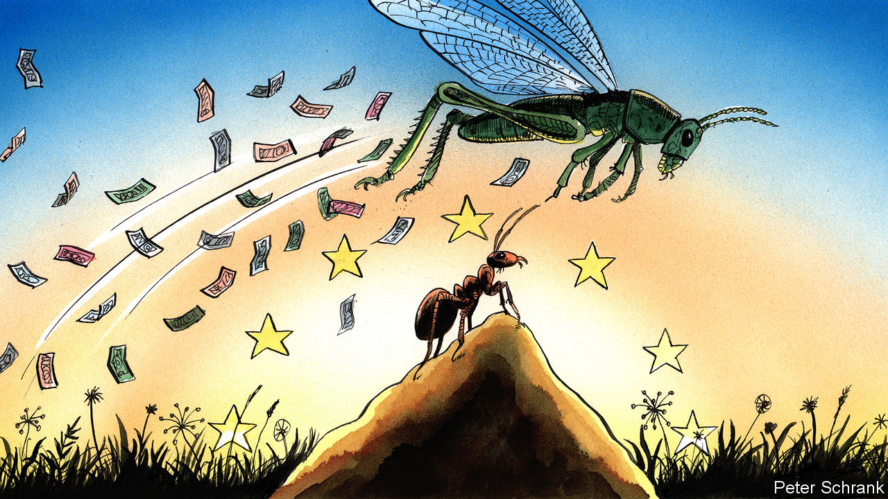

## Charlemagne

# How grasshoppers triumphed over ants in Europe

> The old fiscal rules are no more

> Mar 26th 2020

TO EXPLAIN A complicated story, it helps to have a fable. Those who watched the last euro-zone crisis often turned to Aesop’s story of the ant, who worked hard all summer ahead of the coming winter, and the grasshopper, who lazed about during warm weather only to come begging for a handout when the cold arrived. The euro zone, in this simplistic telling, was split between ants and grasshoppers. On the one side were rich, northern countries such as Germany that reformed their economies and spent little during the long summer of the 2000s. On the other were profligate grasshoppers, such as Greece and Italy, that ran up chunky deficits or left their inefficient economies untouched, causing misery when the financial crisis hit. For the ants, this was vindication. When the grasshoppers came begging, they were forced to live like ants, with strict rules on spending and often painful economic reform. Chirps of complaint were ignored. Ants ruled.

Less than a decade later and the grasshoppers are in the ascendant. EU member states have agreed to rip up spending rules to cope with the economic wreckage caused by covid-19. Governments have gorged themselves at a fiscal buffet. Spain launched a stimulus worth 3% of GDP. France put out extra spending amounting to 2% of GDP. Even Germany, the queen of the ant colony, has joined in. Berlin burst through its “black zero” rule, which insists on a balanced federal budget, with a stimulus package worth 4% of GDP. It will even borrow €156bn ($170bn) to pay for it. “There are no rules,” says Claus Vistesen, an economist at Pantheon Macroeconomics, summing up the new mood. “Why not go big?”

In fact, the grasshoppers have been quietly gaining ground for years. Grumbles about fiscal rules beloved by the ants—which supposedly limit government deficits to 3% of GDP and national debt to 60% of GDP—have been growing. “Flexibility” has been the preferred euphemism for a concerted effort to water down the rules, which gave the European Commission finger-wagging rights over the individual budgets of member states. Other efforts to introduce a special carve-out for spending on environmental policy, which will be an increasingly large chunk of government spending in the coming decades, were gaining ground. An ideological breeze was already blowing in favour of those who wanted looser spending. The novel coronavirus has turned it into a hurricane.

Ants were once backed at the highest levels of Europe’s institutions. But austerity’s main advocates have moved on. The commission has become steadily more relaxed about spending. At the start of the last decade, the European Central Bank was among the loudest voices for austerity. Jean-Claude Trichet, the then president of the bank, implored countries to rein in spending or face ruin. By the end of the decade, Mr Trichet’s successor, Mario Draghi, was practically begging countries to spend more—a call that his successor, Christine Lagarde, has matched. Different leaders now sit round Europe’s top table. Only two veterans of the original euro-zone crisis remain in charge of their countries: the Dutch prime minister, Mark Rutte, and Germany’s Chancellor, Angela Merkel. It is little surprise that Mr Rutte and Mrs Merkel nod to the orthodoxies of a previous era they helped shape. Elsewhere, fresh blood has led to fresh thinking.

The ant mentality is still strong in some countries. Olaf Scholz, the German finance minister, boasts that it was only previous fiscal rectitude that has allowed such a large response to the crisis “without batting an eyelid”. It is an argument repeated by Dutch officials, who justify their decision to unbuckle their fiscal belts with reference to their previously strict diet. Such a claim is undermined by the fact that countries with flabbier finances now have the same capability to borrow and spend themselves out of trouble. Paris has promised to splurge in response to the crisis. Despite running a deficit every year for the past two decades, the French government’s borrowing cost is only fractionally higher than that of the Netherlands, which has run a surplus since 2016.

The scale of the covid-19 crisis offers a nihilistic twist to Aesop’s fable. Sometimes a winter is so harsh that previous behaviour becomes irrelevant. The coming crisis will trash the finances of EU countries whether they were previously parsimonious or gluttonous. The Netherlands has squirrelled away about €30bn in surpluses since 2016. But this is dwarfed by the €90bn it may now have to borrow. Practically every country will exit the crisis with bloated debts and a heaving deficit. Bragging about having slightly healthier finances against such a backdrop would be like boasting about having the cleanest face at a mud-wrestling contest.

Grasshoppers do not have everything their way. On March 25th, Paris and Rome led a group of nine countries demanding the EU issue mutually guaranteed debt in response to the crisis. This idea is dismissed in Berlin and The Hague. A compromise where countries struggling to pay for the covid-19 response can access bail-out funds without overly strict conditions is more likely. At the start of the decade, the grasshoppers would have leapt at such a deal; now they fume that the ants have not capitulated further.

In this way, the grasshoppers are repeating a mistake of the ants’. Rather than building a fiscal policy that worked for both camps, ants forced grasshoppers to adopt ant ways. As a consequence, resentment festered and populists thrived in southern Europe, which snapped back to its fiscal instincts as soon as the opportunity arose. Similarly, a bout of profligacy in response to a crisis will not compel the likes of Germany to adopt a loose fiscal policy for ever. Already, the ants in Brussels and national capitals mutter that fiscal discipline will be needed to bring order to public finances once this crisis has passed. Both sides must recognise they are stuck together. Rather than triumphant chirping, a compromise between ant and grasshopper is in order. A lasting peace trumps temporary hegemony every time. ■