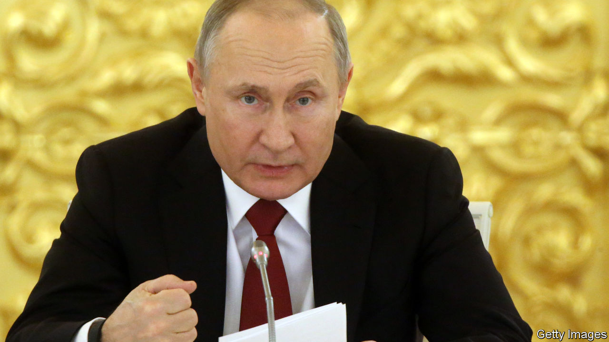
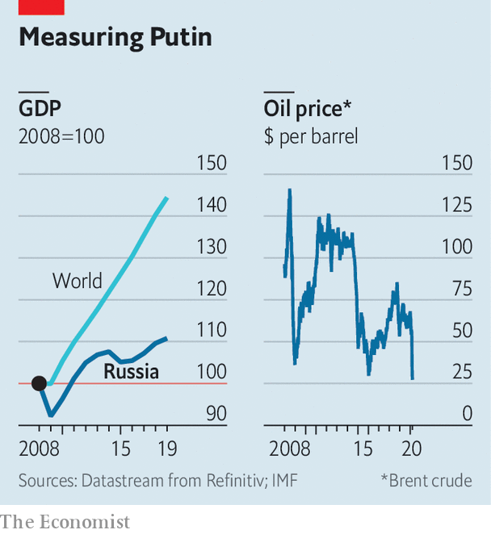

## Fortress Russia

# Russia’s economy is isolated from the global rout

> For now

> Mar 26th 2020MOSCOW

VLADIMIR PUTIN is no doubt feeling smug. The Russian economy ought to be in crisis, but it is not. Covid-19 is causing a global meltdown. The price of oil has slumped below $30 a barrel, half what it was two months ago. Oil and gas traditionally account for two-thirds of Russian exports. That has sent the rouble sliding. The currency has lost nearly a third of its value since early January.

Yet even as the world’s richest countries are in turmoil, taking on vast sums of debt to cushion the blow, Russia’s economy shows few signs of panic. This is not because Russia has diversified, defeated corruption, protected property rights, or boosted competition, investment or growth. It has done none of those things. Rather, the Russian economy is less sensitive to the shock because it has already been self-isolating for the past six years. Ever since Mr Putin illegally annexed Crimea and fomented war in Ukraine, the West has imposed sanctions on Russia and Russia has imposed sanctions on the West.

Since then, the aim of Russia’s macroeconomic policy has been not to foster growth but rather to build a fortress economy that could withstand a severe shock. Underpinning this policy was a fiscal rule in 2017 that required the budget to balance with an oil price slightly over $40 a barrel. Anything above that figure was funnelled into a rainy-day fund which had reached 7.3% of GDP on March 1st.

As a result, Russia now sits on one of the world’s largest gold and foreign-exchange reserves, worth nearly $570bn. Oleg Vyugin, a former official at the central bank and the finance ministry, explains the thinking: “We’re protected against external shocks and foreign enemies because we have modern weapons and rockets, but also because we have gold and reserves.” Russia has also raised its pension age and VAT rate, and has boosted its tax take through digital technology. Mikhail Mishustin, the tax-collector-in-chief, was recently promoted to prime minister.

To be sure, the Russian economy remains highly dependent on energy and commodity prices. The dramatic fall in the oil price, partly induced by Russia’s own decision to break out of its deal with OPEC producers, could deprive the government of about 2trn roubles ($25bn) this year. Russia’s risky bet that it could increase its market share and drive American shale firms out of business may backfire spectacularly if America decides to strike its own deal with Saudi Arabia at Russia’s expense, argues Kirill Rogov, an independent analyst. But for now, Russia has more than enough reserves to see it through the next few years. The decline in the value of the rouble has limited the damage to its public finances caused by the falling oil price. Western sanctions have also made it irrelevant, in many cases, that foreign goods now cost more in roubles.

Cut off from international capital markets since 2014, Russian firms have had no choice but to deleverage. Whereas Western firms took advantage of low interest rates and loaded up on debt, Russia’s corporate debt as a share of GDP has fallen to below 50%, while the state debt-to-GDP ratio is well under 20%. Given that most of Russia’s exports are basic, it is also less vulnerable to disruptions in complex global supply chains. “If you are travelling on a horse, you don’t have to worry about running out of petrol,” observes Natalia Orlova, chief economist at Alfa Bank.

Russia has also become more self-reliant. Its counter-sanctions imposed on food imports from the EU have boosted domestic agriculture, driving down the share of food that is imported by a third in the past five years, to just 24%.

Life in isolation has its downside, as many people outside Russia have discovered since covid-19 struck. Russia is poorer than it should be. Its average annual growth rate since 2014 has been a dismal 0.6%, which is a fifth of the global average. Small- and medium-sized private businesses have shrunk. Quasi-state firms controlled by Mr Putin’s cronies have expanded. Rent-seeking is rampant, which means that opportunities for the honest or diligent are frustratingly meagre.

The economic impact of the new coronavirus, which may be more widespread than the government claims, is only likely to deepen Russia’s structural problems. On March 25th Mr Putin announced his own response to the virus, a pale imitation of the vast economic packages announced by western governments. It largely transfers the cost of the adjustment to Russia’s middle class.

Instead of a lockdown, Mr Putin declared a week-long holiday in Russia. In return, small- and medium-sized businesses are to get a corporate-tax holiday for six months (VAT must still be paid). The social taxes businesses pay on behalf of their employees are to be halved, to 15%.

The president’s welfare-support measures were relatively modest. The government is going to increase child benefits by 5,000 roubles a month ($63) and unemployment benefits by a third to 12,000 roubles. Those who fall sick and lose more than 30% of their income will be able to delay repayments of mortgages and certain other loans.

To compensate for the hit to the national budget, Mr Putin increased the tax on dividends received from offshore holdings from 2% to 15%, effectively levying a new tax on the rich. What this package demonstrates all too vividly is that Mr Putin cares a lot more about bolstering the state than about preserving Russia’s market economy, such as it is.

As Ruben Enikolopov of Moscow’s New Economic School argues, the biggest risk that confronts Russia is not an economic collapse but a social one, with millions of people losing their livelihoods and beleaguered private firms shrinking yet further. Mr Putin has long talked about restoring a Soviet-style socially oriented state. The crisis risks exposing that what he has built instead is a corporatist state that cares little about its private citizens. ■