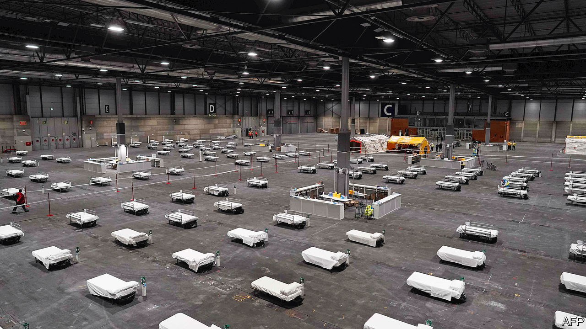
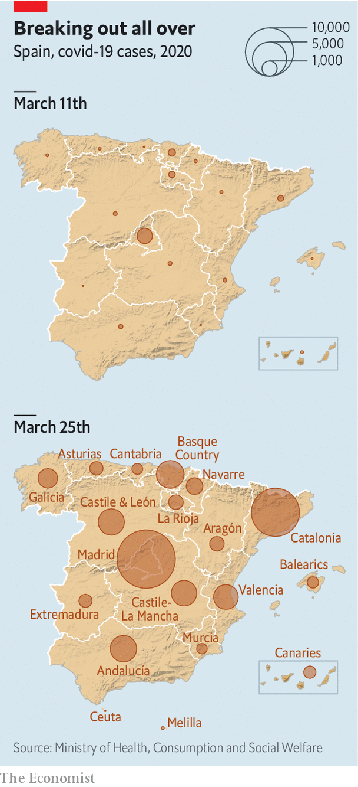

## The emergency room

# Spain has suffered more covid-19 deaths than any country save Italy

> A crucial week in a stricken and shuttered country

> Mar 26th 2020MADRID

Editor’s note: The Economist is making some of its most important coverage of the covid-19 pandemic freely available to readers of The Economist Today, our daily newsletter. To receive it, register [here](https://www.economist.com//newslettersignup). For more coverage, see our coronavirus [hub](https://www.economist.com//coronavirus)

WITH ITS carefully spaced empty white beds laid across the dark floor, the pavilion of Madrid’s exhibition centre looked like an installation left over from last month’s contemporary art fair. In fact it is a field hospital, set up by the army in 18 hours on March 22nd. Three days later it housed more than 300 coronavirus patients, and was being expanded to take up to 5,500. It is the front line in what Spain’s Socialist prime minister, Pedro Sánchez, has called “the most serious situation the country has faced since the civil war”.

After Italy, Spain is the country worst hit by covid-19, with 49,515 cases and 3,647 dead as of March 26th, with both numbers still rising steeply. It has now overtaken China on the death count. Officials see this week as crucial. With the health system in Madrid, the centre of the outbreak, close to breaking point, the government hopes that a state of emergency and lockdown imposed on March 14th will ensure that the peak of infection will pass by the end of the month. Whatever happens, Spain’s economy is heading for deep recession. Its prized health system faces criticism; its politics may be changed.

This week a spectral parliament agreed to extend the state of emergency until Easter. Mr Sánchez has rejected calls from some regional governments to tighten the lockdown further. This already confines most Spaniards to their homes, with no outdoor exercise allowed. It has shut most shops and all bars, restaurants and hotels, but allows factories, farms and building sites to continue. The prime minister notes the restrictions are among the most severe in Europe; tightening them would have an even bigger impact on livelihoods.

The priority now is to get through the health crisis. There are several pressure points. Hospitals and their intensive-care beds in the capital are all but full. As well as the new field hospital, the government has commandeered a dozen hotels for patients with milder symptoms and has ordered private hospitals to admit patients from the public system. The army is ferrying others to quieter areas.

Spain’s outbreak has several peculiarities. The high death rate is partly because the virus has cut a swathe through nursing homes, many of which lack medical staff. Spaniards are more tactile than north Europeans and interact much more with older and more vulnerable relatives. It is also because the government and health services, which are decentralised to regional administrations, were slow to react, with almost no testing until long after the virus had gained a hold. Only now have 650,000 test kits arrived, with another 1m on the way. “The lockdown is very important, but not enough,” says Daniel López-Acuña, a former official at the World Health Organisation. “It has to be backed up with testing.”

Lack of readiness showed itself too in the infection of many health workers (14% of total cases), who lacked protective gear. Spaniards have hailed their steadfastness with nightly applause from balconies. The government hopes to recruit some 50,000 retired or former health workers. Lastly, the virus is now spreading rapidly around the country (faster than in Italy), with Catalonia now accounting for around 20% of cases, behind only Madrid (around a third).

The next worry is the economy. It depends heavily on tourism and the car industry, both of which have shut down completely. Economists are forecasting that GDP will shrink by up to 15%, depending on how long the emergency lasts. Much of that will not be recovered. “Tourists who come later on won’t eat two dinners a night,” says Toni Roldán of Esade-EcPol, a think-tank.

The government has unveiled an aid package worth up to €200bn (around 16.5% of GDP), half in credit guarantees and €17bn in extra spending on health services and income support. It has guaranteed that workers temporarily laid off (some 1.5m so far) will get unemployment benefit. That will not help the 2.5m workers on short-term contracts or the 3.7m self-employed. Officials say they are working on measures for these groups. “The key issue is immediacy,” says Mr Roldán.

How is all this to be paid for? The fiscal deficit could swell to 10% of GDP this year, and, with interest costs rising, push public debt to 120%. No wonder Mr Sánchez is pushing hard for the EU to help out, such as by issuing “coronabonds”.

By common consent the government, an inexperienced and uneasy coalition between the Socialists and far-left Podemos, erred in its tardy reaction to the virus. In what now seems another world, ministers were fixated on healing their divisions with a big feminist demonstration on March 8th. But since the start of the state of emergency, which centralised policing and health services, Mr Sánchez has seemed more sure-footed.

His critics have their own difficulties. The conservative People’s Party (PP) has oscillated between loyalty and sniping. It runs the Madrid regional government, which was more aggressive than others in cutting health spending and privatising some provision. Quim Torra, the separatist head of the Catalan government, called for the “total confinement” of his region, but has failed to handle the virus well. In a poll this month his was the only region where respondents gave higher marks to the central government than their local one.

Mr Sánchez has made verbose and repetitious televised speeches, much mocked by opponents. But many Spaniards like the fact that he is engaging with the problem and with them, says Charles Powell of the Elcano Royal Institute, a think-tank. Spaniards have generally been more disciplined than other Europeans in observing the lockdown. “There’s an element of Spanish patriotism, not nationalism, in this,” says Mr Powell. “My prediction is that Sánchez will come out of it looking stronger.” ■

Dig deeper:For our latest coverage of the covid-19 pandemic, register for The Economist Today, our daily [newsletter](https://www.economist.com//newslettersignup), or visit our [coronavirus hub](https://www.economist.com//coronavirus)