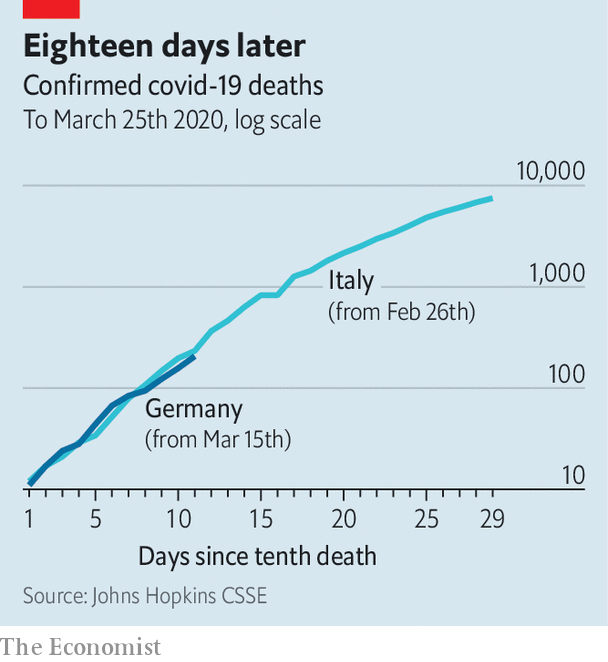

## Covid comparisons

# Why does Germany’s death rate look better than Italy’s?

> The data may deceive

> Mar 26th 2020BERLIN

Editor’s note: The Economist is making some of its most important coverage of the covid-19 pandemic freely available to readers of The Economist Today, our daily newsletter. To receive it, register [here](https://www.economist.com//newslettersignup). For more coverage, see our coronavirus [hub](https://www.economist.com//coronavirus)

A  NEW PASTIME has emerged among people stuck at home: obsessively tracking how their country’s covid-19 death toll compares with those of their neighbours. Some divide the deaths by the number of reported cases of the disease to get a supposed fatality rate. That, in turn, often leads to the premature conclusion that some European countries are spectacularly better than others at keeping people with covid-19 alive.

Take Italy and Germany. On March 25th Italy had recorded 74,386 cases of covid-19 and 7,503 deaths, the highest number in the world. Germany’s tally that day stood at 37,323 cases and just 206 deaths. Going by these figures, the fatality rate would seem to be around 20 times higher in Italy than in Germany. In fact, this is a spurious number, for several reasons.

First, in any country the number of confirmed covid-19 cases is an unknown fraction of the actual number of cases. Both Italy and Germany have been testing lots of people. In Germany, where different doctors and regions have different practices as to whom they test, accurate national figures on the number of tests done are hard to verify. That makes comparing the two countries tricky. But the broad consensus seems to be that there has been a greater degree of testing in Germany, meaning that it is spotting more mild cases of the disease than Italy. Severe ones end up in hospital, where they are obviously easy to count.

What is clearer is that the first wave of covid-19 infections in Italy was predominantly among older people, who are far more likely to die than younger people, even with the best of care. The median age of those diagnosed with covid-19 in Italy is 63 years, compared with 47 in Germany. The two countries have a similar share of older people in the general population. But only 20% of cases reported in Germany are people aged over 60, compared with 56% of those in Italy. The early German cases seem to have contracted the disease at carnivals and ski-resorts, which explains why the initial profile is so young.

Another reason why Italy’s death rate looks much higher is that its epidemic began earlier. Covid-19 deaths lag behind infections by several weeks. That means that for quite a time the disease can spread unnoticed. Italy’s first deaths were on February 22nd, Germany’s two weeks later. So a large number of Germans who are already infected will become sicker and die in the coming days and weeks. That is starting to happen. On March 23rd Germany’s cumulative number of covid-19 deaths jumped by 56%; the next day’s increase was 33%.

Lastly, Italy’s deaths would not be so numerous if its covid-19 patients had not overwhelmed its hospitals. The country’s epidemic has been concentrated in the Lombardy region, whereas Germany’s cases have been distributed more broadly across several hotspots. As the disease spreads in both countries, it will become clearer whether the German health system really is so much better than Italy’s at keeping covid-19 patients alive. ■

Dig deeper:For our latest coverage of the covid-19 pandemic, register for The Economist Today, our daily [newsletter](https://www.economist.com//newslettersignup), or visit our [coronavirus hub](https://www.economist.com//coronavirus)

## URL

https://www.economist.com/europe/2020/03/26/why-does-germanys-death-rate-look-better-than-italys
