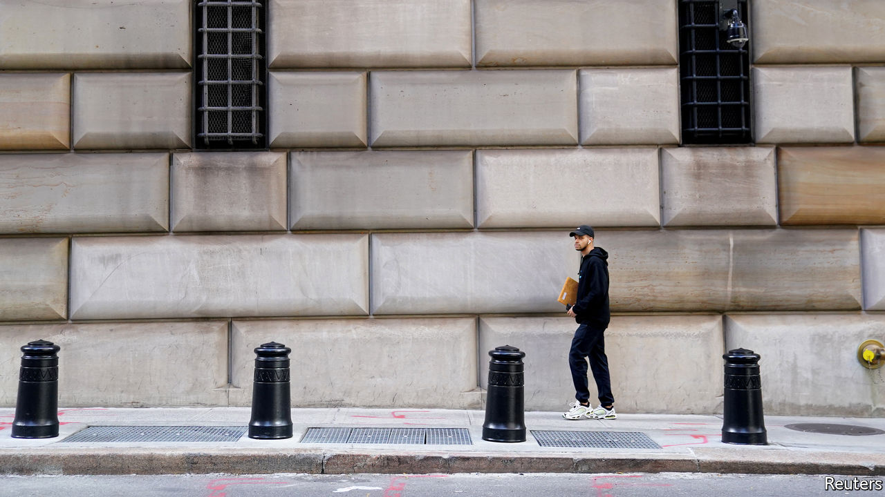

## The Zoom accord

# America’s central bank is not the only one doling out greenbacks

> Central banks in emerging markets are conducting auctions

> Mar 26th 2020HONG KONG

Editor’s note: The Economist is making some of its most important coverage of the covid-19 pandemic freely available to readers of The Economist Today, our daily newsletter. To receive it, register [here](https://www.economist.com//newslettersignup). For more coverage, see our coronavirus [hub](https://www.economist.com//coronavirus)

WHEN AMERICA and its allies wanted to cheapen the dollar in 1985, their officials met in the Plaza Hotel in New York. When they sought to stabilise the currency two years later, they gathered in the Louvre Palace in Paris, conversing over turbot soufflé cardinale washed down with Puligny Montrachet, according to Funabashi Yoichi, a former journalist. The dollar is again a cause of international concern, strengthening from March 9th to 20th, as companies, banks and countries scrambled for the world’s dominant currency, before falling a little this week. But if the world’s policymakers wish to tame it again, where will they meet? In a time of lockdowns, any successor to the Plaza and Louvre accords will have a less resonant name.

America’s Federal Reserve has already tried to alleviate dollar scarcity by reviving a network of swap lines, which allow other central banks to borrow dollars in exchange for the equivalent amount in their own currencies, swapping them back again up to three months later. The Fed eased the terms of its existing lines with Britain, Canada, the euro area, Japan and Switzerland. It then reintroduced lines with nine other central banks, including those of Australia, Brazil, Mexico, New Zealand, Singapore and South Korea.

Many of these central banks are now busily furnishing dollars to banks at home. The Bank of Japan has offered over $156bn since March 17th. Its counterparts in the euro area, Britain and Switzerland have lent over $182bn combined. On March 18th Brazil’s central bank began offering dollar loans to financial institutions that could provide Brazilian government bonds, issued in global markets, as collateral. The Bank of Mexico said it would begin dollar auctions. Earlier this month, the Reserve Bank of India (RBI), which does not have a Fed swap line, but does have almost $482bn of its own foreign-exchange reserves, offered $2bn to its banks. It received bids worth over $4.6bn, prompting it to offer another $2bn auction on March 23rd.

Could the Fed extend these lines further? It has no appetite for assessing which countries warrant its help, or bearing the risk that it might not get its dollars back. Some have therefore suggested it should team up with the IMF. In 2015 Randall Henning of the American University in Washington, DC, proposed that the fund could decide confidentially which of its members has the “very strong” policies and institutions required to qualify for its own precautionary, strings-free loans. These countries would then also become eligible for a Fed swap line. If ever they could not repay, the fund would lend them the money to do so. Mr Henning calculated that, in addition to Mexico and South Korea, another seven emerging markets might qualify, including Chile and Malaysia.

If the dollar resumes its upward march, America’s Treasury could also help weaken it by buying other currencies, points out Zach Pandl of Goldman Sachs. But what to buy? The traditional choices would be the euro and the yen. But both Japan and the euro area fear the deflationary impact of a stronger currency. A better bet, Mr Pandl argues, might be Mexico’s peso or Brazil’s real. It’s just a pity officials cannot share a meal and a bottle of fine wine before they tuck in to each other’s currencies. ■

Dig deeper:For our latest coverage of the covid-19 pandemic, register for The Economist Today, our daily [newsletter](https://www.economist.com//newslettersignup), or visit our [coronavirus hub](https://www.economist.com//coronavirus)