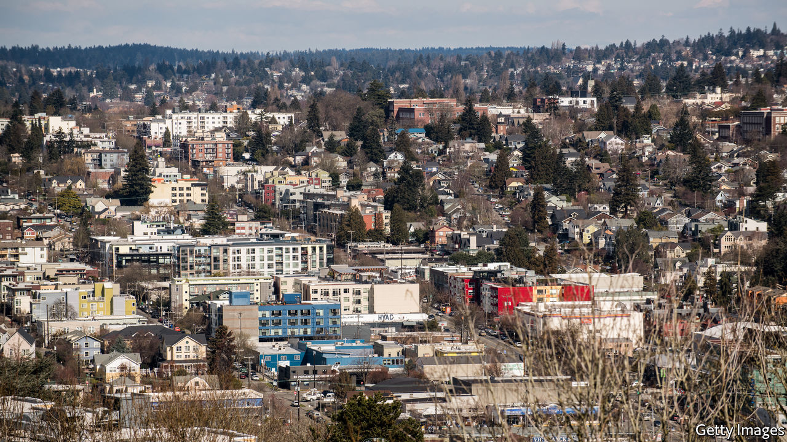
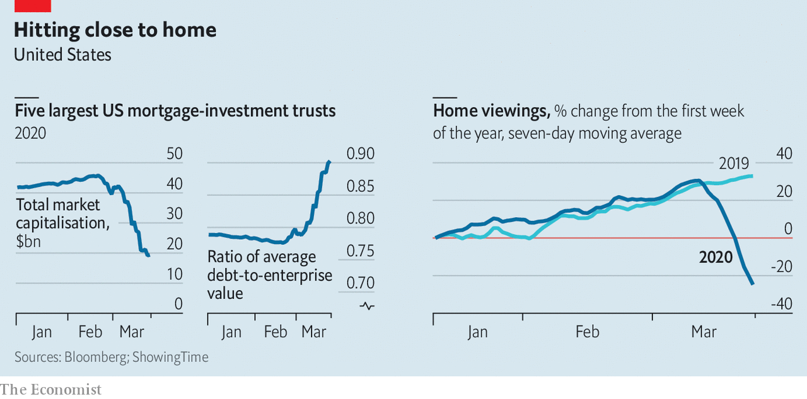

## On shaky ground

# America’s mortgage market sickens

> Mar 26th 2020

AMERICA'S $19trn commercial and residential mortgage market is jittery as investors begin to fear that laid-off workers and shut-down firms will struggle to repay their debts. Plenty of investors—such as real-estate investment trusts—are highly leveraged. As the value of mortgage-backed securities has dropped sharply they have begun to face margin calls on their debt from their bankers. Some have warned investors that they are unable to meet cash calls. Demand for new residential mortgages is likely to suffer, too. Lockdowns and economic uncertainty have stopped homebuyers looking.■

## URL

https://www.economist.com/finance-and-economics/2020/03/26/americas-mortgage-market-sickens
