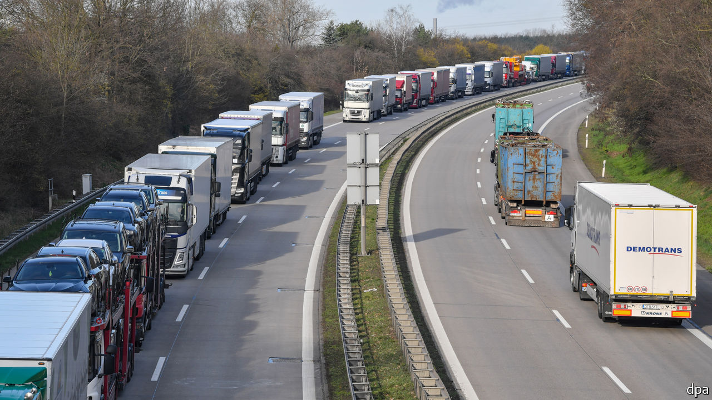
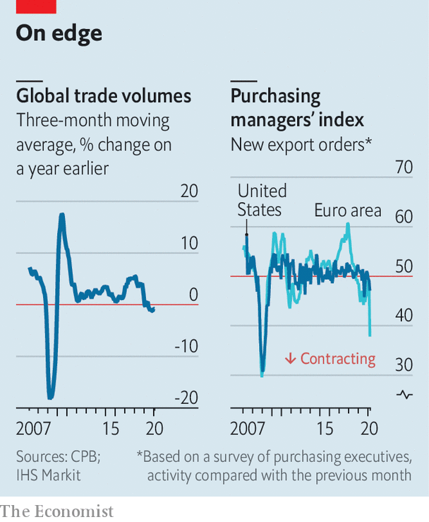

## Trucks, queues and blues

# If you thought the trade war was bad for global commerce...

> The disruption from the pandemic will be much worse

> Mar 26th 2020WASHINGTON, DC

CONTAINER-SHIP navigators, box-ticking customs officials, logistics wizards, truck drivers and warehouse nightwatchmen: all are familiar with dealing with glitches involving international trade, from strikes to trade wars. But with forecasters predicting a slump in global GDP this year, even their most creative thinking cannot keep $25trn of goods and services flowing around the world.

Trade is the conduit through which economic pain passes from one country to another. Even simple products rely on elaborate supply chains: a humble cup of coffee requires 29 firms to collaborate across 18 countries, according to one estimate. Shocks convulse in either direction. A port closure or customs delay can cripple production elsewhere. If consumers stop buying cars and phones, manufacturers and workers in distant lands feel the pinch.

When world output, at purchasing-power parity, fell by 0.1% in 2009, trade volumes collapsed by a whopping 13%. Quarterly volumes fell by even more (see chart). Weaker demand in America and the European Union rippled along trade routes to Canada, China, emerging Asia, Japan and Mexico. One study finds that 27% of the decline in American demand and 18% of that in the European Union was borne by foreign producers.

The shock coming this year threatens to be far more brutal. When one of the world’s economic giants sneezes, the rest of the world catches cold. Now everyone is coughing. Factory closures are being exacerbated by a rise in trade barriers. And global demand is plummeting as households’ incomes dry up and cash-strapped firms put their investment plans on ice.

At first the virus infected manufacturing in China, which typically supplies nearly 10% of the world’s intermediate-goods trade. The dollar value of Chinese exports in January and February was 17% below what it was a year earlier (though American tariffs may also have contributed to the weakness). As delivery times stretched out for longer and longer, companies had to pause production for lack of components.

Now factories across Europe, North America and Asia must cope not only with uncertain supplies of parts from China but also with sick workers and a dizzying array of local and national shutdowns. Audrey Ross of Orchard International, a company based in Canada that trades products including mascara and bath sponges, says planning has become a nightmare. One customer in Germany is closed; another in France is open. Warehouses in America have shorter opening hours. Diversifying away from China had at first seemed like a sensible strategy. Now nowhere is safe.

To make matters worse, barriers to trade are going up. More than 50 governments have restricted exports of medical supplies, 33 of which acted after the beginning of March. Tourism has been crushed—it accounts for 8% of global services trade. Flight cancellations have seen the cost of air freight, much of which goes in the belly of passenger jets, soar. Vaughn Moore of AIT Worldwide Logistics, a freight-forwarding company, reports that rates have risen from $2-3 per kilo to $9-11, which for some goods is prohibitively expensive.

Land borders are becoming harder to cross too. Countries from America to Armenia have placed new restrictions on free movement. In almost all cases there are meant to be exceptions for people transporting goods. But haphazard implementation has led to queues that stretch for miles. On March 15th the Italian transport minister had to call her Hungarian counterpart to request that a blockade be removed. Restricted border crossings have in some cases made it hard for drivers to get to work. “Everybody wants to do their own thing,” grumbles Umberto de Pretto of the International Road Transport Union. “If road transport stops the world stops.”

Bunged-up borders mean that it gets harder to refill empty supermarket shelves as people stockpile food, and to meet rocketing demand for medical equipment. Mario Aronovich, a customs broker in Mexico, remembers receiving calls when the crisis started about whether it was possible to export medical masks from Mexico to China. Now he is getting calls about trade in the opposite direction.

So just how big will the drop in overall trade be? In 2009 declining demand accounted for over two-thirds of the crash in trade, a far bigger share than the 15-20% caused by the credit crunch. The extent of the pandemic-induced slowdown in consumer spending and investment is already becoming clear. And it has already dented trade activity badly—a survey of factory bosses in March suggests sharp falls in export orders in advanced countries. Simon Macadam of Capital Economics, a consultancy, has pencilled in a 20% drop in trade volumes this year. That is bigger than in 2009. The drop in trade could be worse if the most pessimistic forecasts of jaw-dropping double-digit year-on-year declines in GDP in some rich countries over the next quarter or two come true.

A lesson from 2009 is that trade bounces back. Some of the precipitous drop then reflected companies drawing down their inventories; that reversed quickly enough when things returned to normal. Gloomier types point out the colossal uncertainty about when the rebound might come. Trade thrives on trust and predictability. Today, with supply chains buckling and borders closing, both are in short supply. ■