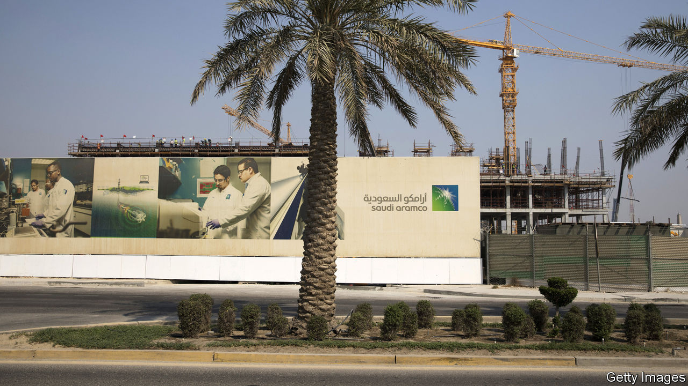

## Buyer beware

# Saudi Arabia floods the oil market; America tries to prop up prices

> But for supply to match demand, they may have to fall even further

> Mar 26th 2020NEW YORK

Editor’s note (March 30th 2020): This article has been updated since it was first published.

EARLY IN MARCH the oil market’s central banker seemed to go berserk. Saudi Arabia, the most powerful member of the Organisation of the Petroleum Exporting Countries (OPEC), has long adjusted its supply to help stabilise the price of crude. Russia had teamed up with OPEC since 2016, but as covid-19 drove demand relentlessly down, it refused OPEC’s plea to cut production. Saudi Arabia retaliated, declaring its intent to flood global markets. The price of Brent crude dropped by half between March 5th and March 30th, when it sunk below $22 a barrel.

America is trying to step in. Having failed to secure funding, the Department of Energy has quietly suspended plans to buy 77m barrels of American crude to store in its strategic stockpile. Ryan Sitton, a Texas oil regulator, is mulling restrictions on his state’s output, which accounts for 41% of America’s total. “The world is in an extraordinary time,” he says. “We need to consider extraordinary solutions.” News on March 23rd that President Donald Trump had appointed an energy envoy to Saudi Arabia raised hopes that America might broker a truce between the kingdom and Russia.

America is not a newcomer to oil-market meddling. The formation of OPEC was inspired in part by the Texas Railroad Commission (on which Mr Sitton now serves). In the 1930s, when the price of oil wallowed below $1 a barrel, troopers fanned across Texas to enforce the commission’s production limits. As America’s oil imports rose, attention shifted to securing supply. The Strategic Petroleum Reserve was created in 1975, after the Arab oil embargo.

Now that shale has transformed America into the world’s biggest oil producer, the country has renewed interest in propping up the price of crude. Mr Sitton maintains that production cuts may be necessary to ensure that America’s shale industry survives covid-19. But America will find OPEC’s mantle an awkward fit.

The vast salt caverns along America’s Gulf coast that contain the strategic reserve are already about 90% full, so they cannot store enough excess supply. Texan regulators have not tried to curb output for decades. Any attempt would surely meet legal and practical hurdles. A grand supply agreement between America, Saudi Arabia and Russia might boost the oil price, but only temporarily.

“The price war has become largely irrelevant,” says Ben Luckock of Trafigura, a trading company. Saudi production now seems far less important, he argues, than the pandemic’s historic destruction of oil demand. Covid-19 is obliterating this at such an astonishing rate that analysts cannot adjust their models quickly enough. Bernstein, a research firm, estimates that demand in the first half of the year may be 10%, or even 20%, below what it was in 2019. In the past 35 years demand has only twice been lower than in the preceding year—in 2008 and 2009.

Yet production has been slow to respond. That is only in part because of the price war. Once a shale well is drilled, there are only marginal savings from stopping production. Many oil companies are hedged and continue pumping in the hope prices will rise. Even when firms slash spending, output may not drop quickly. On March 24th Chevron, an American supermajor, said that it would cut capital spending by 20% this year, but that production in 2020 would roughly match that in 2019.

It looks possible that supply will not just exceed demand for oil now but fill the capacity to store it. Bernstein reckons that there could be over 735m barrels of extra crude this year, and only about 500m barrels of storage available in the OECD, a club of mainly rich countries, and oil tankers.

In the face of such a demand shock, “a production cut that takes a month or two to implement won’t do much,” argues Damien Courvalin of Goldman Sachs, a bank. He contends that a production limit in Texas would slow the consolidation that America’s shale industry needs to be competitive in the long term. Government stimulus might help to boost demand. But the essential fix to bring the market back into balance, reckons Mr Luckock, is a painful one: even lower oil prices. ■

## URL

https://www.economist.com/finance-and-economics/2020/03/26/saudi-arabia-floods-the-oil-market-america-tries-to-prop-up-prices
