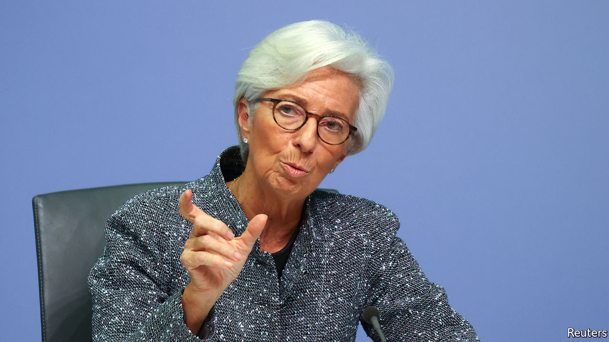

## Ripping up the rules

# The ECB breaks its self-imposed rules

> But will its latest salvo alone ensure a healthy expansion?

> Mar 26th 2020

Editor’s note: The Economist is making some of its most important coverage of the covid-19 pandemic freely available to readers of The Economist Today, our daily newsletter. To receive it, register [here](https://www.economist.com//newslettersignup). For more coverage, see our coronavirus [hub](https://www.economist.com//coronavirus)

CHRISTINE LAGARDE took over as the president of the European Central Bank (ECB) in November intent on peacemaking. The bank’s negative interest rates and bond-buying were reviled in the euro area’s northern countries. In order to heal the rift Ms Lagarde launched a year-long review of the ECB’s strategy. Few investors expected policy to change much in 2020.

Covid-19 upended all that. On March 18th the ECB announced an emergency asset-purchase scheme that would buy €750bn ($809bn) in government and corporate bonds. With its existing programmes, the bank will hoover up over €1trn in assets this year—equivalent to 9% of euro-area GDP. But even this might not be enough to gin up the economy.

The severity of the pandemic means that the ECB has been bolder and considerably more flexible than economists would have thought possible a few months ago, says Piet Christiansen of Danske Bank. In large part that is because the ECB is amending some of the rules that have until now governed its asset purchases.

One self-imposed rule concerns the composition of purchases. The ECB generally tries to buy government bonds in proportion to the capital each member state puts into it (or its “capital key”), which is roughly in line with the size of its economy. This time the bank will be more flexible. It could, for example, buy more Italian and Spanish bonds, even though these together account for around a quarter of the capital key. As the virus spread across the south of the euro zone, investors had begun to demand a higher premium for holding southern states’ bonds—and Ms Lagarde did not help when she remarked that she did not consider it the ECB’s job to close yield spreads. The announcement of the emergency bond purchases helped to calm those nerves.

More controversially, the ECB says its emergency purchases will not be bound by its self-imposed “issuer limit”, which had meant that it could not hold more than a third of a member’s sovereign debt. Its holdings of German and Dutch bonds have been fast approaching the cap. The decision could raise heckles in Germany, where the rule is seen as ensuring that the ECB’s purchases do not monetise national debt.

The ECB is breaking more of its own rules. It is expanding the range of assets it will buy. The new scheme will cover Greek sovereign bonds; they had previously been deemed ineligible because of their low credit rating. And the ECB will start to buy assets with maturities of less than a year. That has a happy interaction with recent fiscal easing. On March 23rd the German government said that it would borrow €156bn in order to support its economy (see [article](https://www.economist.com//europe/2020/03/26/germany-offers-cash-for-everyone)). Much of Germany’s borrowing will take the form of short-term bills, says Frederik Ducrozet of Pictet, an asset manager.

Even with all this flexibility, there is still a question of whether the stimulus is sufficient. The extent of the economic damage done by the virus is slowly becoming clear. On March 24th a survey of purchasing managers indicated the steepest drop in activity in its 22-year history. Investors’ medium-term inflation expectations, as measured by the five-year forward swap rate, have fallen to 0.8%, well below the bank’s target of inflation close to, but below 2%. That suggests that investors think more easing is needed to ensure a healthy expansion after the epidemic ends.

One reason for investors’ gloom may be that governments are still doing too little. Even after Germany’s splurge, new spending across the euro zone amounts to only 2% of GDP. Economists at Citibank estimate that something nearer 5% is warranted. Leaders were set to consider whether to make cheap credit lines available to governments through the zone’s bail-out fund after The Economist went to press. Such talks tend to become mired in arguments over what type of strings should be attached to the cash. The pandemic means that a deal looks likelier than ever. But central bankers are also well aware of another, less happy, link between monetary and co-ordinated fiscal policy. The more the ECB does, the less governments feel they need to take action. ■

Dig deeper:For our latest coverage of the covid-19 pandemic, register for The Economist Today, our daily [newsletter](https://www.economist.com//newslettersignup), or visit our [coronavirus hub](https://www.economist.com//coronavirus)

## URL

https://www.economist.com/finance-and-economics/2020/03/26/the-ecb-breaks-its-self-imposed-rules
