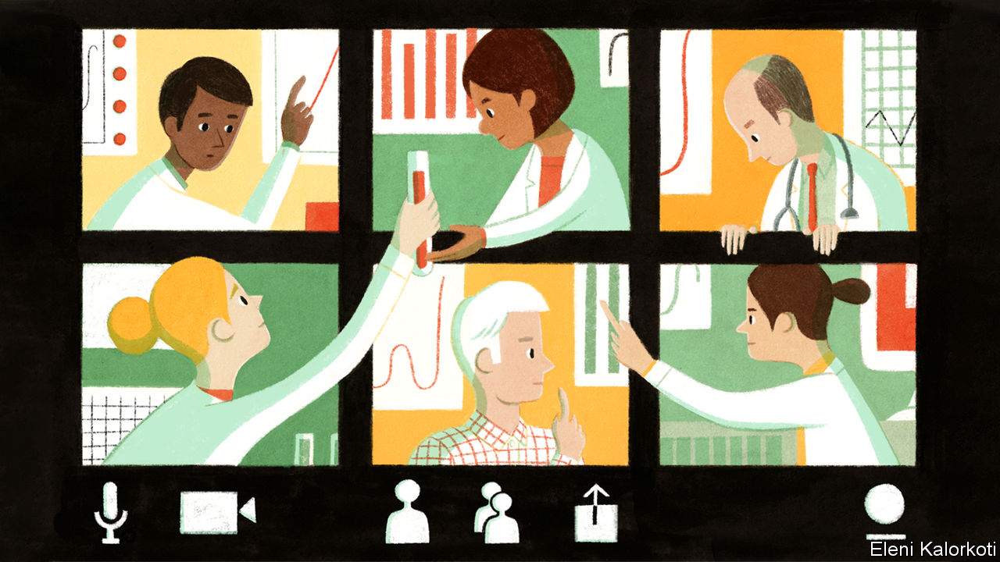

## Stop, collaborate and listen

# Crowdsourcing to fight covid-19

> Many trials are under way to find the best treatment

> Mar 26th 2020

Editor’s note: The Economist is making some of its most important coverage of the covid-19 pandemic freely available to readers of The Economist Today, our daily newsletter. To receive it, register [here](https://www.economist.com//newslettersignup). For our coronavirus tracker and more coverage, see our [hub](https://www.economist.com//coronavirus)

“WE ARE TRYING to fly the plane while we are building it.” That is how Richard Hunt from America’s department of health described caring for patients seriously ill with covid-19 in a training session on the subject on March 24th. The session was webcast to almost 2,000 people in 39 countries (most were in America). The questions sent in advance filled 25 pages, said Mr Hunt.

The thirst for clinical guidance is desperate. Three months after doctors in the Chinese city of Wuhan encountered the world’s first covid-19 patients, medics in more than 150 countries are treating growing numbers. British scientists reckon that 4.4% of those infected will need hospitalisation; about one in three of those requires treatment in an intensive-care unit (ICU). Doctors in ICUs treat severe pneumonia, the hallmark of a serious case of covid-19, all the time. But with this new disease they do not yet know which changes in a patient’s symptoms, blood tests or vital signs are critical ones. Some may point to improvements, while others suggest deterioration and the need for more intensive care, such as a ventilator.

Knowing when and for how long to put someone on a ventilator is not just crucial for that patient, says Mark Caridi-Scheible of the Emory Critical Care Centre in Atlanta, one of the instructors on the webinar; it is also important for the sake of the next patient who needs the machine. As hospitals around the world brace for more covid-19 patients than they have ventilators for, that question is at the top of their list.

While the disease spreads, the World Health Organisation (WHO) is crowdsourcing what hospitals are learning. It has asked doctors to submit anonymised covid-19 patient records to its global database, listing the drugs prescribed, procedures carried out and outcomes. But it has received fewer contributions than hoped, says Soumya Swaminathan, the WHO’s chief scientist. Talking to doctors directly seems to work better. Clinicians who treat covid-19 patients in 30 countries chime in at a twice-weekly virtual gathering run by the WHO. Their input, plus the clinical studies that are being published at a steady clip, are distilled into the WHO’s standards of care. Knowledge is evolving so quickly that these standards have been revised five times in less than two months.

Meanwhile, veterans from the earliest battles of the pandemic are taking their knowledge to others. On March 12th eight Chinese doctors, led by Liang Zongang, a professor of cardiopulmonary reanimation, arrived in Italy on a charter flight that brought medical equipment supplied by the Chinese Red Cross. They were followed on March 18th by around 300 Chinese intensive-care doctors.

Online learning about covid-19 is gathering speed, especially in developing countries. Around the world, clinicians already gather online to learn and share their experience on such topics as HIV/AIDS, tuberculosis, cancer and mental health. The ECHO Project, based at the University of New Mexico, has trained and supports hundreds of such groups in 39 countries, mostly in Africa and Asia. Many are now using their sessions to learn about covid-19. The experience at hospitals in China, Italy and Spain suggests that is prudent. As critical-care wards in the affected countries were inundated with coronavirus patients, they rapidly had to train doctors and nurses from unrelated specialisms in how to intubate patients and perform other procedures. Dr Caridi-Scheible, whose hospital is already treating more than a dozen covid-19 patients, warns the medics who are standing by for their first cases to “call in every friend and favour you are owed”.

To save the lives of gravely ill patients, doctors are trying many drugs. They are bombarded with suggestions from all kinds of sources online. But as soon as any particular medication is mentioned, everyone rushes to buy or use it, even preventively, despite the lack of evidence, says John Hick from the Hennepin County Medical Centre in Minneapolis. “Until we take the time to figure out what works, throwing the kitchen sink at every patient might actually harm them,” he adds. Steroids were used in the 2003 outbreak of SARS, a respiratory disease caused by another coronavirus, but studies since then suggest they may in fact have caused some harm.

Reliable answers can only come from proper clinical trials. Hundreds are under way. In early March Bruce Aylward, who led the WHO’s fact-finding mission to China in February, said 200 trials had been registered there. But with so many small trials, it was difficult to enroll enough patients. Small trials cannot distinguish a small effect from chance. Such a lack of data may explain why a trial of Kaletra, an HIV drug combination, in patients with severe covid-19 was not conclusive, says Ana Maria Henao Restrepo of the WHO. Trials from China may yet bear fruit. The earliest, in severely ill patients treated with remdesivir, a drug developed to treat Ebola, is due to finish collecting data on April 3rd.

What is really needed is a large, international trial that collects data about lots of drugs from many hospitals. The WHO hopes that a trial it announced on March 20th will do so. It will test four different possibilities: remdesivir, chloroquine, Kaletra, and Kaletra plus interferon beta, the drugs which currently seem to hold most promise. The hope is that medics, even those working under great pressure, will recruit patients. Patients are enrolled through the WHO’s website, which will randomly assign each of them to a trial drug (which will be limited to those that are available at the time).

The trial is “adaptive”, so it will change as results come in. Data will be monitored by an independent board. Ineffective treatments will be dropped and replaced by more promising ones. This will allow the best treatments to be compared swiftly.

After patients are enrolled in the trial, doctors need only record a few data points. When did each patient leave hospital or die? After how long? Did the patient need oxygen or ventilation?

There will be no placebo and doctors will know which treatment has been given to which patient. Those are not features of high-quality clinical trials in normal times. But the design is the best way to find out in the shortest time which of a number of drugs works best. The WHO has not said how long it expects the trial to take. Countries including Argentina, Bahrain, Canada, Iran, Norway, South Africa, Spain, Switzerland and Thailand have already said they will join. Some 3,200 European patients will participate under the co-ordination of a French biomedical research agency. Other international trials are being planned—for example, to determine whether the drugs being tested in patients work to prevent illness when taken by health-care workers. The pace of discovery is unprecedented. But the stakes could hardly be higher. ■

Dig deeper:For our latest coverage of the covid-19 pandemic, register for The Economist Today, our daily [newsletter](https://www.economist.com//newslettersignup), or visit our [coronavirus tracker and story hub](https://www.economist.com//coronavirus)

## URL

https://www.economist.com/international/2020/03/26/crowdsourcing-to-fight-covid-19
