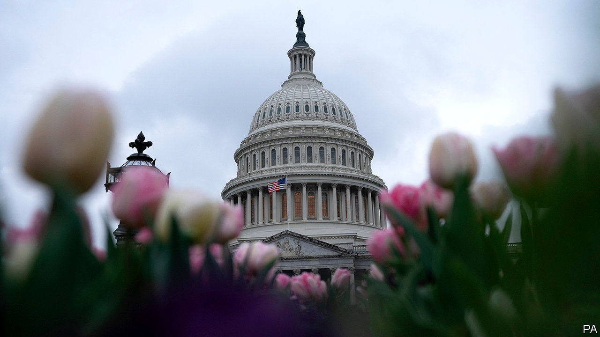
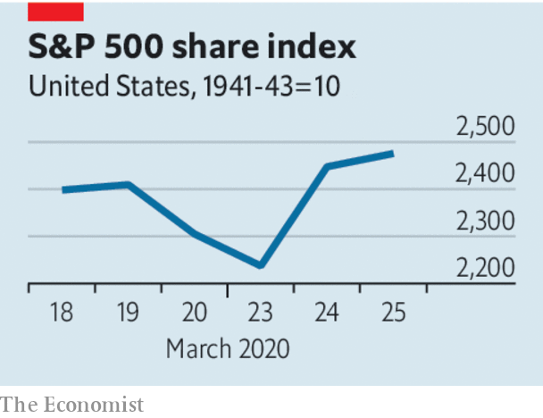

## The medicine tastes bad

# America’s emergency stimulus is imperfect but necessary

> Like past rescue packages, this one could leave a lingering sense of unfairness

> Mar 26th 2020

Editor’s note: The Economist is making some of its most important coverage of the covid-19 pandemic freely available to readers of The Economist Today, our daily newsletter. To receive it, register [here](https://www.economist.com//newslettersignup). For more coverage, see our coronavirus [hub](https://www.economist.com//coronavirus)

NO TEXTBOOK WAS ever written to tell economists what to do in the face of the extraordinary economic hiatus caused by covid-19. Yet as they consider the deserted malls, abandoned offices and billions of lives on hold, the overarching responsibilities of economic policymakers are clear. First, they must protect the incomes of those who cannot work during lockdowns through no fault of their own. Second, they must make sure that growth bounces back fast when daily life resumes.

The enormous emergency spending bill due to be passed by America’s Congress—which will cost the taxpayer about $2trn (10% of GDP) up front and support much more in new lending—goes some way to discharging both duties. It beefs up unemployment benefits, provides emergency loans and grants to small businesses, and gives $1,200 unconditionally to most Americans. When combined with the ultra-loose monetary policy of the Federal Reserve, which this week announced that it would buy government and mortgage debt in unlimited quantities, the fiscal boost will underpin growth once lockdowns are lifted. America now stands in contrast to some other parts of the world, such as the euro area, where markets expect a prolonged disinflationary slump (see [article](https://www.economist.com//finance-and-economics/2020/03/26/the-ecb-breaks-its-self-imposed-rules)).

But the bill also brings dangers. Markets cheered it not just because of its likely effect on growth, but also because it directly benefits investors. Large firms will have access to cheap taxpayer-financed loans on an unprecedented scale. The Fed had already announced, on March 23rd, that it would buy companies’ short-term debt. Congress is now giving the central bank a capital infusion to support vast direct lending to corporate America. Emergency interventions like these shift the costs of the crisis away from investors and towards taxpayers (see [article](https://www.economist.com//finance-and-economics/2020/03/25/how-to-pay-for-the-pandemic)).

That is partly necessary, because letting a large number of big firms go bankrupt could prove so disruptive that it would worsen the crisis. And investors are not completely undeserving beneficiaries. No firm could have been expected to stockpile cash to pay workers to do nothing in the event of a government-enforced lockdown. The real potential unfairness in the stimulus is that aid to large firms is the part of the rescue package that is most likely to work without a hitch. Sophisticated corporations will have no trouble borrowing from the Fed or from backstopped capital markets, even as they lay off some workers (prohibited only “to the extent practicable”). But aid to small firms, and directly to the jobless, may turn out to be less than comprehensive.

Small businesses employ 52% of private-sector workers. Half have a cash buffer of less than one month, by one estimate. The bill starts a new programme to lend to them directly. The part of any government loan used to pay wages, utility costs, rent or mortgages will be forgiven—except if firms lay off workers, in which case the subsidy will be reduced in proportion to the number of jobs lost. This scheme is more complex than those in some European countries, under which governments are paying most of the wages of suspended workers. It is hard to imagine that its administration will be quick and efficient. And some analysts think the pot of money on offer is too small (see [article](https://www.economist.com//united-states/2020/03/26/congress-puts-aside-its-habitual-dysfunction-and-responds-to-covid-19)). Those most adept at navigating the bureaucracy may get most of the benefit.

Cash handouts to the public are simple enough. But $1,200 is not much help for a laid-off worker. The jobless will rely on the bill’s temporary expansion of unemployment insurance benefits by $600 per week. Yet America cannot construct an adequate social safety-net overnight. For example, 8.5% of Americans lack health insurance. Some workers who are laid off will join their ranks just as they face a heightened risk of falling ill.

Make no mistake: we would vote for the bill, most of which is urgent and necessary. But it is far from perfect. And just like past emergency stimulus, it could work better for big firms than for anyone else, leaving a lingering sense of injustice. ■

Dig deeper:For our latest coverage of the covid-19 pandemic, register for The Economist Today, our daily [newsletter](https://www.economist.com//newslettersignup), or visit our [coronavirus hub](https://www.economist.com//coronavirus)

## URL

https://www.economist.com/leaders/2020/03/26/americas-emergency-stimulus-is-imperfect-but-necessary
