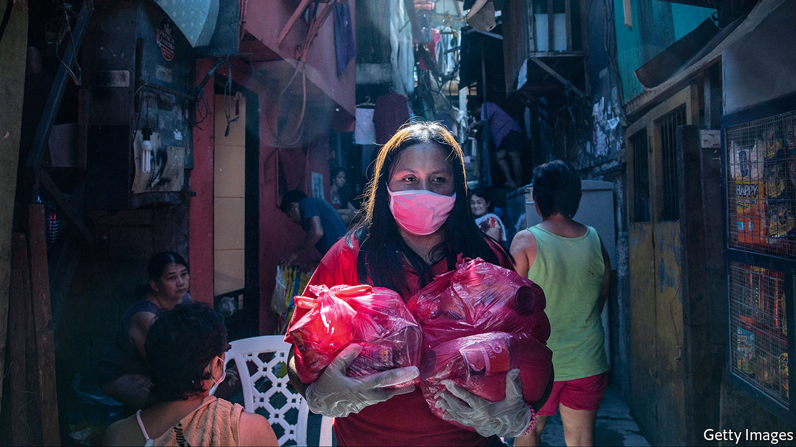

## The next calamity

# The coronavirus could devastate poor countries

> It is in the rich world’s self-interest to help

> Mar 26th 2020

Editor’s note: The Economist is making some of its most important coverage of the covid-19 pandemic freely available to readers of The Economist Today, our daily newsletter. To receive it, register [here](https://www.economist.com//newslettersignup). For more coverage, see our coronavirus [hub](https://www.economist.com//coronavirus)

THE NEW coronavirus is causing havoc in rich countries. Often overlooked is the damage it will cause in poor ones, which could be even worse. Official data do not begin to tell the story. As of March 25th Africa had reported only 2,800 infections so far; India, only 650. But the virus is in nearly every country and will surely spread. There is no vaccine. There is no cure. A very rough guess is that, without a campaign of social distancing, between 25% and 80% of a typical population will be infected. Of these, perhaps 4.4% will be seriously sick and a third of those will need intensive care. For poor places, this implies calamity.

Social distancing is practically impossible if you live in a crowded slum. Hand-washing is hard if you have no running water (see [article](https://www.economist.com//middle-east-and-africa/2020/03/26/africa-is-woefully-ill-equipped-to-cope-with-covid-19)). Governments may tell people not to go out to work, but if that means their families will not eat, they will go out anyway. If prevented, they may riot.

So covid-19 could soon be all over poor countries. And their health-care systems are in no position to cope. Many cannot deal with the infectious diseases they already know, let alone a new and highly contagious one. Health spending per head in Pakistan is one two-hundredth the level in America. Uganda has more government ministers than intensive-care beds. Throughout history, the poor have been hardest-hit by pandemics. Most people who die of AIDS are African. The Spanish flu wiped out 6% of India’s entire population.

Dozens of developing countries have ordered lockdowns. India has announced a “total ban” on leaving home for 21 days (see [article](https://www.economist.com//asia/2020/03/26/india-and-pakistan-try-to-keep-a-fifth-of-humanity-at-home)). South Africa has deployed the army to help enforce one. They may slow the disease, but they are unlikely to stop it.

Many places are still in denial. Street markets in Myanmar are packed. Brazil’s populist president, Jair Bolsonaro, dismisses covid-19 as just “a sniffle” (see [article](https://www.economist.com//the-americas/2020/03/26/brazils-president-fiddles-as-a-pandemic-looms)). Some leaders are clueless. Tanzania’s president, John Magufuli, said churches should stay open because the coronavirus is “satanic” and “cannot survive in the body of Christ”. Many autocrats see covid-19 as a handy excuse to tighten their grip. Expect some to ban political rallies, postpone elections and extend surveillance over citizens’ daily lives—all to protect public health, of course.

Granted, there are some reasons for hope. Poor countries are young—the median age in Africa is under 20—and the young appear less likely to die from an infection. The poorest are very rural: two-thirds of people in countries with incomes per head below $1,000 a year live in the countryside, compared with less than a fifth in rich countries. Farmers can grow yams without breathing viral droplets on each other. The climate may help. It is possible, though far from certain, that hot weather slows the spread of covid-19. Some places have useful experience. Countries that endured Ebola learned a lot about hand-washing, contact-tracing and securing public trust.

Alas, even the good news comes with caveats. People in poor countries may be young, but they often have weak lungs or immune systems, because of malnutrition, tuberculosis or HIV. Rural folk may get the virus later, but they will probably still get it. Lockdowns will be hard to sustain unless governments can provide a generous safety-net. Firms need credit to avoid laying off staff. Informal workers need cash to tide them over. Unfortunately, poor countries do not have the financial muscle to provide these things, and covid-19 has just made it much harder.

Demand has collapsed for the commodities on which many emerging markets depend, from crude oil to fresh flowers. Tourism has tanked. No one wants to visit the Masai Mara or Machu Picchu just now. Foreign investors have pulled $83bn from emerging markets since the start of the crisis, the largest capital outflow ever recorded, says the Institute of International Finance, a trade group. Remittances, usually a safety-net in hard times, may tumble as migrants in rich countries lose their jobs.

Many poor and middle-income countries face a balance-of-payments crisis and a collapse in government revenues as they need to raise health-related spending and imports (to reduce the death toll) and welfare (so that workers can isolate themselves without running out of money). Whereas governments in rich countries can borrow cheaply in a crisis as investors flock to safety, poor countries see their borrowing costs soar. The trade-off between saving lives and saving livelihoods is excruciating. The worry, as Imran Khan, Pakistan’s prime minister says, is that “if we shut down the cities...we will save [people] from corona at one end, but they will die from hunger.”

Far from helping, many better-off countries have taken a nationalist turn. Some places, such as the EU, are restricting the export of medical kit. That goes against the values they profess to hold. Other countries, such as Kazakhstan, are curbing exports of food, which is not in short supply. If global trade is gummed up, the economic damage will be far greater. For poor countries that rely on imported food, it could be deadly.

Since so much remains unknown about covid-19, any response must be based on imperfect information. But some things are both urgent and obvious. Governments in poor countries, as elsewhere, should supply people with timely, accurate information, by any means practical. No cover-ups, no internet shut-downs, no arresting of those who share unwelcome news.

The rich world, meanwhile, should help the poor world swiftly and copiously. The IMF says it is ready to deploy its $1trn lending capacity. Much more may be needed. As The Economist went to press, the G20 was about to set out a plan. It should be generous. Some of those vast rich-world bail-out pots should be used to cushion the suffering of the global south. China is winning influence with high-profile deliveries of medical equipment. Poor countries will remember who helped them.

As past campaigns against malaria and HIV showed, it takes a co-ordinated global effort to roll back a global scourge. It is too late to avoid a large number of deaths, but not too late to avert catastrophe. And it is in rich countries’ interests to think globally as well as locally. If covid-19 is left to ravage the emerging world, it will soon spread back to the rich one. ■

Dig deeper:For our latest coverage of the covid-19 pandemic, register for The Economist Today, our daily [newsletter](https://www.economist.com//newslettersignup), or visit our [coronavirus hub](https://www.economist.com//coronavirus)