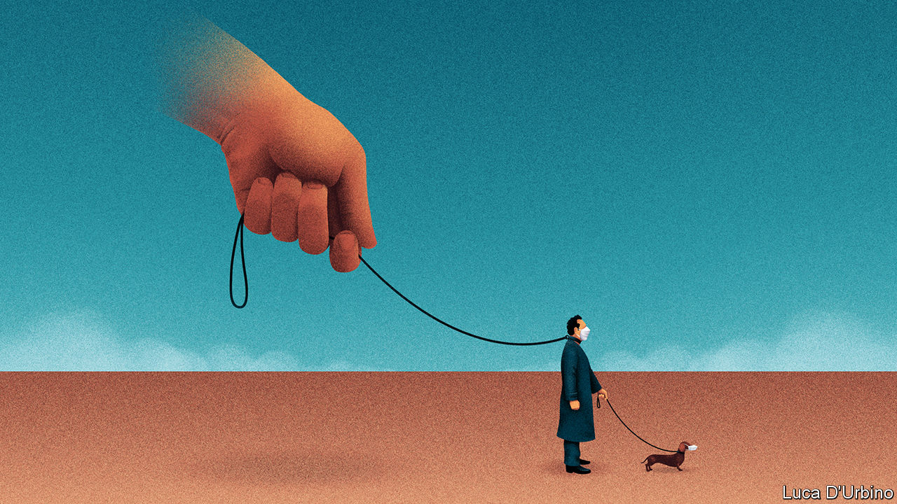

## Everything’s under control

# The state in the time of covid-19

> Big government is needed to fight the pandemic. What matters is how it shrinks back again afterwards

> Mar 26th 2020

Editor’s note: The Economist is making some of its most important coverage of the covid-19 pandemic freely available to readers of The Economist Today, our daily newsletter. To receive it, register [here](https://www.economist.com//newslettersignup). For more coverage, see our coronavirus [hub](https://www.economist.com//coronavirus)

IN JUST A few weeks a virus a ten-thousandth of a millimetre in diameter has transformed Western democracies. States have shut down businesses and sealed people indoors. They have promised trillions of dollars to keep the economy on life support. If South Korea and Singapore are a guide, medical and electronic privacy are about to be cast aside. It is the most dramatic extension of state power since the second world war.

One taboo after another has been broken. Not just in the threat of fines or prison for ordinary people doing ordinary things, but also in the size and scope of the government’s role in the economy. In America Congress is poised to pass a package worth almost $2trn, 10% of GDP, twice what was promised in 2007-09. Credit guarantees by Britain, France and other countries are worth 15% of GDP. Central banks are printing money and using it to buy assets they used to spurn. For a while, at least, governments are seeking to ban bankruptcy.

For believers in limited government and open markets, covid-19 poses a problem. The state must act decisively. But history suggests that after crises the state does not give up all the ground it has taken. Today that has implications not just for the economy, but also for the surveillance of individuals.

It is no accident that the state grows during crises. Governments might have stumbled in the pandemic, but they alone can coerce and mobilise vast resources rapidly. Today they are needed to enforce business closures and isolation to stop the virus. Only they can help offset the resulting economic collapse. In America and the euro area GDP could drop by 5-10% year-on-year, perhaps more.

One reason the state’s role has changed so rapidly is that covid-19 spreads like wildfire. In less than four months it has gone from a market in Wuhan to almost every country in the world. The past week logged 253,000 new cases. People are scared of the example of Italy, where almost 74,000 recorded cases have overwhelmed a world-class health system, leading to over 7,500 deaths.

That fear is the other reason for rapid change. When Britain’s government tried to hang back so as to minimise state interference, it was accused of doing too little, too late. France, by contrast, passed a law this week giving the government the power not just to control people’s movements, but also to manage prices and requisition goods. During the crisis its president, Emmanuel Macron, has seen his approval ratings soar.

In most of the world the state has so far responded to covid-19 with a mix of coercion and economic heft. As the pandemic proceeds, it is also likely to exploit its unique power to monitor people using their data (see [article](https://www.economist.com//briefing/2020/03/26/countries-are-using-apps-and-data-networks-to-keep-tabs-on-the-pandemic)). Hong Kong uses apps on phones that show where you are in order to enforce quarantines. China has a passporting system to record who is safe to be out. Phone data help modellers predict the spread of the disease. And if a government suppresses covid-19, as China has, it will need to prevent a second wave among the many who are still susceptible, by pouncing on every new cluster. South Korea says that automatically tracing the contacts of fresh infections, using mobile technology, gets results in ten minutes instead of 24 hours.

This vast increase in state power has taken place with almost no time for debate. Some will reassure themselves that it is just temporary and that it will leave almost no mark, as with Spanish flu a century ago. However, the scale of the response makes covid-19 more like a war or the Depression. And here the record suggests that crises lead to a permanently bigger state with many more powers and responsibilities and the taxes to pay for them. The welfare state, income tax, nationalisation, all grew out of conflict and crisis (see [article](https://www.economist.com//briefing/2020/03/26/rich-countries-try-radical-economic-policies-to-counter-covid-19)).

As that list suggests, some of today’s changes will be desirable. It would be good if governments were better prepared for the next pandemic; so, too, if they invested in public health, including in America, where reform is badly needed. Some countries need decent sick pay.

Other changes may be less clear-cut, but will be hard to undo because they were backed by powerful constituencies even before the pandemic. One example is the further unpicking of the euro-zone pact that is supposed to impose discipline on the member-states’ borrowing. Likewise, Britain has taken its railways under state control—a step that is supposed to be temporary but which may never be retracted.

More worrying is the spread of bad habits. Governments may retreat into autarky. Some fear running out of the ingredients for medicines, many of which are made in China. Russia has imposed a temporary ban on exporting grain. Industrialists and politicians have lost trust in supply chains. It is but a small step from there to long-term state support for the national champions that will have just been bailed out by taxpayers. Trade’s prospects are already dim (see [article](https://www.economist.com//finance-and-economics/2020/03/26/if-you-thought-the-trade-war-was-bad-for-global-commerce)); all this would further cloud them—and the recovery. And in the long term, a vast and lasting expansion of the state together with dramatically higher public debt (see [article](https://www.economist.com//finance-and-economics/2020/03/25/how-to-pay-for-the-pandemic)) is likely to lead to a lumbering, less dynamic kind of capitalism.

But that is not the biggest problem. The greater worries lie elsewhere, in the abuse of office and the threats to freedom. Some politicians are already making power grabs, as in Hungary, where the government is seeking an indefinite state of emergency. Israel’s prime minister, Binyamin Netanyahu, appears to see the crisis as a chance to evade a trial for corruption.

The most worrying is the dissemination of intrusive surveillance. Invasive data collection and processing will spread because it offers a real edge in managing the disease. But they also require the state to have routine access to citizens’ medical and electronic records. The temptation will be to use surveillance after the pandemic, much as anti-terror legislation was extended after 9/11. This might start with tracing TB cases or drug dealers. Nobody knows where it would end, especially if, having dealt with covid-19, surveillance-mad China is seen as a model.

Surveillance may well be needed to cope with covid-19. Rules with sunset clauses and scrutiny built in can help stop it at that. But the main defence against the overmighty state, in tech and the economy, will be citizens themselves. They must remember that a pandemic government is not fit for everyday life. ■

Dig deeper:For our latest coverage of the covid-19 pandemic, register for The Economist Today, our daily [newsletter](https://www.economist.com//newslettersignup), or visit our [coronavirus hub](https://www.economist.com//coronavirus)

## URL

https://www.economist.com/leaders/2020/03/26/the-state-in-the-time-of-covid-19
