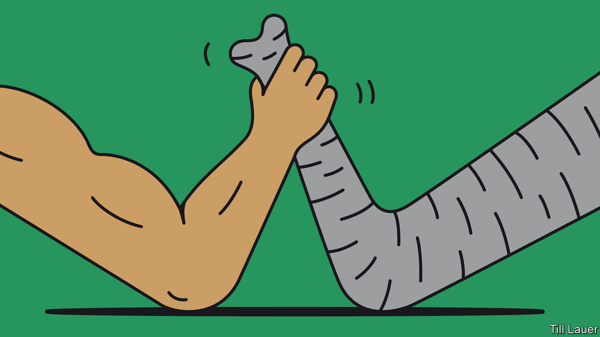

## On Taiwan, Myanmar, primaries, elephants, Freeman Dyson, congenital diseases, house names

# Letters to the editor

> A selection of correspondence

> Mar 26th 2020

Countries are indeed struggling to cope with covid-19 (“[The politics of pandemics](https://www.economist.com//leaders/2020/03/12/the-politics-of-pandemics)”, March 14th). But China’s approach is not the only way to suppress its spread. Taiwan has relatively few cases of the disease. Learning harsh lessons from the SARS crisis in 2003, the government of Taiwan acted swiftly and established a central command centre in order to respond to the outbreak. Taiwan’s health minister held press conferences almost every day to provide updates and information. Tests on travellers from Wuhan, the Chinese city where the outbreak started, began in December, one month ahead of China. Technology using big-data analysis was applied for intensive health monitoring.

Despite being excluded from participating in the World Health Organisation because of pressure from China, Taiwan sent an early warning to the international health body about the risk of transmission of the coronavirus between humans at the end of December. However, the warning was not shared with other countries by the WHO because of its relationship with China. That error ultimately delayed the global response to the pandemic. The politics of pandemics, which exists inside the WHO as well as between states, should be unacceptable to any country that cares about public health.

The Chinese propaganda machine is trying to convince the world that its draconian response to the coronavirus is the only way to combat its spread; other countries are following its lead. Taiwan proves that democracies can successfully fight the virus without an authoritarian response. Given the nature of China’s autocratic system, Taiwan should serve as a better democratic model for managing pandemics.

DAVID LINTaipei Representative Office in the United KingdomLondon

You provided good context for the recent failure by civilian lawmakers to limit the generals’ power in Myanmar (“[Making war and law](https://www.economist.com//asia/2020/03/12/myanmars-army-blocks-constitutional-reforms)”, March 14th). Since 1962 the armed forces have determined to control power in perpetuity, which they have accomplished through rule by decree (1962-74, 1988-2011), a single-party socialist system controlled by the army (1974-88), and, since the manipulated elections in 2010, through a constitution which the generals dictate and cannot be altered without their approval. Yet this continuous military control was not only based on command of all forces of coercion, but, until recently, all avenues of social mobility (a contrast with all other armies in Asia with no such pervasive power). That has now gradually broken down through political, economic, educational and civil advances. Military control will probably ebb, though slowly and in relation to assurances of the unity of the state and the army’s autonomy from civilian political restraints. But the local elections of 2020 will not change that trajectory.

DAVID STEINBERGProfessor emeritus of Asian studies at Georgetown UniversityBethesda, Maryland

[Lexington ](https://www.economist.com//united-states/2020/02/29/the-primary-problem)was right to point out that our primary system poorly reflects the public interest (February 29th). The column referred to a paper by the Brookings Institution, which says that “party organisations need to find ways to reassert more control over their candidate selection processes before candidates reach the primary ballot.”

The error is in the way we vote. When only a single vote is allowed, moderates split their votes and radicals win. There are several better options, such as “approval voting”, which was recently implemented in Fargo, North Dakota, and will soon be on the ballot in St Louis. It favours consensus and increases the quality of candidates by not being vulnerable to vote splitting. Americans should try several different local methods, so that we can ultimately replace the current silly national system.

FELIX SARGENTChairBoard of directorsCentre for Election ScienceOakland, California

Conflict between humans and elephants remains a problem in many parts of the world, including Sri Lanka ([Banyan](https://www.economist.com//asia/2020/02/27/of-all-sri-lankas-conflicts-the-one-with-elephants-is-the-oldest), February 29th). There is a very simple and cost-effective natural solution: beehive fences. Elephants are terrified of bees and will flee at even the sound of them. Beehive fences involve wires strung between hives; if elephants walk through the wires they irritate the bees, which swarm out and chase them away. Lucy King developed the concept and it is now used widely in east Africa (see her recent TED talk). Not only is it an effective deterrent, farmers can also make money from selling honey.

RICHARD MILBURNKing’s College London

In this particular moment of crisis, Freeman Dyson’s ideas on the origin of life are of particular interest ([Obituary](https://www.economist.com//obituary/2020/03/12/freeman-dyson-died-on-february-28th), March 14th). In a humble “not scientific theory”, Dyson proposed that RNA, the information engine of viruses, was at the origin of cells’ DNA. With time, the RNA and the cells learned how to collaborate and “grew gradually into a harmonious unity”. Dyson was a supporter of the idea that symbiosis, or collaboration, is among the driving forces behind evolution in cells as much as in societies. He answered an unsolicited email I sent him last January with kind words: “At age 96, I am lucky to be still smart enough to know that I am not as smart as I used to be.” Kindness and humbleness often go together. He was still one of the smartest people on the planet when he wrote those words.

MARIO ALEMIMilan

Your piece on curing rare genetic diseases with targeted therapies showed what can be done with analysis of our DNA (“[Broken](https://www.economist.com//technology-quarterly/2020/03/12/congenital-diseases-reveal-a-lot-about-human-biology)”, March 14th). Unfortunately its subheading was “Congenital disease”. Congenital means originating from the time of birth and covers genetic and non-genetic defects, like my own congenital anosmia. I don’t intend to have my gene analysed in order to be able to smell.

PETER TOMPKINSLondon

I was amused to read your piece on British house names (“[Dun Namin](https://www.economist.com//britain/2020/03/12/why-britons-house-names-reflect-their-class-anxieties)’”, March 14th). Some of us did not have a choice. When we moved to our house 16 years ago there were numbers on the opposite side of the road but not ours, so we had to choose a name. Haslemere incidentally is a postman’s hell for two reasons: a very high number of named houses and many steep hills.

JOCK GARDNERHaslemere, Surrey

There is a sixth category of house names: the professions. My uncle, a pharmacist, called his house Nux Vomica.

KEITH HUNTERLondon

When I dealt with retired personnel in the Royal Air Force an inordinate number of them named their home Llamedos. Eventually, I realised the connection to Dylan Thomas’s Llareggub, “bugger all”.

CLIVE RAINBOWSpeen, Berkshire