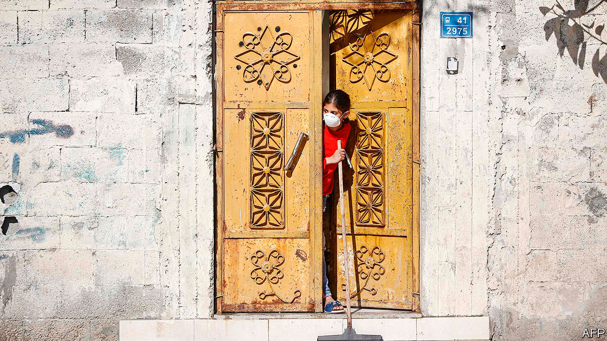

## A double lockdown

# Gaza, already under siege, imposes quarantine

> Residents respond with dark humour

> Mar 26th 2020BEIRUT

Editor’s note: The Economist is making some of its most important coverage of the covid-19 pandemic freely available to readers of The Economist Today, our daily newsletter. To receive it, register [here](https://www.economist.com//newslettersignup). For more coverage, see our coronavirus [hub](https://www.economist.com//coronavirus)

AS BORDERS CLOSE, businesses shut and much of the world adjusts to being locked down, residents of Gaza can only look on with grim amusement. Isolation is nothing new for the territory’s 2m Palestinians. They have been under blockade since 2007, when Hamas, a militant group, seized power after winning a majority in legislative elections. Israel and Egypt have largely cut off the movement of goods and people in and out of Gaza.

It is not a total lockdown: Gazans are free to move about their sliver of land, which measures 365 square kilometres (140 square miles). But few can venture any farther. Last year, on average, just 740 people were able to leave Gaza each day.

“Fourteen days of isolation? Welcome to our last 14 years,” goes one joke making the rounds on messaging apps. An unemployed graduate, desperate to emigrate, quips that his Palestinian passport is at last worth the same as a European one. Another laughs at videos of Westerners panic-buying the wrong goods—perishable food, incomprehensible amounts of toilet roll—and jokes about starting an online course to teach proper stockpiling.

As the virus swept through Israel and the occupied West Bank, though, the restrictions turned Gaza into a reverse cordon sanitaire. Residents wondered, with a sort of bitter optimism, whether their plight would spare them from a crisis that has paralysed much of the world.

No longer. On March 21st the health ministry announced the territory’s first two cases of covid-19. The patients had returned two days earlier from Pakistan, via the Rafah crossing with Egypt. Days later another seven cases were confirmed, all members of the security forces who had met the returnees. Officials said all the patients were isolated. Still, they took no chances. Restaurants and cafés have been closed and Friday prayers cancelled.

An outbreak would be catastrophic. Gaza is one of the world’s most densely populated places. The health-care system, shattered by the long blockade, would be unable to cope. Even in normal times, basic items like antibiotics are often in short supply. The territory has just 62 ventilators, or three for every 100,000 people. At least a quarter of them are already in use. Beds in intensive-care wards are similarly scarce. So are doctors, because scores of them have emigrated recently.

The virus has begun to pop up in other ravaged corners of the Middle East as well. For weeks Syria insisted that it had been spared the scourge of covid-19. Few Syrians believed this, given the number of people travelling back and forth to Iran, home to one of the world’s worst outbreaks. But on March 22nd the government logged the country’s first official case. It stopped public transport and imposed a curfew. Worse still would be an epidemic in Idlib, the last big rebel-held pocket, where 3m people live in dire conditions. Libya announced its first case of covid-19 on March 24th.

These countries may never know the full extent of their outbreaks. Doctors in Gaza say they received only about 200 kits to test for the virus. Most have already been used. They are pleading with Israel and the WHO to send more, but it is unclear when, or if, they will. More than 1,400 people, many of them recently returned from abroad, have been crammed into schools turned makeshift isolation centres, sleeping six or eight to a classroom—a quarantine within an open-air jail. ■

Dig deeper:For our latest coverage of the covid-19 pandemic, register for The Economist Today, our daily [newsletter](https://www.economist.com//newslettersignup), or visit our [coronavirus hub](https://www.economist.com//coronavirus)

## URL

https://www.economist.com/middle-east-and-africa/2020/03/26/gaza-already-under-siege-imposes-quarantine
