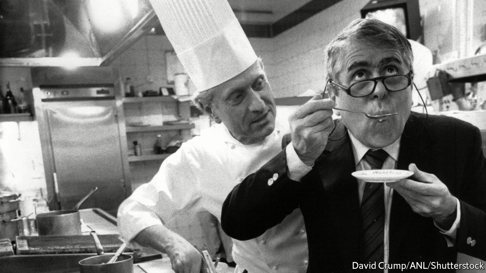

## Cooking with Albert

# Michel Roux died on March 11th

> The chef and restaurateur who, with his brother, transformed British dining was 78

> Mar 26th 2020

THE SIGHT was so awful that Michel Roux, then only in his 20s and new to London, quickly turned his face away. Through the window of the Lyons Corner House near Marble Arch he could see people eating British peas. The peas were fluorescent, big as quails’ eggs. And there was worse: on each side-plate a piece of sliced bread, limp as a handkerchief and bleached frighteningly white. He realised then that he had come to a land that was still in the culinary Dark Ages. And it was all Albert’s fault.

His older brother had persuaded him to come. He had been working as a chef in London for eight years, and now had plans. Those eventually led to the founding of two restaurants, Le Gavroche in Chelsea and the Waterside Inn at Bray in Berkshire, which transformed fine dining and the whole food scene in Britain. Each venue earned three Michelin stars, something the country had never experienced before. But as Michel stood aghast in the street that day, he was torn between revolutionary fervour and despair.

Despite the fact that Albert was dark, dumpy and short, and he was tall, fair and much handsomer, he had always looked up to him, so to speak. If Albert had been a fireman, he would have been a fireman too. As it was, Albert went young to be apprenticed to a pastry-chef, so at 14 he did the same. There at last he surpassed his brother, becoming so good at pastries and desserts that for many years he held the title of Best Pastrycook in France. No one could make an omelette soufflé Rothschild (succulent with apricots, perfumed with Cointreau, his tour de force when he was Cécile de Rothschild’s chef for nearly six years), the way he could. (Albert was more of a sauce man.) They bickered all the time, doing a TV cookery show later in which they flirted with filleting each other, but they made a good team; so in 1967 they bought their 90-seater restaurant in Lower Sloane Street and shook up London together.

What they offered was classic French-restaurant cuisine, short menus cooked fresh à la minute; not, as was the custom even in high-class British restaurants then, dishes reheated from frozen or cooked far in advance. Every ingredient was fresh too, often sourced from French suppliers whom they knew as friends. (Later, they ordered in almost everything from Rungis market in Paris.) As the business expanded, first with the Waterside Inn, then with two smaller restaurants in London, then with more down-market eateries that plain folk could almost afford, the same philosophy was applied to all of them, and a host of eager young British chefs were trained, some with Roux Scholarships, to run them.

All this made Michel enormously proud, yet it was hardly what he had expected. He had wavered about being a chef. With his looks and his deep voice—in his kitchen, he never needed a microphone—he might have made an opera singer. But love of food ran deep. Growing up as the son of a charcutier, he had learned whether it was Monday or Tuesday from the smell of boudin or andouillettes on the stairs; and his earliest memory was of beating up egg yolks which, as if by magic, thickened in the hot stock into sauce for his mother’s blanquette of veal. To run just one restaurant with Albert would have been good enough. And it was hard work: so hard that he was hardly ever at home, and his first wife divorced him. Though he knew almost no English, he still had to take his turn at front-of-house while Albert was manning the stove. They cooked and played host in alternate weeks, knowing well that if they tried to share service there might be blood.

Both of them came up with ideas, but his strength lay in details. Precision and patience were a pastrycook’s skills. It mattered to him, for instance, that commis waiters should not talk to the customers and that diners should wear ties (he almost refused entry to the Rolling Stones when they turned up without them). Every ingredient had its right place, too, and as each arrived he would taste it, unseasoned, to judge exactly where it might sit within a dish. When he and Albert produced cookery books, spreading the revolution to ordinary British kitchens, he, being a perfectionist, wrote the words, just as on their cookery shows he was the suave and particular main presenter. And in 1986 it made sense to split their interests, so that while his brother went bustling after new business he departed for Bray, to run the whitewashed former pub on the Thames they had opened a decade before.

There, as the Waterside Inn reinforced its reputation (and kept its stars) with quenelles de brochet and his own sublime tarte Tatin, he could make a public virtue of being classic and old-fashioned. The dining rooms were padded deep with chintz. His wine cellar was exclusively French, for he loved his bordeaux and burgundies too well to stray—going to Bordeaux every year to taste the en primeur vintage, and cultivating his own vineyard at his villa near Saint-Tropez. Nouvelle cuisine passed him by: on his menus butter featured everywhere, irreplaceable and indispensable. And bad manners never ceased to infuriate him. The new generation of celebrity chefs struck him as sadly insecure, even unbalanced, using dreadful words and treating their underlings like dirt. He himself was kind to his chefs, and his kitchen was happy. He did not need to blanch their heads in boiling water to make sure he kept them.

Had Britain really changed, then, since his arrival? He sometimes wondered. By 2020 London could boast three three-star Michelin restaurants—but Paris had ten. Britain now offered cuisines from all over the world, but too many new dishes were merely visual, picnic stuff that lacked depth. The best of British cooking was still the afternoon tea, with treacle tart and sponge cake and scones with jam and cream, which he and Albert both loved greedily and which had persuaded them, in the beginning, that there was hope to be found somewhere. But those peas, alas, were not yet right. They had to be fresh-shelled, to start with; cooked in butter, never water; and then, preferably, cut one by one in half before they could ever grace a plate. ■