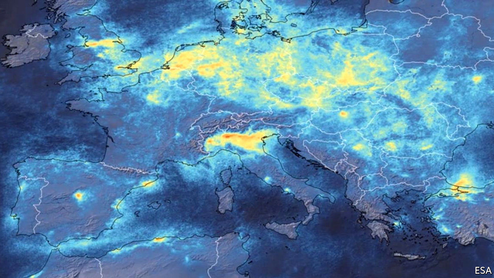

## The pandemic

# Airborne particles may be assisting the spread of SARS-CoV-2

> Reducing pollution seems to reduce the rate of infection

> Mar 26th 2020

Editor’s note: The Economist is making some of its most important coverage of the covid-19 pandemic freely available to readers of The Economist Today, our daily newsletter. To receive it, register [here](https://www.economist.com//newslettersignup). For more coverage, see our coronavirus [hub](https://www.economist.com//coronavirus)

POLLUTION AND disease have long been associated in people’s minds. The very word “malaria”, for example, means “bad air” in Italian. But the germ theory of infection, developed in the 19th century, knocked on the head the idea that it is the air itself which causes illness. Rather, bad smells indicate sources of pathogens, such as sewage, which are best avoided. A paper just published by a group of Italian researchers does, however, posit the idea that SARS-CoV-2, the virus behind the covid-19 pandemic, might be getting a helping hand from atmospheric pollution.

The paper in question, by Leonardo Setti of the University of Bologna and his colleagues, has not yet been through any process of peer review. Such early releases are, though, becoming commonplace for covid-19-related work, on the assumption that holding ideas back for bureaucratic approval might cost lives. Dr Setti and his associates found themselves wondering why (even allowing for time lags caused by its arrival in different places on different dates) SARS-CoV-2 seemed to spread much faster in Italy’s north—specifically in the wide plain that forms the valley of the Po—than in other parts of the country.

Their hypothesis is that the catalyst was pollution—specifically, small airborne particles that might carry the virus on their surfaces. These are usually far more abundant in the Po valley than elsewhere. In the paper, the researchers cite previous work from other places which suggests that influenza viruses, respiratory syncytial viruses and measles viruses can all spread by hitching lifts on such particles. And they make a good case that, allowing for a 14-day delay caused by SARS-CoV-2’s incubation period, the daily rates of new infections in the Po valley correlate closely with the level of particulate pollution.

An alternative explanation for this correlation might be that, rather than carrying the virus themselves, airborne particles increase susceptibility to infection in those who encounter the pathogen by some other means. Either way, though, a reduction in airborne-particle levels may be a second way, independent of reduced human contact, that lockdowns will help stop the virus spreading around.

Dig deeper:For our latest coverage of the covid-19 pandemic, register for The Economist Today, our daily [newsletter](https://www.economist.com//newslettersignup), or visit our [coronavirus hub](https://www.economist.com//coronavirus)

## URL

https://www.economist.com/science-and-technology/2020/03/26/airborne-particles-may-be-assisting-the-spread-of-sars-cov-2
