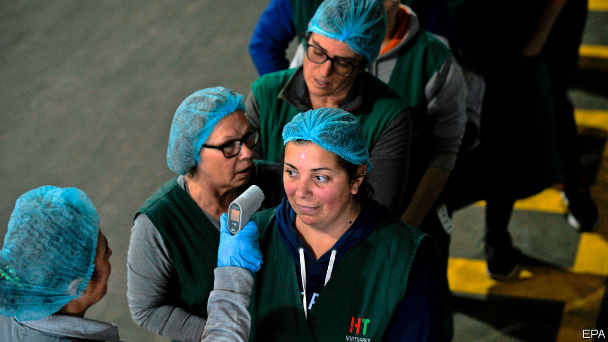

## Detecting elevated body heat

# Taking people’s temperatures can help fight the coronavirus

> And now here is the fever forecast

> Mar 26th 2020

Editor’s note: The Economist is making some of its most important coverage of the covid-19 pandemic freely available to readers of The Economist Today, our daily newsletter. To receive it, register [here](https://www.economist.com//newslettersignup). For more coverage, see our coronavirus [hub](https://www.economist.com//coronavirus)

STICKING A THERMOMETER into an armpit, mouth, ear or other body cavity is the most accurate way to take someone’s temperature. Understandably, though, this cannot be done at airports or checkpoints set up elsewhere to screen the masses for feverish victims of covid-19. So, in a bid to detect the warmth produced by a fever without touching any bodies, officials have opted for alternatives.

The hand-held “thermometer guns” now ubiquitous in China, among other places, are one option. These instruments, known technically as spot pyrometers, use a device called a bolometer to estimate an object’s temperature. A bolometer’s electrical resistance depends on how hot it is. That, in turn, depends on the amount of infrared radiation falling on it from whatever it is pointing at.

Spot pyrometers are used widely in industry to check equipment for signs of overheating, but the infrared signals they rely on can be muddled by dust, moisture, smoke, a change in ambient temperature, a smudge on the device’s lens or even by radio signals. Beyond all this, an official checking a stream of foreheads may, for reasons of personal safety, be reluctant to hold the gun close enough to obtain an accurate reading.

An alternative technology, the thermal camera, is costlier. But it can operate from farther away. Instead of a single bolometer, it has an array of them. These form the pixels which generate the camera’s image, thus building up a heat map of whatever that camera is looking at.

One popular thermal camera, the A320, made by FLIR Systems, an American firm, can detect variations in radiation which correspond to temperature differences within an image of just 0.02°C. But this merely shows whether one part of the object being examined is warmer or cooler than another. When measuring the object’s actual temperature, the A320 is accurate only to about 2°C, says Giovanni Scaglia, FLIR’s head of sales in Italy. For a single reading, this is enough to mistake normal body temperature for a raging fever. In practice, however, the camera’s software looks for deviations from the average temperature of passers-by. Those noticeably hotter than their fellows can then be selected for closer investigation.

Identifying individuals who are infected is important, in order to stop them passing the virus on. But temperature data can also be used to track the epidemic as it spreads. This is the goal of Kinsa Health, a firm in San Francisco that has sold or donated more than 1m smartphone-connected thermometers to households in America. The phones these thermometers are linked to carry an app that transmits back to base each body-temperature recording which its user makes. The app can then give simple medical advice (for example, based on age, sex and so on, does a user with a particular temperature need to see a doctor or not?) The app also provides epidemic information about the neighbourhood, including such things as how badly local schools are affected.

Using its thermometers and apps, Kinsa has built up a trove of data on past fevers in America. Besides being good for public health, this information has commercial value. One American pharmacy chain pays Kinsa for fever data in order to avoid particular stores selling out of things the feverish may wish to purchase.

In the past, Kinsa’s focus has been on influenza. But now the fear is that any elevated body temperature is the result of covid-19. On March 18th the firm began posting relevant data, duly anonymised, but more or less in real time, on a website called Health Weather. In contrast to this “nowcasting”, a government site called FluView, which is run by the Centres for Disease Control and Prevention, relies on sources like hospitals to provide it with data, and tends to lag an epidemic by about two weeks.

Once a fever kicks in, people tend to take their temperature frequently. Kinsa therefore knows a lot about how an epidemic is progressing, and how severe it is, in lots of different places around America. In the past, this has enabled it to make accurate forecasts of disease burden down to the level of individual zip codes. According to Nirav Shah of Stanford University, who advises the firm, such forecasts can look up to 20 weeks into the future for influenza.

Covid-19 is not influenza, of course, and presumably has different patterns of spread. But even before these have been worked out properly, data from Kinsa’s remote thermometers are flagging up useful warnings. As The Economist went to press, atypically high numbers of fevers had popped up in much of peninsular Florida. Time, then, for Floridians to get off the beaches and start keeping their distance from one another.■

Dig deeper:For our latest coverage of the covid-19 pandemic, register for The Economist Today, our daily [newsletter](https://www.economist.com//newslettersignup), or visit our [coronavirus hub](https://www.economist.com//coronavirus)