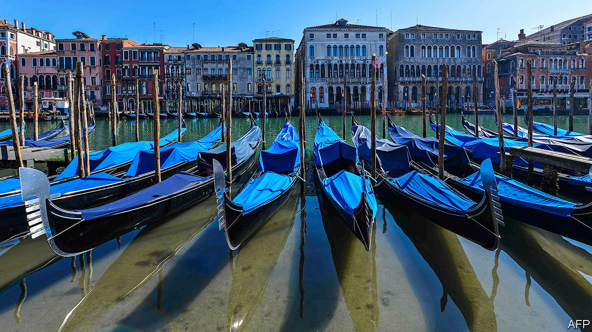
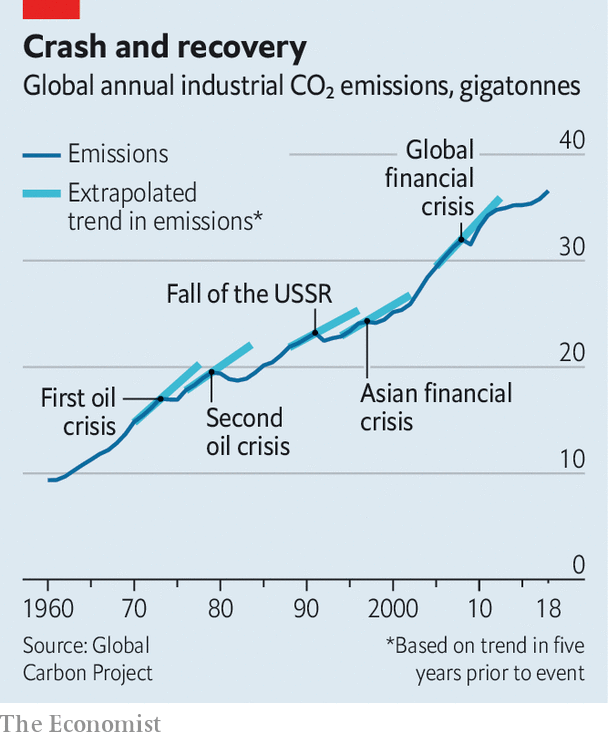

## Covid-19 and climate change

# The epidemic provides a chance to do good by the climate

> The chances are, though, that it will not be taken

> Mar 26th 2020

Editor’s note: The Economist is making some of its most important coverage of the covid-19 pandemic freely available to readers of The Economist Today, our daily newsletter. To receive it, register [here](https://www.economist.com//newslettersignup). For more coverage, see our coronavirus [hub](https://www.economist.com//coronavirus)

IN VENICE, WATER in the canals is running clear, offering glimpses of fish swimming against the current. As human activity grinds to a halt, natural rhythms resume. A similar, less visible story is being played out in the skies. Around the world, levels of toxic air pollutants are dropping as places go into lockdown in an attempt to curb the spread of SARS-CoV-2, the virus causing a pandemic of a new disease called covid-19. Emissions of greenhouse gases are following a similar pattern.

One example of pollution falling is that satellites looking down on China’s large cities have witnessed a dramatic drop since January in levels of nitrogen dioxide, a gas generated by machinery such as internal-combustion engines. This fall coincides with the imposition of a countrywide quarantine, travel restrictions, and the shutting down of power stations and factories. Nitrogen dioxide causes respiratory problems. A drop in its levels therefore brings benefits. The concentration of another pulmonary irritant—fine soot particles—was also lower in those cities, by 20-30%, in February of this year compared with levels in the previous three years.

Similar patterns have shown up elsewhere, as the virus spreads and lockdowns follow. Satellite data from Italy reveal a marked decline in nitrogen-dioxide concentrations, particularly in the Po valley, the original focus (see [article](https://www.economist.com//science-and-technology/2020/03/26/airborne-particles-may-be-assisting-the-spread-of-sars-cov-2)) of the country’s epidemic, and where Italy’s shelter-at-home rules were first imposed. South Korea also saw a drop, starting in mid-February. And in New York City, data collected by TomTom, a GPS-navigation firm, show peak-hour traffic down between 13.5% and 26%. Not surprisingly, carbon-monoxide levels in the city are half those during the corresponding period last year, according to researchers at Columbia University.

Drops like these, in pollutants that are directly harmful to human health, would be expected to be matched by falling emissions of those more-subtly harmful pollutants, the greenhouse gases produced by human activity. And the team at Columbia did indeed find that carbon-dioxide concentrations over New York have fallen. They dropped by 8-10% this month compared with March 2019. In China, meanwhile, industrial shutdowns are estimated to have caused a 25% drop in emissions of CO2 in February, compared with the same month in 2019.

An optimist might see these changes as a silver lining to what is an extremely dark cloud. But that would depend on their being sustained when things return to normal. As François Gemenne of the University of Liège, in Belgium, puts it, “the climate needs a sustained drop in greenhouse-gas emissions, not a year off”. Unfortunately, not only is that unlikely to happen, but the response to the crisis could easily make things worse.

The short-term amelioration of CO2 emission is likely to be real. On March 16th Glen Peters of Norway’s Centre for International Climate Research published estimates suggesting that if, as forecast by the Organisation for Economic Co-operation and Development (OECD) at the beginning of the month, the world’s GDP were to grow by 1.5% this year (a halving of its pre-pandemic estimate), this would lead to a 1.2% decline in carbon-dioxide emissions. This decline, even though the economy would still be growing, would be because of the increasing carbon-efficiency of economic activity. Since then, the prospects for the global economy have worsened considerably. Most forecasters now expect world GDP to shrink this year, and some predict a contraction of fully 4%—twice the decline seen after the global financial crisis of 2007-09. That will make the fall in emissions even bigger.

But not, perhaps, for long. In 2009, worldwide CO2 emissions from fossil fuels and cement production dropped by 1.4%. A year later, however, they were growing again by 5.8-5.9%—faster than they had done since 2003. By the end of 2010, annual emissions were greater than they had ever been (see chart). Overall, therefore, the financial crisis made little difference to the quantity of CO2 in the atmosphere.

Subsequent analysis has shown that the rise of emissions after the crisis of 2008 was caused especially by rapid growth in certain large emerging economies, notably those of China and India. Low fossil-fuel prices were part of the cause. But there were also stimulus packages deliberately intended to promote carbon-intensive areas of business, such as construction.

Sadly, there are signs of a similar pattern of environmentally inappropriate stimuli happening now. Canada, for instance, is preparing a multibillion-dollar bail-out for its oil and gas industry. Airlines are clamouring for help, too. Several Chinese provinces have announced plans to go on a 25trn yuan ($3.5trn) construction-spending spree. And other ideas that have been floated in China include vouchers to encourage people to buy cars.

Meanwhile, an analysis by BloombergNEF, a clean-energy-research firm, finds that solar power may take a hit, as governments preoccupied with fighting the virus postpone decisions to commission new plants and to agree on targets for the growth of renewable energy. China, indeed, has already deferred an auction for the right to build several huge solar farms. As a result, BloombergNEF suggests, for the first time in decades the amount of solar-energy capacity installed this year could be lower than that in the previous one.

There is also the question of what happens to COP26, the 2020 United Nations Climate Change Conference which is supposed to be held in Glasgow, in November. This was meant to be a moment for the world’s governments to come forward with their most ambitious plans yet to address the problem of rising greenhouse-gas emissions—the first summit of such moment since the one held in Paris in 2015, which agreed to limit global warming to 1.5-2°C above pre-industrial levels. British ministers and UN officials are now discussing whether to shift the meeting into the early months of 2021.

In the shorter term, the focus is on what will happen to an important preparatory meeting scheduled to take place in Bonn, in June. To get agreement at COP26 was already going to be challenging, even without a global pandemic to detract political minds and resolve. Delaying the meeting in Bonn will make things worse.

There are a few accidental consequences of the epidemic, though, that may have long-term effects which greens would see as positive. One concerns everybody’s favourite environmental whipping boy, the airline industry. Before the crisis, this industry agreed to the launch next year of a scheme called CORSIA, which has the goal of maintaining net global emissions from aeroplanes at the annualised average of the two years 2019 and 2020. Emissions beyond this average would have to be offset by such things as tree-planting projects and schemes to capture methane from landfill sites. Clearly, emissions by airlines in 2020 are going to be abnormally low, which will, if the rules are followed, lower the threshold above which these offsets would be invoked. Whether that happens in practice will depend, though, on whether airlines are willing to continue to be bound to something rather different from what they originally thought they were signing up to.

Ultimately, the outcome of covid-19 for the climate will depend on two unknowns. One is how long the pandemic lasts—something over which politicians have some control, but certainly not as much as they would like. The other is how governments choose to pull their economies out of the hole now being created, which is entirely a matter of politics.

The lazy way, the easy way, to boost countries’ economies in response to the virus would be for governments to throw money at established versions of big industries like energy, transport and construction. They could, though, if they chose to do so, spend the cash instead on encouraging climate-friendly versions of these industries: more solar energy (or even, heaven forfend, nuclear power) instead of bungs to oil and gas; more batteries for cars, and money for research into hydrogen-powered fuel cells; cash prizes for ways of making steel and cement without releasing CO2; and so on.

Fatih Birol, head of the International Energy Agency, an intergovernmental organisation that operates under the aegis of the OECD, has already put out a plea for green stimuli of this sort. Similar calls, though, were made in 2008 and 2009. They fell on deaf ears. Perhaps this time around it will be different.■

Dig deeper:For our latest coverage of the covid-19 pandemic, register for The Economist Today, our daily [newsletter](https://www.economist.com//newslettersignup), or visit our [coronavirus hub](https://www.economist.com//coronavirus)