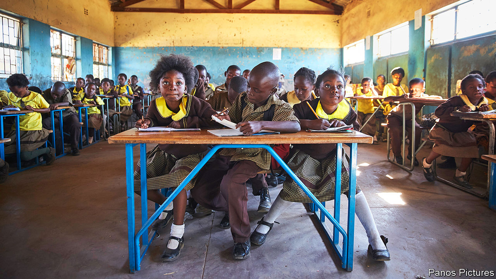
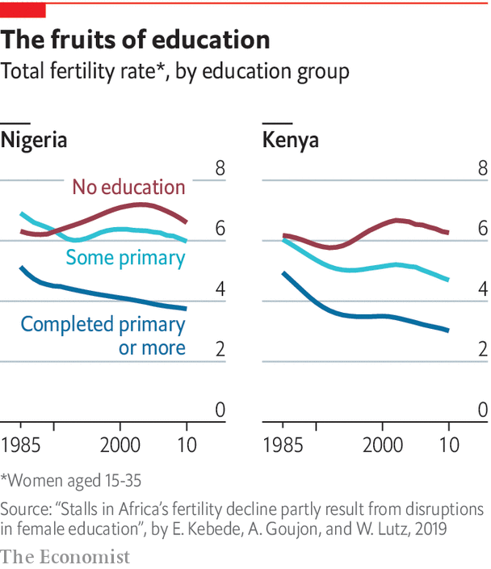

## Demography

# Africa’s population will double by 2050

> But the education of more African girls means it might peak sooner than most people expect

> Mar 26th 2020

BY 2050, NIGERIA is forecast to have 400m people, meaning it will overtake the United States as the world’s third-most-populous country. The starkness of this fact (its population is currently about 200m) illustrates the degree to which demography will shape Africa’s future. Nigeria’s growth is part of an extraordinary population surge across the continent, but there is controversy about whether it will continue or can be reined in. The answer to that question has serious economic and political implications.

Sub-Saharan Africa’s population is growing at 2.7% a year, which is more than twice as fast as South Asia (1.2%) and Latin America (0.9%). That means Africa is adding the population of France (or Thailand) every two years. Although Asia’s population is four times bigger, almost two children are born each year in Africa for every three in Asia. Most experts agree that, if it continues at its current growth rate, like Nigeria, Africa’s population will double by 2050. That would be 2.5bn people, meaning more than a quarter of the world’s people would be in Africa. Few question those figures because much of the growth is already baked into what demographers term “population momentum”—that is, Africa has so many women of childbearing age that even if most decided to have fewer babies today, the population would keep expanding.

As a result, some doomsayers are dusting off the theories of Thomas Malthus, who argued in 1798 that a growing human population would starve because it would outstrip the supply of food. Among these is Malcolm Potts, a professor at the University of California, Berkeley, who argued in a paper in 2013 that “the Sahel could become the first part of planet Earth that suffers large-scale starvation and escalating conflict as a growing human population outruns diminishing natural resources.”

Yet demographic forecasts of coming decades diverge in a way that could be crucial. The UN expects Africa’s population to double again between 2050 and 2100, to 4.3bn people, or 39% of the world’s total and that fertility rates (the average number of children that women will have over their lives) will fall slowly. It reckons that the rate, which has dropped to about 4.4 from 6.7 in 1980, will take another 30 years to fall below three. But that underestimates the impact of a big jump in the number of girls who are now going to school across large parts of the continent, argues Wolfgang Lutz, a demographer at the International Institute for Applied Systems Analysis near Vienna. It also highlights the urgency of getting even more of them into school.

In the 1970s little more than half of children in sub-Saharan Africa were enrolled in primary school. That share has shot up to almost 100%. The statistic is slightly misleading, since the percentage of children regularly attending schools is lower, though improving. In Ethiopia, for instance, primary-school enrolment has risen to 100% from 65% in 2003, though attendance only stands at 61%. This matters because few things have a stronger influence over fertility rates than education. African women with no formal education have, on average, six or more children. This falls to about four for women who have finished primary school and to about two for those who have finished secondary school.

There is, however, a 20-year lag between changes in education and changes in fertility, so improvements in schooling since the early 2000s are only beginning to be seen (see chart). The change, when it comes, though, may be quick. In Iran women went from having seven children each to fewer than two between the early 1980s and 2006 after a big rise in female education.

If African countries were rapidly to expand their provision of schooling for girls the continent’s total population might peak around 1.9bn in 2070 before falling to below 1.8bn by the end of the century, according to Mr Lutz.

There are many more reasons to invest in schools than simply to tame population growth. Educated youngsters are more likely to want democratic government, and to reject alternatives such as one-party rule than their uneducated peers. This growing demand for democracy among the young is evident across the continent, whether in the peaceful protests that toppled Omar al-Bashir, the long-standing dictator of Sudan, or that have pushed Ethiopia to abandon one-party rule. Marion Kirabo, a 23-year-old law student in Uganda, helped lead protests against a proposed increase in tuition fees at Makerere University in Kampala last year. The police fired tear gas then hauled them off to a prison cell. “We think we are a different brand,” she says. “We are informed, we are more liberal.”

Falling birth rates, when accompanied by rising literacy, can help kick-start growth, too. Economists reckon that up to a third of East Asia’s economic miracle can be attributed to its “demographic dividend”, or improvement in the ratio between the number of working-age people and that of children and pensioners. Lower fertility can also start a virtuous cycle in which families with fewer children can invest more in educating them and are also able to put aside more in savings. This can have wider economic impacts through lowering the cost of capital.

Morocco, which has one of the lower fertility rates in Africa at 2.4, also has one of the highest rates of saving. Because of this the government is able to borrow at interest rates of 2.25% a year. Nigeria has a fertility rate twice Morocco’s and its national savings as a share of GDP are half the level of Morocco’s.

Nigeria has to pay 13% when issuing local-currency bonds. “What marks China, Mauritius or Morocco apart from Kenya, DR Congo, Nigeria and Zambia, is the fertility rate,” says Charlie Robertson of Renaissance Capital, an investment bank. “The former have fewer children and high savings. The latter have many children, low savings, and high interest rates.”

But it is not enough to simply change the dependency ratio. Skills matter, too. A recent study by the African Development Bank found that the higher the literacy of countries, the more diverse their exports. Put together these various influences can be powerful. David Canning at Harvard University and others reckon that lowering the fertility rate by one child more than forecast in Nigeria would almost double the size of its expected increase in income per head by 2060.

The big problem is continuing to get children into schooling. In Ghana primary-school enrolment jumped from 66% to 89% between 1990 and 2016. But in Nigeria school enrolment has dropped by four percentage points to just 61% since 2003. The situation is even worse in the north-east of the country, where the jihadists of Boko Haram (whose name, in Hausa, means “Western education is forbidden”) have attacked schools and kidnapped schoolgirls. For many families that cannot rely on the state for education, one option is to send someone across the sea. ■