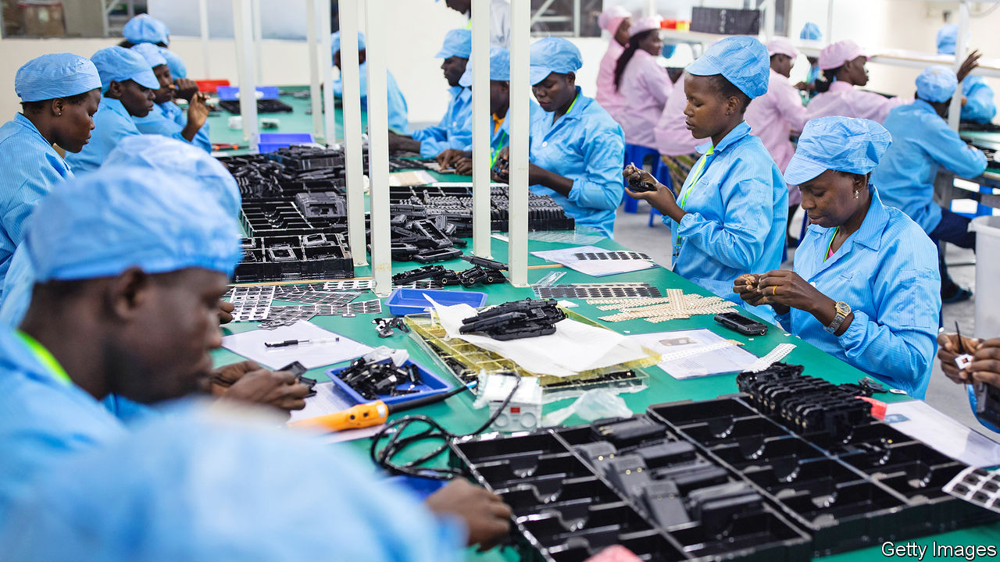
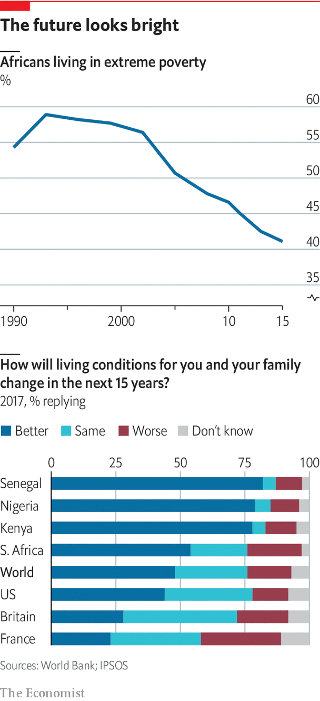

## Economy

# Many of Africa’s economies are doing well

> But there are questions about the best road to long-term growth

> Mar 26th 2020

PASSING THROUGH the gate leading into the Hawassa industrial park feels a bit like crossing a boundary between Africa’s past and a vision of its future. On one side three-wheeled tuk-tuks beep their horns as they swerve around pot holes on the main road running through this southern Ethiopian town. On the other side smooth asphalt forms geometric grids around the rows of new factory buildings that represent one of Africa’s boldest attempts to industrialise by following in the footsteps of Asia.

The park opened three years ago, yet it already employs almost 30,000 people and has plans to double. Most of the young women working in it make clothing for companies such as PVH, which owns brands including Tommy Hilfiger and Calvin Klein. Selamawit Malkato, 20, had never seen a factory until she came to Hawassa. But last year she stood with scores of other hopefuls outside the park’s gates. Her sister already had a job inside, stitching shirts. The days are long; the pay low; the bosses strict. Still, Ms Selamawit travelled 60km from her home village looking for work in firms attracted by a supportive government and duty-free access to American markets. “Being a large player in the apparel industry we need to give it a go,” says Vinod Hirdaramani, a Sri Lankan businessman who has opened a garment factory in the park. “It’s one of the last frontiers of apparel making.”

For all the rapid growth in Hawassa and the many other industrial parks that Ethiopia is building, a cloud hangs over its industrialisation strategy. Turnover of employees is high, productivity has been lower than expected and exports are growing more slowly than hoped. To be sure, some of this may just be the high costs of establishing new industries far away from their markets and suppliers and without a ready pool of experienced workers. And the gap between transport costs in Africa and established manufacturing centres is narrowing, argues Dirk Willem te Velde of the ODI, a think-tank in London.

Some of the gloom is over a more fundamental question: will export-led manufacturing play a big role in Africa’s economic growth or has the continent missed its chance because automation will give many manual jobs to machines? The question is important because governments have to decide where to invest scarce resources—in ports and railways to foster manufacturing, for instance, or fast internet cables and film schools.

Most successful economies eventually move away from manufacturing towards services. Dani Rodrik, an economist at Harvard, argues that Africa’s are at risk of doing so without first having gone through a phase of industrialisation. The risk is that this “premature de-industrialisation” could leave many African countries unable to produce the good jobs and economic growth needed to catch up with the rich world. Yet such a gloomy outlook seems to be at odds with what is happening on the ground. Although manufacturing’s share of GDP is shrinking in much of the rich world, it has increased in Africa from a low of 9.4% in 2011 to 11% in 2018. Though there are questions about the reliability of those manufacturing data, it is clear that exports are rising sharply. The value of textiles and clothing leaving Ethiopia has jumped about ten times since the early 2000s, and about five times in Kenya and Uganda.

The outlook for Africa’s economies is more nuanced than simply a question of them doing more manufacturing or staying poor. Many countries are expanding into areas that economists are starting to call “industries without smokestacks”. Some, such as flower-exports, may not be classified as manufactured goods in export statistics. But the process of making them looks a lot like factory work and demands many of the same management skills. John Page at the Brookings Institution, a think-tank, argues these industries also deliver many of the benefits of normal manufacturing, including lots of jobs. Kenya’s flower industry employs up to 70,000 people. Horticulture in Ethiopia provides 180,000 jobs. They are also growing quickly. Kenya’s exports of cut flowers to Europe are worth almost $700m a year, up from $134m in 2000.

Moreover, many are starting to export more services, such as running call centres. South Africa, the continent’s most developed industrial economy, sold services worth more than $16bn to the world in 2017, against $10bn worth of car exports that year. Some 40,000 people are employed in South Africa doing back-office work, mostly for foreign companies. Its industry has been growing by more than 20% a year, because it has millions of educated English-speakers and a time zone that makes it easy to work for Europe, Asia and America. Although operating costs are about 50% higher than in India or the Philippines, South Africa is able to provide lawyers or chartered financial analysts who do complex work remotely for law firms or banks, reckons Everest, a consulting firm. “Africa has a massive opportunity as a low-cost provider of services,” says Yasmin Kumi of Africa Foresight Group. Creative industries such as music and film are booming, too, with African musicians filling stadiums in the rich world.

The choice for governments over which path to back is not as stark as it might seem. Faster internet connections are good for the whole of the economy, not just firms employing people doing digital jobs. A study by Jonas Hjort and Jonas Poulsen found big jumps in employment after countries were connected to undersea internet cables. Many of the things that governments should be doing anyway, such as investing in primary-school education or liberalising electricity markets, are good for growth of both sorts, says Stefan Dercon, an economist at Oxford University.

Whichever path Africa ends up taking, its progress will be shaped by two powerful forces: a fast-growing middle class with rising spending power; and the growing integration of Africa’s markets. Start with the middle class. There is plenty of disagreement about how big this group is. The African Development Bank decided that about one-third of Africans were middle-class since they could spend the equivalent of $2-20 a day. Pew used a higher definition ($10-20) in 2015 and decided just 6% of Africans were middle class. Fraym, a data firm, looked at what people own (such as fridges) and how educated they are and concluded that Africa has a “consumer class” of 330m people spending $1.6trn a year.

Whatever the exact number, there is little doubt that it is growing quickly, pulled upward in a group of countries that are growing steadily richer. To see them one needs to first strip out oil producers such as Nigeria and Angola, which have been hit by lower prices. Then one needs to look past South Africa, where growth has been slammed by a decade of on-off power cuts caused by rampant corruption in the state-owned electricity utility. Admittedly this excludes some big countries, but those that are left, which together make up about half of sub-Saharan Africa’s economy, will have notched up average growth rates of 5-6% a year for the past decade. Some, such as Ethiopia, had average growth of more than 10% between 2010 and 2015. Income per person there has jumped 70% between 2010 and 2017.

African firms still face many difficulties catering to this source of home-grown demand. Domestic firms operating in Africa’s fragmented markets are often unable to get economies of scale that competitors in Asia reach. They are also held back by chronic shortages of electricity (some 600m people on the continent are not plugged in), potholed roads and inefficient ports. “The biggest problem is the continent’s inability to develop value chains,” argues Khaled Sherif of the African Development Bank. “Africa exports oil but imports gasoline, it exports cocoa beans and imports chocolate.”

This may begin to change thanks to efforts to make the world’s largest free-trade area, scheduled to come into effect in July. Only 17% of African countries’ trade is with each other, compared with intra-regional trade of 60-70% in Asia and Europe. The United Nations Conference on Trade and Development (UNCTAD) reckons that the elimination of tariffs on trade within Africa would boost GDP by about a percentage point. More importantly as African firms export to neighbouring countries, they can specialise and also learn to become more competitive in global markets as Morocco has done with carmakers and aerospace firms. “Each plane that’s flying now has something from Morocco,” says Mohcine Jazouli, the deputy foreign minister. “Sometimes it’s a piece of an engine, sometimes it’s a piece of the seat, sometimes a cable, but whatever it is, it has been produced in Morocco.”

Another change is the emergence of a startup culture. Last year venture-capital funds invested about $1.3bn in new African firms, an increase of more than 600% over the $200m invested in 2015. It may take a while for economists to work out what building blocks went into this startup boom, but one must be the rising number of educated youngsters—enrolment rates in tertiary institutions across Africa almost tripled to 16% between 2000 and 2016.

Investing in a business anywhere is always a gamble. But in many parts of Africa the risks are needlessly exacerbated by governments. Foreign investors who have seen regular debt crises in many African countries assume that their returns will be diluted by currency devaluations. Many worry about corruption, civil conflict or that their businesses will be expropriated. The big difference between countries that are doing well and those that are not is how well they are governed and how stable they are. ■

## URL

https://www.economist.com/special-report/2020/03/26/many-of-africas-economies-are-doing-well
