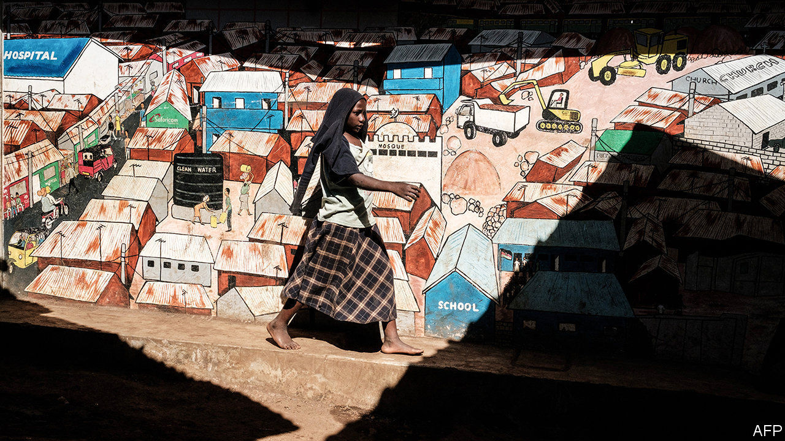

## The future

# Why are some African countries improving and others not?

> Governance and economy policy have a lot to do with it

> Mar 26th 2020

MANY AFRICANS rightly complain that outsiders carelessly lump together its 54 different countries and talk of it as a place that rises or falls as one. Such generalisations are not just lazy but also obscure more than they clarify. The most likely trend over coming decades in Africa will be a clear divergence between how various countries are doing, argues Nic Cheeseman, an expert in African democracies. Some are becoming richer and more democratic even as others stay poor and undemocratic.

This may seem obvious, but many left-wingers generalise that Africa is poor because its former colonial powers want to keep it that way, not because of the choices its leaders are making. Many conservatives, on the other hand, sweepingly say that corruption or bad governance are to blame, without taking account of the obstacles many African countries face. Yet it is in looking at the detail of how otherwise similar countries have taken different paths that lessons can be learned.

The first lesson, about the importance of simply having a state that works, comes from Rwanda and Burundi. Both are small, landlocked and densely populated. Since independence both saw genocides against their Tutsi minorities by their Hutu majorities. In the early 1990s Burundi was almost twice as rich as Rwanda. Yet since then incomes in Rwanda have increased more than three times (adjusted for purchasing power). Those in Burundi have fallen. One big difference between the two is governance. Although neither country is democratic, Rwanda has a functional government and low corruption. The Mo Ibrahim Foundation, which promotes democracy, ranks Rwanda eighth in Africa in its index of governance, which looks at a variety of indicators including the rule of law, infrastructure and sanitation. Burundi comes 43rd.

The second is that economic policies matter. When Kenya and Tanzania gained independence in the early 1960s they had similar economies, dependent on farming, and almost identical incomes per head. Both initially suppressed democracy to run authoritarian one-party states. But they chose very different economic models. Tanzania nationalised big companies and forced people onto collective farms in the name of “African socialism”. Kenya embraced free markets. Today Kenyans are 14% wealthier, adjusted for purchasing power (or 80% wealthier by market exchange rates).

Zimbabwe and Botswana further reinforce this. In the early 1980s Zimbabwe was richer than Botswana before Robert Mugabe destroyed its economy by wantonly printing banknotes and stealing farms for his cronies. Now Botswana is seven times richer.

Perhaps the most striking example of how countries with good policies and robust institutions can climb into a virtuous cycle of development—and how those without can get stuck in cycles of poverty and conflict—is Mauritius, Africa’s most successful economy. In 1961 James Meade, a Nobel laureate in economics, bluntly declared that “the outlook for peaceful development is poor”. Mauritius was small, remote from trading partners and dependent on the export of sugar. Yet, since independence, income per person in Mauritius has increased about six times after inflation, making it Africa’s second-richest country per person. Its success has drawn the interest of big-name economists. Jeffrey Sachs and Andrew Warner decided that Mauritius did well because its economy was open. Paul Romer, another Nobel laureate, attributed its success to foreign investment into its export-processing zones.

Having sensible economic policies is not enough, though. Several other African countries also tried to boost manufacturing by attracting foreign investors to export-processing zones. Only a few, including Ethiopia, Lesotho and South Africa, succeeded. Arvind Subramanian and Devesh Roy, two economists who also looked at Mauritius, concluded that its trade and investment policies accounted for only part of its success. Another important ingredient was the strength of its institutions. Since independence its elections have been peaceful, its government has followed the law, its courts have been honest and corruption has been tolerably low. It regularly comes top in the Ibrahim governance index.

Mauritius is all the more striking when set against its bigger neighbour, Madagascar, which seemed far more likely to succeed because of its richer natural resources and bigger population. In the 1970s, just as Mauritius began attracting foreign investors, Madagascar thought it was a fine idea to send them packing. It expelled the American ambassador and nationalised two American oil companies. While Mauritius was helping find export markets for its sugar farmers, Madagascar began grabbing land from its commercial farmers. It is one of the few countries in the world to have become poorer over the past 50 years, because of disastrous socialist policies and repeated political crises.

The most important lesson—and the one that offers the most hope—is that many of these trends are mutually reinforcing. Countries with more capable bureaucracies and more open democracies tend to do better economically and invest more in education. Stronger economies and better schooling, in turn, help slow population growth and improve dependency ratios. Not all countries are in this virtuous cycle. But for those that are, the differences are striking. Kenyan women, for instance, are not just much richer than their cousins in Tanzania, they also each have 1.4 fewer children. Rwanda’s people are not just better off than those in Burundi, their literacy rate is five points higher, too.

Many parts of Africa are still deeply troubled. Nigeria’s economy is not growing quickly enough to keep pace with its population because of inept governance. South Africa, the economic powerhouse, is a laggard that can barely keep its lights on because of corruption and mismanagement. The Sahel is stuck in cycles of violence, high fertility and illiteracy that will take decades to break. Covid-19 is a huge risk to the continent’s people and will disrupt its economies. But, over the longer term, the major trends taking hold—rapid urbanisation; increasing migration and remittances; a rising share of children in school; the hundreds of thousands of students at universities abroad—are reasons for hope. Given a fair wind, these powerful forces promise to bring more democracy and wealth to hundreds of millions of people. ■

## URL

https://www.economist.com/special-report/2020/03/26/why-are-some-african-countries-improving-and-others-not
