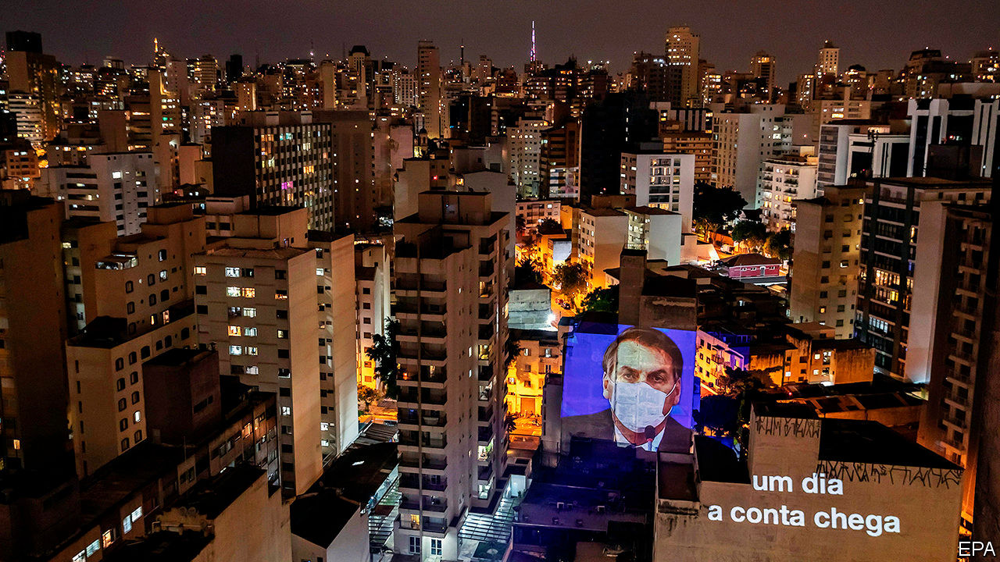

## BolsoNero

# Brazil’s president fiddles as a pandemic looms

> It’s just a sniffle, he claims

> Mar 26th 2020SÃO PAULO

Editor’s note: The Economist is making some of its most important coverage of the covid-19 pandemic freely available to readers of The Economist Today, our daily newsletter. To receive it, register [here](https://www.economist.com//newslettersignup). For more coverage, see our coronavirus [hub](https://www.economist.com//coronavirus)

THE FIRST person to die from covid-19 in the state of Rio de Janeiro was a 63-year-old maid who commuted each week to a beachside apartment in Leblon, the priciest neighbourhood in Brazil. Her employer had recently returned from Italy. The maid, who had diabetes and high blood pressure, died on March 17th in a city 100km (60 miles) away, where she and five relatives shared a cinder-block house. Several hospital workers there have since fallen ill. 

If the virus in Italy jumps between generations living together, in Brazil it started by hopping between classes, which are socially distant but physically close. One vector may be the populist president, Jair Bolsonaro. On March 15th, after his communications secretary tested positive for the virus, he ignored quarantine orders and took selfies with fans. When the first Brazilian died of covid-19 on the next day, he denounced “hysteria” about the virus.

Other leaders are less complacent. Voting remotely for the first time, congressmen proclaimed a “state of calamity”, which lets the government breach constitutional spending limits. Rodrigo Maia, the president of the lower house, wants to spend at least 400bn reais ($80bn, or 4% of GDP) to help the health system and the economy. The health minister, Luiz Henrique Mandetta, is not an ideologue, unlike many of his cabinet colleagues. City and state governments are imposing isolation measures—São Paulo and Rio de Janeiro have full lockdowns—and turning football stadiums into hospitals. Universities and private labs are developing covid-19 tests. Companies are donating materials for their production. Brazil’s biggest brewery is making hand sanitiser. 

But workers against the disease must block out signals from a president who continues to disparage their efforts. On March 25th he told Mr Mandetta to stop calling for large-scale social distancing. In a televised speech on March 24th, he urged local governments to abandon “scorched-earth” strategies of closing schools and shops, and blasted the media for spreading “the sensation of fear”.

As The Economist went to press, Brazil had 59 covid-19 deaths and 2,554 confirmed cases. But testing has mostly been limited to patients in hospital. The true number is probably much higher. Piecemeal responses by governments and the private sector will not fend off disaster. Warm climates like Brazil’s may slow transmission of the virus, says a new study from the Massachusetts Institute of Technology. Otherwise “there are no mitigating factors,” says Paulo Chapchap of the Sírio-Libanês hospital in São Paulo. Private hospitals like his are strained, because current patients tend to be rich folk who caught the disease abroad, or their intimates. As it migrates to the masses it could quickly overwhelm the public health system, which serves four-fifths of the population.

Brazil’s universal health-care system serves more people than any other totally free system in the world, but the country spends just 3.8% of GDP on it. Italy spends 6.7% of GDP; Germany, 9.4%. Brazil’s public system has just seven acute-care hospital beds per 100,000 people, nearly all of which are occupied by non-covid patients. Demand for acute-care beds in some cities abroad has approached 25 per 100,000 during the pandemic. Mr Mandetta warns that the system could “collapse” in April.

The Institute for Health Policy Studies in Rio calculates that the government would need to spend 1bn reais for every 1% of the population infected in order to treat all severe cases. The government has approved around 10bn reais of extra spending, a rise of a tenth but probably too little. “The forecast is catastrophic,” says Miguel Lago, the institute’s director.

Until the government reaches its goal of testing 30,000-50,000 people a day, which may take months, lockdowns are the only way to slow transmission. This is especially hard in favelas. These informal settlements are home to 13m of Brazil’s 211m people, including a fifth of those in Rio. They are densely packed and many lack running water. For now, grassroots groups, not the government, are running public-health campaigns. Organisers in the Maré, in Rio, suggest quarantining patients with mild symptoms in empty schools. Paraisópolis, in São Paulo, plans to move older residents to rented mansions in a leafy district nearby. Activists are driving around favelas with loudspeakers, telling residents to stay home. In some, drug-traffickers have shut open-air drug markets, cancelled bailes funk (all-night parties) and imposed curfews. “If the government isn’t capable of making it happen, organised crime will,” vows one gang on WhatsApp.

In many favelas commerce continues because people have to work. Just a fifth of residents have formal jobs. Most are day-labourers, vendors or domestic employees. They can afford to stay home only if the government pays them, says Eliana Sousa Silva of Redes da Maré, an NGO.

The government plans to give informal workers 300 reais a month for three months. That may not be enough. Brazil’s fiscal deficit and weak credit rating will prevent the government from offering a massive stimulus (see [article](https://www.economist.com//the-americas/2020/03/26/covid-19-will-sicken-latin-americas-weak-economies)). Paulo Guedes, the economy minister, has proposed almost no new economic support.

As suffering spreads, the political cost to Mr Bolsonaro will become clearer. Twenty-three people who travelled with him to see Donald Trump in Florida this month have tested positive for covid-19. On March 13th Fox News reported that the president’s son, Eduardo, said that his father had the virus. Both then denied it. A judge ordered the military hospital in Brasília, the capital, to publish the names of confirmed cases from the delegation. It held back two.

People in swanky neighbourhoods that voted for Mr Bolsonaro in 2018 are now banging pots and pans in nightly protests. In one poll, his approval rating dropped to its lowest point since he took office last year. Fiddling while a pandemic looms may cost him re-election in 2022. ■

Dig deeper:For our latest coverage of the covid-19 pandemic, register for The Economist Today, our daily [newsletter](https://www.economist.com//newslettersignup), or visit our [coronavirus hub](https://www.economist.com//coronavirus)

## URL

https://www.economist.com/the-americas/2020/03/26/brazils-president-fiddles-as-a-pandemic-looms
