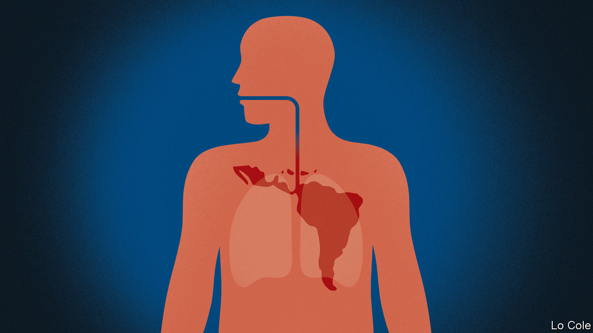

## Bello

# Covid-19 will sicken Latin America’s weak economies

> Governments scramble to mitigate the shock

> Mar 26th 2020

Editor’s note: The Economist is making some of its most important coverage of the covid-19 pandemic freely available to readers of The Economist Today, our daily newsletter. To receive it, register [here](https://www.economist.com//newslettersignup). For more coverage, see our coronavirus [hub](https://www.economist.com//coronavirus)

IN BRAZIL, COPACABANA beach is deserted and football stadiums are being turned into field hospitals. Colombia has shut its border with Venezuela. Seabirds have taken possession of Peruvian beaches and a puma was spotted ambling through the suburbs of Santiago, Chile’s capital. Covid-19 has now arrived in strength in Latin America. With it have come lockdowns in many countries, though some leaders remain in denial, storing up trouble. Everywhere, it is threatening and testing both public health and livelihoods.

The virus has struck a patient that in economic terms has a serious pre-existing condition. Since 2014 the region’s economy has grown at an annual average rate of less than 1% a year and income per person has dropped. Now it faces a contraction even more severe than that induced by the financial crisis in 2009, when Latin America’s GDP fell by 1.7%. Back then, thanks to prudent economic management, many countries were able to soften the blow by relaxing monetary and fiscal policy. Now they have less scope to do so. Many central banks had already cut interest rates last year because of economic weakness. On average, public debt was 57% of GDP in 2019, compared with below 40% in 2008, according to the Inter-American Development Bank (IDB).

As in 2009, Latin American countries face less demand for their exports and lower prices for them. Unlike then, they will also be hit by quarantines and the concomitant temporary shutdown of many service businesses. Mexico, Central America and the Caribbean, with close ties to the economy of the United States, will be especially badly hit. Tourism, which directly accounts for 15.5% of GDP and 14% of total employment in the Caribbean islands, has stopped dead. Some South American economies have been badly hit by the contraction in China, their biggest export market.

Nobody knows how long quarantines will last, so forecasts involve more guesswork than usual. Early this year Ben Ramsey of J.P. Morgan Chase, a bank, had reckoned on growth of 1.2% in Latin America. Now he thinks the region will contract by 2.2%, assuming a recovery in the second half of the year. Santiago Levy, a former chief economist of the IDB, reckons that the region will be lucky if the contraction is no worse than 4% or 5%. The UN Economic Commission for Latin America and the Caribbean, which predicts a fall of 1.8%, thinks the number of poor people will rise from 185m to 220m (in a total population of 650m).

Policymakers are scrambling to react. “They are using their tool-kits and throwing caution to the winds,” says Mr Ramsey. Central banks in Chile, Brazil, Mexico and Peru have made emergency cuts in interest rates. Several are readying credit lines for firms (Brazil’s central bank has announced that it will inject $230bn into the financial system, about 11% of GDP) and help for health services and workers.

But here they face a difficulty: most Latin Americans work in small businesses and are in the informal (unregistered) economy. Emergency payments can reach formal workers and, through conditional cash-transfer programmes, the poorest. That leaves out a large segment of the lower-middle and working classes.

Peru’s government has ordered a payment of 380 soles ($108) per family, but is finding it hard to distribute. Governments might consider resorting to mototaxi (tuk-tuk) money, in which, with suitable security and social distancing, they courier cash to households.

How will they pay for all this? Some may face a “sudden stop” in private capital inflows, similar to that suffered by Argentina in 2001 and 2018. Ecuador, an oil exporter which was all but bankrupted by Rafael Correa, its populist president from 2007 to 2017, looks close to default. Other countries have seen investors demand higher premiums to hold their bonds. Currencies have suffered, too. Since February, against the dollar the Mexican peso has depreciated by a quarter and the Brazilian real by 16%.

Countries that can still tap financial markets should make it clear that their spending measures are temporary and that they don’t imply losing control over public finances, urges Mr Levy. Others may turn to the IMF, which is preparing emergency finance. Some governments may print money, something that has been rightly frowned upon by serious policymakers in Latin America since the 1980s, when it was associated with hyperinflation. But today deflation looks a bigger risk than inflation. Desperate times call for desperate measures.

Dig deeper:For our latest coverage of the covid-19 pandemic, register for The Economist Today, our daily [newsletter](https://www.economist.com//newslettersignup), or visit our [coronavirus hub](https://www.economist.com//coronavirus)

## URL

https://www.economist.com/the-americas/2020/03/26/covid-19-will-sicken-latin-americas-weak-economies
