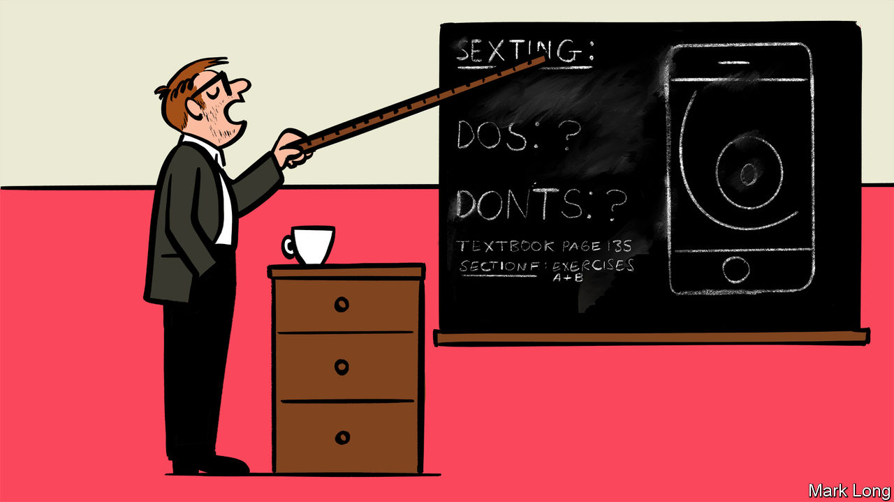

## Sharing and not caring

# American teens are sexting more and sexing less

> How to adapt sex-ed to a different kind of peril

> Mar 26th 2020WASHINGTON, DC

BY CONVENTIONAL measures, American teenagers have become prudish. Less than half of high-school students are having sex, with fewer partners and more contraception than the generation before them. Teen-pregnancy rates have never been lower. But those indicators no longer offer a complete picture: online, teens are bucking the trend. In 2019, among 12- to 17-year-olds, 14% reported sending nude images, compared with 12% three years earlier; 23% received them, up from 19%. The steady climb may reflect rising smartphone use and changing social norms. What it certainly reflects, says Justin Patchin, of the University of Wisconsin-Eau Claire, is that “the current approach to stop this isn’t working.”

For a decade, the prevailing advice to teens about sexting has been straightforward: don’t. In about half of states it is illegal for under-18s to sext, on child-pornography grounds. Legal punishments for minors are rare, but widely publicised in hard-line sex-education literature. One sexting-prevention programme in Connecticut, sponsored by the state’s criminal-justice division, warns would-be sexters that “your family members are eventually very likely to see any images you send electronically,” and friends may be “ashamed to be associated with you.” Public-school lesson plans from one county in Florida are bluntly entitled “Sexting Over the Net! STOP IT NOW” and “Safe Sexting: No Such Thing.”

Those reactions are understandable. But they are based on misconceptions of the problem. “We wasted so much time trying to figure out why kids were sexting,” laments Joris Van Ouytsel of the University of Antwerp, who began studying the topic in 2013. More important, researchers now broadly agree, is the context in which children are doing it. Just as it is offline, consent is vital. Things go wrong when teenagers pressure and coerce others, most often girls and younger teenagers, to send nude photos; or forward them to someone else, as happens in 4% of cases.

Conflation of abusive and non-abusive sexting has led to an oversimplified response. The onus of most interventions has been on the sender. But Jeff Temple, of the University of Texas Medical Branch at Galveston, notes that such thinking ignores the fact that sext-senders are often the victims of harassment. It also lets off teenagers who demand sexts or share them without permission, and leaves out the recipients of unsolicited ones who have been “cyber-flashed”. In some places sexting laws lump together teenagers who take nude photos of themselves, technically creating child pornography, with adult predators. Some states, including New Mexico and Washington, have begun decriminalising sexting between minors—a good first step.

“We have to stop being distracted by the fact that sexting involves digital technology,” says Elizabeth Englander, director of the Massachusetts Aggression Reduction Centre. Instead, she argues, it is “part and parcel of sexual development”. The internet has spawned novel abuses with wider-than-ever reach, but they tend to mirror those in the real world. For instance, more than a quarter of teenagers in relationships suffer “digital-dating abuse”, where one partner uses technology to snoop on, threaten or stalk the other; 35.9% of teenage victims have also suffered that offline.

Yet most sex education is stuck in analogue. New Jersey is rare in covering sexting problems in its curriculum; in December a bill was introduced to incorporate it in Illinois, too. The question that remains is what they should be teaching. To find out, researchers discussed some anti-sexting messages with older teenagers in Massachusetts and Colorado. Girls reported being affected by danger-fuelled warnings they had heard in the past (“You can’t control a picture once it’s been sent”); boys, on the whole, didn’t. Even among female students who had found such messages convincing, 40% had sexted nonetheless. Ms Englander concludes that just-say-no messages “may work for some, but not many, kids.” Worse, they risk scaring those who need help from coming forward.

Some researchers are proposing an alternative: a tech-savvy version of “abstinence-plus” education, which discourages sexting but offers strategies to keep teenagers safe if it does happen. The goal is to ensure that “any backlash is not irreparable”, explains Sameer Hinduja, co-director of the Cyberbullying Research Centre. It would stress that all sexting carries risk, but certain strands elevate it: taking a photo with your face in it, with a birthmark, in a recognisable place; sending it to a stranger, storing it on a cloud server, using an unsecured app. And it would incorporate sexting into broader conversations about respect in relationships generally. Most experts endorse this approach.

Laypeople, though, will probably “cringe”, “even recoil” at it, Mr Hinduja admits, “because it counters everything they have been taught” about sexting. Some concerns are age-old, such as that children will as a result have more sex, online or off. Others are new. Encryption meant to protect minors’ identity could complicate child-pornography investigations. Without a formal curriculum, parents can still talk to their children about how to be good “digital citizens”. But some translation may be required. “When we say ‘sexting’, kids know we’re boomers,” says Darren Laur, a 55-year-old former law-enforcement official who now runs a digital-literacy company. “They say ‘send nudes’.”■