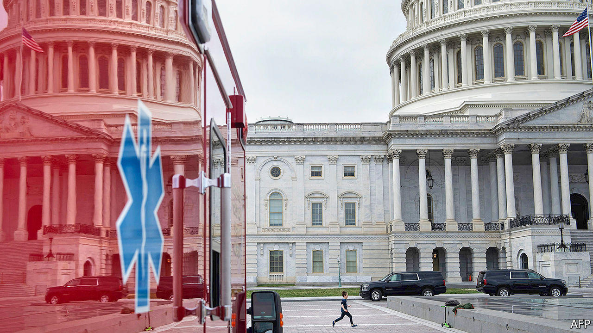

## A $2trn bazooka

# Congress puts aside its habitual dysfunction and responds to covid-19

> The fiscal stimulus is impressive, but America may need another one before too long

> Mar 26th 2020WASHINGTON, DC

Editor’s note: The Economist is making some of its most important coverage of the covid-19 pandemic freely available to readers of The Economist Today, our daily newsletter. To receive it, register [here](https://www.economist.com//newslettersignup). For more coverage, see our coronavirus [hub](https://www.economist.com//coronavirus)

EVEN TO THE housebound and socially distanced, the signs of a contraction are apparent. The 18th Street corridor of Adams Morgan, a typically bustling stretch of restaurants and shops in Washington, DC, is shuttered—closed as part of the nationwide effort to contain the epidemic of covid-19 that had, as of March 25th, infected 65,778 Americans and killed 942, according to Johns Hopkins University. One fledgling business—a new bar called Death Punch—never managed to open its doors. Down the road, an established whiskey bar called Jack Rose has been selling off its gargantuan collection at discount to support its staff. The queue for it snaked several blocks—a long dotted line of aficionados standing a careful six feet apart.

These are just the premonitions of the pain to come. Unemployment will rocket as much of the economy is put into a sort of medically induced coma. So many unemployment claims are being filed in Ohio that the state website has crashed. The national weekly unemployment numbers that will be released on March 26th are widely expected to be the worst in history. Goldman Sachs has predicted that there could be 2.25m new claims over the week—triple the previous record. And just as the covid-19 epidemic has not yet reached its apex, neither has the economic crisis. Morgan Stanley predicts that GDP will fall by 8% year-on-year in the second quarter and unemployment will rise to 12.8%, compared with just 3.5% in February.

To head off the damage, Congress has prepared the largest fiscal stimulus in modern history. Its provisions—including bail-outs for firms both big and small, expanded unemployment-insurance benefits and a straight cash transfer to Americans—are expected to cost close to $2trn, roughly one-tenth of GDP. This is the third substantial piece of legislation to deal with covid-19. Even this may not be enough.

Whole industries rely on congregating people. So too, unfortunately, does the virus. Twelve states have ordered all non-essential businesses closed. Seventeen states, covering half the country’s population, have urged residents to stay at home. Many white-collar tasks can just about be performed remotely. But cruelly, those likeliest to lose income or their jobs are in more precarious, less well-paid industries—restaurant staff (of which there are 9.6m), retailers (8.8m) or hotel workers (2m). If they lose their livelihoods, the effects will ripple through the economy.

One corrective for this problem is unemployment insurance. Yet this is not as robust as in other parts of the rich world. The American version replaces a smaller share of previous income than the average in the OECD, a club of mostly rich countries, and declines faster with time. Individual states, which administer the programme jointly with the federal government, differ in their generosity: Mississippi caps its maximum benefits at a paltry $235 a week.

At the insistence of Democrats, Congress would make this part of the safety-net decidedly more European, at least temporarily. The federal government would pay to top up unemployment-benefit levels by $600 a week—an enormous increase, given that the current weekly average is $385. The set of people eligible for benefits would also be expanded to include independent contractors, such as gig-economy workers. Those who have been laid off but not fired could receive compensation for lost hours. And the length of the benefit period would be extended from the usual 26 weeks to 39 weeks. The cost of all of this is thought to be $260bn: a serious expansion of a targeted programme.

A similarly gargantuan wad of cash—$250bn—will be spent on a less targeted scheme, sending cheques to Americans direct from Uncle Sam. Below some generous income thresholds ($75,000 a year for a single person and $150,000 for a married couple) every family can expect $1,200 per adult and $500 per child. This is the best version of a cash transfer that was proposed. Previously the White House had pushed the idea of a payroll-tax holiday; an early version of the stimulus bill ignored people who did not file taxes. Both would have excluded those with the lowest incomes from an ostensibly universal programme. Reaching everyone eligible now will require ingenuity, such as using administrative data from states, says Sam Hammond of the Niskanen Centre, a think-tank. But even if sent quickly, the cheques could be both too small for those who need them and too big for those who do not.

The government is also expected to set aside $500bn to stabilise firms and states. The capital could facilitate lending several times larger than that. Democrats in Congress and the White House got stuck on a (relatively) small portion of the programme, the $75bn set aside to bail out embattled big firms like airlines and those deemed critical to national security—because of the latitude the treasury secretary would have to set and disclose the terms of loans. A compromise struck in the dead of night bulked up independent oversight.

A more intriguing scheme is the $350bn set aside to save small and medium-size firms (those with fewer than 500 employees). The programme would give loans of up to $10m without interest or fees to pay for employees, rental costs and sundry other expenses. These would then be forgiven in proportion to the share of staff spared the sack: a firm that kept all employees would owe nothing; one that dispensed with half would owe half, and so on.

This is a more complicated idea than those devised by European finance ministers facing down the pandemic. Rishi Sunak, the British chancellor, pledged to pay up to 80% of wages for furloughed workers; the Danish government could pay up to 90% of the costs. The added hurdle in America may mean that the most sophisticated operations get the grant-loans (or “groans” in bureaucratic argot), while mom-and-pop operations languish. It may also mean that even more money will be needed. Research from Glenn Hubbard, an economist at Columbia Business School, and Michael Strain of the American Enterprise Institute, a think-tank, estimates that total needs could amount to $1.2trn—roughly triple the sum allocated. With the ink not yet dry on the phase-three bill, bigger bail-outs may be needed in future.

The extraordinary legislation is not intended to avoid the recession that already seems to have arrived, but to spur the fastest possible rebound. This of course requires that the cause—the covid-19 pandemic—is effectively dealt with first.

But after a brief period of taking the virus seriously, President Donald Trump seems eager to lift restrictions as soon as possible. He has taken to saying that “the cure cannot be worse than the problem itself”, and that he wants the country “opened up and just raring to go by Easter”, which epidemiological projections suggest is unwise. The collapse of the stockmarket, which used to be Mr Trump’s barometer of success, may be spooking the president. Markets jumped in anticipation of the coming stimulus. But pre-emptively relaxing the restrictions would harm both public health and the economy.

Because health authority is devolved to the states, it is unlikely that Mr Trump would pre-empt local declarations of emergency. But some states could follow suit, and the president’s supporters might not adhere to the recommended course of social distancing. Already, the lieutenant-governor of Texas has suggested that the elderly might risk death for the sake of the economy. Liberty University, an evangelical Christian institution led by a devotee of the president’s, is proudly inviting thousands of students back to campus in defiance of public-health advice.

Mr Trump appears to be defaulting into an old playbook—vacillating wildly in the hope of winning concessions. What may work with Democrats or North Korean dictators has no chance against a virus, however. And as things worsen, as seems likely, such irresolution may look like political malpractice. Already, New York appears to be a new disease hotspot. “The apex is higher than we thought and the apex is sooner than we thought,” said Andrew Cuomo, the governor of New York, in his address to citizens. He is warning that the city’s health system could be overwhelmed by lack of ventilators and protective equipment for staff. The medicine—a controlled, national shutdown of the economy—may be strong stuff. But a premature reopening, leading to rampant transmission of the virus, could produce something far worse.■

Correction (March 26th 2020): An earlier version of this article mistook Morgan Stanley’s annualised quarter-on-quarter growth forecast for its year-on-year growth forecast. Sorry.

Dig deeper:For our latest coverage of the covid-19 pandemic, register for The Economist Today, our daily [newsletter](https://www.economist.com//newslettersignup), or visit our [coronavirus hub](https://www.economist.com//coronavirus)