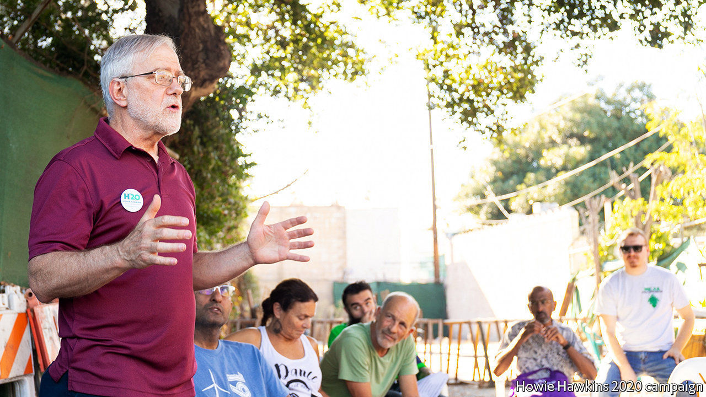

## Zowie Howie

# Howie Hawkins will probably be the Green Party’s 2020 nominee

> He looks unlikely to play spoiler, as Jill Stein did in 2016

> Mar 26th 2020CHICAGO

HOWIE HAWKINS, the front-runner for the Green Party’s presidential nomination, is inclined to look on the bright side. Munching on oatmeal during a recent campaign visit to Chicago, the genial, white-bearded 67-year-old lists reasons for his optimism. First comes his record of pursuing seemingly lost causes. The ex-Marine, construction worker, lorry-unloader and member of the Teamsters says, “I’ve been on the unpopular side that proved right in the end several times.”

As a teenager in 1960s San Francisco he joined the Peace and Freedom Party, demanding an end to the war in Vietnam. As a student at Dartmouth College he helped the Clam Shell Alliance stir opposition to nuclear power in New Hampshire. He marched for civil rights in America and opposed apartheid in South Africa. As a long-standing democratic socialist, he first dropped leaflets for Bernie Sanders in Vermont in the 1970s. Today he sees more Americans than ever welcoming ideas of “eco-socialism”. Triumphs don’t come easy, but “it’s a matter of time until we win people over”, he says.

For Greens the purpose of the election is twofold. One is to use the campaign to build the party, win volunteers and find recruits who can later run for local office, beginning with county boards. Without this, he says, the party will never gain national appeal. The second purpose is to press other parties to adopt green policies. He cites his own record of running to be governor of New York. In the 2014 race he won nearly 5% of the vote, enough to spook Andrew Cuomo, a Democrat, into taking up greener, leftier policies, such as a ban on fracking and plans for paid family leave and cheaper college.

He also cites the Green New Deal, which he says he has pushed since 2010. A version of it was adopted by Alexandria Ocasio-Cortez and other Democrats in the House. He sniffs that they have watered it down—“They took the brand and eliminated the content”—since their ambition is zero carbon emissions for America by 2050, and he says it must be 2030. He is pleased, nonetheless, that the plan is spreading.

His other policy ideas are equally bold, amounting to a $23trn plan to reshape the economy, impose a carbon tax, bring in a national health service, electrify all railways, put light-rail and other public transport in all cities and build up a machine-tools industry to make new environmental equipment, such as electric furnaces for steelmakers. He would also prevent the plastics industry from using petrochemicals and encourage the use of carbon-free cement for construction.

What of the party he helped to found? Mr Hawkins, who has won almost all the state primaries so far and expects to be picked in July at a convention in Detroit, wants the Greens to weave together their various strands of peace activists, social-justice campaigners and ecologists. They are still too “atomised” and prone to ideological squabbles, he says. Until they get over that, mass appeal will not follow.

Other countries show what might be possible. Greens in many rich democracies have sprouted vigorously in recent years. In Germany, for example, they could help form the next government. America’s system squeezes third parties, but elsewhere, even where first-past-the-post electoral politics hurts small ones, as in Britain and Canada, the odd Green MP gets elected. American voters say they want to tackle climate change. Disaffection with traditional parties is rising. And if there ever were electoral reform—such as a switch to ranked-choice voting—smaller parties could gain.

As for the 2020 election, Mr Hawkins hopes to appeal to young, fervent and disgruntled supporters of Mr Sanders, upset that their candidate has been pushed aside by Democratic primary voters. If the Democratic convention were to prove a bitterly contested one, some “Bernie bros” could give Howie a look. This raises a spectre for the Democratic Party. Ralph Nader, running as an independent in 2000, picked up 2.8m ballots (nearly 3%) in a tight presidential race, a tally that helped to keep Al Gore out of the White House. In 2016 Jill Stein, the Green Party’s candidate, helped by Russian meddlers, received 1.5m votes (1%), many of them in crucial midwestern states that Donald Trump narrowly won.

A repeat performance is unlikely. Polling by YouGov for The Economist shows support for third-party candidates at 3%, half of what they won in 2016. More probably, then, Mr Hawkins is in a fight to avoid humiliation. Even getting on the ballot in many states, which Greens usually manage, is proving difficult. The problem is getting signatures (and the tightening of some requirements). The party’s presidential candidate is eligible to stand in just 21 states so far. Mr Hawkins guesses 1.6m more signatures are needed to qualify in the remaining ones. The arrival of covid-19 makes that look almost impossible. On March 19th he suspended his effort to gather those signatures. As for disruption to campaigning because of the virus, Mr Hawkins seems relaxed. He says he has 10,000 books at home and an appetite to read as many of them as possible. ■ 

Dig deeper:

## URL

https://www.economist.com/united-states/2020/03/26/howie-hawkins-will-probably-be-the-green-partys-2020-nominee
