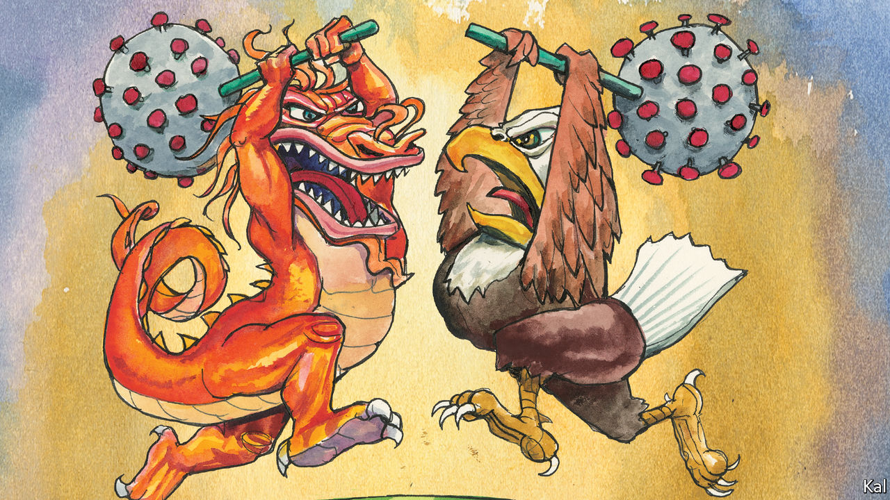

## Lexington

# Relations between China and America are infected with coronavirus

> China-bashing has become a bipartisan passion

> Mar 26th 2020

Editor’s note: The Economist is making some of its most important coverage of the covid-19 pandemic freely available to readers of The Economist Today, our daily newsletter. To receive it, register [here](https://www.economist.com//newslettersignup). For our coronavirus tracker and more coverage, see our [hub](https://www.economist.com//coronavirus)

FACED WITH the first great crisis of his presidency, Donald Trump fell back on his go-to tactic: blame China. His decision in January to bar non-American visitors from the country appears to have been his only prompt action against the coronavirus. After that failed to prevent it penetrating America’s borders, he has been insisting on China’s responsibility for the pathogen.

While the disease was concentrated in China, Mr Trump called it by its approved name, coronavirus. Since its arrival in America he has referred to it, in daily tweets and briefings, as the “China virus”. Others in his administration use “Wuhan virus”, including Mike Pompeo, the secretary of state. He is reported to have demanded the G7 group of industrial countries call it by that name. A White House staffer is said to prefer the phrase “kung flu”.

It is easy to see what Mr Trump is about. He wants to distract from his administration’s failure to contain the disease—such that America, despite having had months to prepare for it, will soon have more covid-19 cases than China. He also sees in the issue an opportunity to own the libs. A note circulated by Mr Trump’s re-election campaign last week suggests that it plans to make the president’s fearlessness in uttering the phrase “China virus” a defining difference between him and his presumed Democratic opponent, Joe Biden. In 2016 Mr Trump portrayed Hillary Clinton’s aversion to the unhelpful phrase “radical Islamic terrorism” as weak; he has updated the tactic.

Yet what candidate Mr Trump said in 2016 and what America’s president says are different matters. China has responded angrily to his administration’s slurs. Where recent pandemics—including the 2014 west African Ebola outbreak—saw productive Sino-American co-operation, this one has taken the already-poor relations between Mr Trump and Xi Jinping to new lows.

And they are liable to worsen, despite efforts on both sides to rein in the rhetoric this week. Mr Trump appears set on a campaign of China-baiting which America’s looming recession and death toll will make more feverish, especially as the virus spreads to Republican-voting states. China-watchers warn of a rising risk of a “low probability, high consequence” upset. In the best case, one opines, the relationship with China will be “utterly broken”.

The best way to lower the tension would be if Mr Trump’s diversionary tactic failed. But this would require his supporters to denounce his handling of the virus, of which there is currently no sign. Republicans admire it. And even if their faith wobbled, Mr Trump’s China-bashing would be likelier to sustain his popularity on the right than to endanger it.

This reflects more than Republicans’ traditional hawkishness. Bashing China unites two of the Republicans’ main factions: national-security sorts, who dislike Mr Trump’s protectionism but like his belligerence, and economic populists, who are wary of militarism but love the tariffs. By extension, it is also one of the ways the Republican establishment, which dominates the former group, has made peace with Mr Trump. No wonder ambitious Republicans, who try to keep a foot in both camps, sound especially hawkish. They include Mr Pompeo, who calls China’s ruling party “the central threat of our times”.

Discernible, too, amid the Republican mistrust of China is a fear of national decline that looks like an accompaniment to white conservatives’ dread of the socio-demographic currents that threaten the party. In a tweet this week, Newt Gingrich, a Trump loyalist and former presidential candidate, lamented that Huawei, a Chinese telecoms firm emblematic of state capitalism, was dispensing medical supplies while “our once great telecommunications companies have lost their entrepreneurial drive.”

This helps explain why Republicans find it easy to ignore the obvious expediency of Mr Trump’s latest China-bashing. It also explains why few appear to have registered that his antagonistic China policy has not achieved much. His tariffs have been ruinous to American farmers and consumers and won no big concessions from China on any of the issues, such as intellectual-property theft, they were supposed to address. The need to confront China has been embraced by many Republicans as an ideological imperative, requiring no supporting evidence of its wisdom.

And yet the pandemic also points to other ways in which Mr Trump’s policy has backfired. In line with its general disregard for science and civilian expertise, the administration slashed the Centres for Disease Control’s China-based staff—the potential focal point for Sino-American pandemic co-operation—ahead of the outbreak. Instead of rallying its allies in a global response to the pandemic, it has continued to alienate them. Mr Trump gave the Europeans no forewarning of his plan to bar non-American visitors from their countries this month. Instead of rising above China’s propagandists, he got into the mud with them.

Earlier this month Mr Trump was lambasted for having allegedly tried to buy a promising German coronavirus vaccine for America’s exclusive use. He would do better to reignite the liberal values and openness to talent upon which America’s economic dynamism is based. Last week Propublica, a news website, described how a Chinese scientist, Weihong Tan, was hounded from the University of Florida last year by federal restrictions on scientists with ties to China. Now at Hunan University, he switched from cancer research and created a faster test for covid-19. And Mr Trump’s recent rhetoric, which has helped inspire a surge in hate crimes against Asian-Americans, cannot have tempted him to return.

Mr Trump’s effort to redefine relations with China as fundamentally competitive may prove to be his most enduring legacy. Contrary to his politicking, even Democrats now see the relationship in those terms. His management of it, as the pandemic highlights, is a different story: it shows how America can lose.■

Dig deeper:For our latest coverage of the covid-19 pandemic, register for The Economist Today, our daily [newsletter](https://www.economist.com//newslettersignup), or visit our [coronavirus tracker and story hub](https://www.economist.com//coronavirus)

## URL

https://www.economist.com/united-states/2020/03/26/relations-between-china-and-america-are-infected-with-coronavirus
