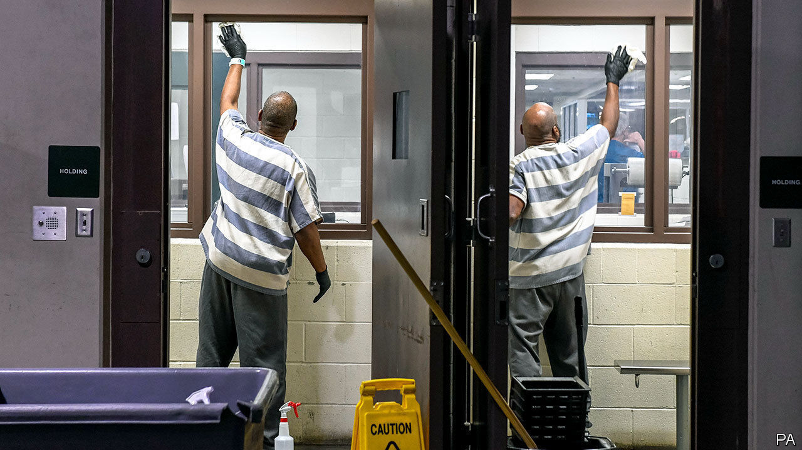
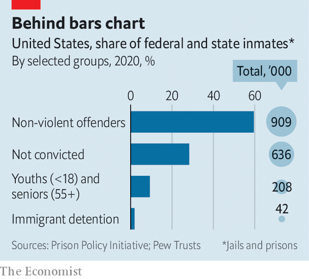

## Pushing on an open door

# The virus should speed efforts to shrink America’s prison population

> Two million Americans are behind bars. Covid-19 may bring some long-overdue change

> Mar 26th 2020CHICAGO

Editor’s note: The Economist is making some of its most important coverage of the covid-19 pandemic freely available to readers of The Economist Today, our daily newsletter. To receive it, register [here](https://www.economist.com//newslettersignup). For more coverage, see our coronavirus [hub](https://www.economist.com//coronavirus)

FACED WITH a pandemic, officials rush to close any place that threatens to become a centre of transmission. If fewer people mingle inside cruise ships, schools, churches or retirement homes then the risk of mass infections falls. Yet for more than 2m Americans squeezed into jails and prisons, along with many staff, a shutdown is not an option. Instead, such places risk becoming hotspots for disease. In 1918 the Spanish flu raged through San Quentin prison in California, infecting 500 of its 1,900 inmates in just two months.

Anxiety is rising by the day. The sheriff of Harris County, Texas, has likened his huge jail to “a perfect incubator” for covid-19, saying an outbreak would spread like “wildfire”. Inmates at an immigrant-detention centre in New Jersey have launched a hunger strike to demand soap. At Rikers Island, in New York, prisoners this week refused to leave their dormitories, worrying about infections. Tom Dart, sheriff of Cook County, who runs a large jail in Chicago, warns he is “juggling with impending disaster”. Some prisoners have the virus, but he lacks tests for checking others or even protective gear for staff.

“Universities and hotels you can close. I’m left with people I can’t send home,”, says Sheriff Dart. Instead he improvises. He clumps new arrivals in cohorts by the day they come in, hoping to isolate potentially sick ones for at least a week to prevent any infection spreading. Tents for quarantine are now going up in place of a mental-health centre. Staff take inmates’ temperatures, quiz them about sickness in the family and spray food trays with bleach water more often than before.

Such efforts are well-meant but inadequate. The virus is already spreading behind bars. Prisons in every state now ban regular visitors. In 15 states even lawyers are blocked. As staff and volunteers who provide education, therapy and other services also stay away, another risk is that morale will fall, to be replaced by mounting fear and frustration. That bodes ill for good order. In Italy similar efforts to contain the virus this month provoked at least 25 prison riots and several deaths.

Inmates are often packed close and obliged to buy their own soap—seen as a luxury, not a basic need—from meagre earnings. They will struggle to fend off infection. Pam Oliver, a sociologist who studies prisons in Wisconsin, calls the lack of hygiene “extremely dangerous”. The current crisis at least is raising public awareness of “severe overcrowding and unsanitary conditions” for those locked up, says Inimai Chettiar, of Justice Action Network, which campaigns for reform.

In Harris County some pregnant inmates have been released. Those protesting in Rikers want detainees aged 50 or older sent home. Ohio’s chief justice has said that people at highest risk of infection must be isolated outside jails. Ms Oliver notes that older inmates are both at risk and pose little threat, as they are unlikely to reoffend. A bill, HR4018, which was unanimously passed by the House last year and is waiting to go before the Senate, would make it easier for elderly prisoners to serve the final third of their sentences at home.

Another effort in many states aims to prevent people entering jails in the first place. Sheriff Dart in Chicago says daily arrivals have recently fallen by nearly half, from 100, as police issue more citations and arrest fewer offenders. That is becoming common in dozens of counties and cities. In Baltimore the state attorney, Marilyn Mosby, has told prosecutors to stop charging non-violent offenders such as those caught dealing drugs, trespassing or illegally selling sex. In Los Angeles, where 17,000 are in jail on an average day, officials are aiming to get the population down by 2,000. Daily arrests there have dropped from 300 to 60, says the sheriff.

Amid all this, there is an opportunity to release those whose detention does little for public safety. Of the 1.29m in state prisons, according to the Prison Policy Initiative, a think-tank, nearly half are held for non-violent crimes. Three-quarters of the 631,000 in jails are awaiting trial, mostly on non-violent charges. Those held for breaking parole conditions or not posting bail, and those nearing the end of their sentences, may all be let out early. Montana’s chief justice has called for judges to free “as many prisoners as you are able” in such categories. One county jail in Kentucky released 120 of its 697 detainees this month.

The remaining population will be harder to reduce, but some individuals who are classed as “violent offenders” probably also pose little threat to public safety, says Julian Adler at the Centre for Court Innovation in New York. He points out that some defendants strike plea bargains and get a record as violent, though they have never inflicted or threatened physical harm on any victim. “Statistics can mislead,” he says. A getaway driver, convicted as an accessory to a robber, may count as a violent felon. So may someone who brawled in a bar. Mr Adler hopes the current push to rethink who should be kept inside will change public attitudes in the longer term.

This wish may not be forlorn. Efforts are under way in several states to change laws so as to shrink the incarcerated population: by doing away with cash bail, for example, or by getting police to carry out fewer arrests for misdemeanours. Such existing programmes are routinely backed by both political parties and have made it easier to respond quickly in the face of covid-19, according to Laurie Garduque of the MacArthur Foundation, which funds research on jail reform. The speedy action of many courts, sheriffs and other officials in the past week or so she describes as admirable. The pandemic brings a reminder that society’s most vulnerable—the poor, homeless and mentally ill—commonly end up in jails. Efforts to help them now are “not radical”, says Ms Garduque, “but are pushing in the same direction that we knew from before.” After the pandemic, she predicts, “we can go even further.” ■

Dig deeper:For our latest coverage of the covid-19 pandemic, register for The Economist Today, our daily [newsletter](https://www.economist.com//newslettersignup), or visit our [coronavirus hub](https://www.economist.com//coronavirus)

## URL

https://www.economist.com/united-states/2020/03/26/the-virus-should-speed-efforts-to-shrink-americas-prison-population
