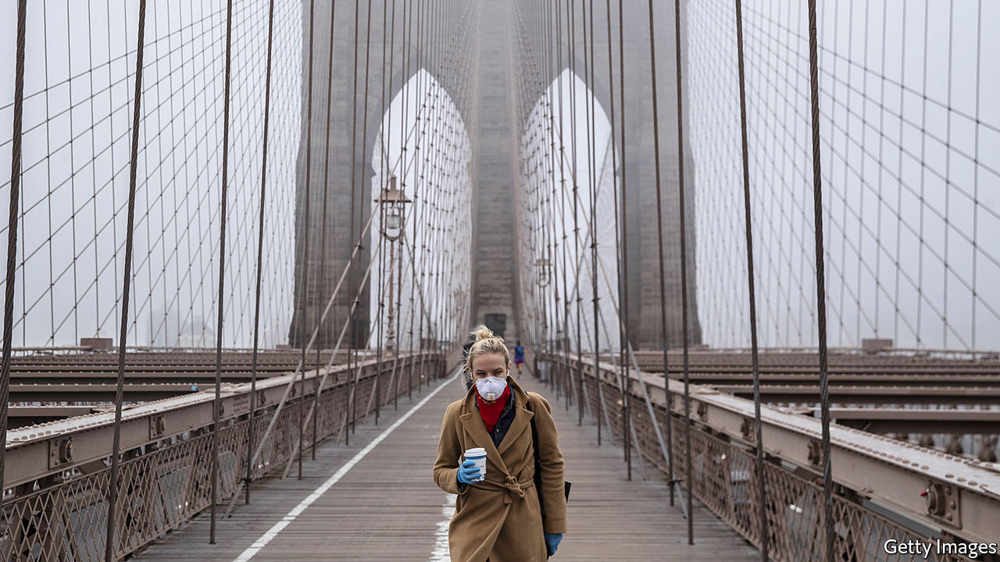

## The bills you have to pay

# Young Americans have been surprisingly vulnerable to the virus

> This may not last

> Mar 26th 2020

Editor’s note: The Economist is making some of its most important coverage of the covid-19 pandemic freely available to readers of The Economist Today, our daily newsletter. To receive it, register [here](https://www.economist.com//newslettersignup). For more coverage, see our coronavirus [hub](https://www.economist.com//coronavirus)

AMONG MANY worrying data points from the coronavirus crisis, one in particular has struck Americans. In a report published on March 18th the Centres for Disease Control and Prevention (CDC) showed that of the 508 known patients to have been hospitalised in the United States by March 16th, two-fifths were younger than 55. Of those, half were between 20 and 44. For a virus that is meant mostly to affect elderly people, those figures were extremely worrying. In the overall population adults aged 19 to 55 make up 47% of the population.

The report set off a storm. On March 22nd Anthony Fauci, a leading member of the White House’s task-force on the disease, noted that young people are certainly not immune. “All bets are off, no matter how young you are, if you have an underlying, serious medical condition,” said the doctor. Alexandria Ocasio-Cortez, a 30-year-old Democratic congresswoman, told young people they should be concerned not only for their elderly relatives but also for themselves: “Let me tell you something, in the state of New York, about 55% of our cases are with folks 18 to 49.”

It remains to be seen whether young people will continue to make up such large proportions of those hospitalised. But it seems unlikely. Since the CDC’s research was published, the number of confirmed cases in America has leapt from 4,226 to over 65,000. The CDC has not updated its figures on hospitalisation. There are some reasons why, at least in the early stages of the epidemic, young people might have been particularly affected. The spread in America has been concentrated in big cities like New York, which tend to be younger than the rest of the country. Before lockdowns were implemented, young people were more likely to crowd into bars, restaurants and subway carriages where the disease can spread easily. As it spreads further, it is likely that older people will make up a larger share of those in hospitals.

But there are some reasons to remain concerned about younger Americans. Research on the virus in China suggests that obese people, those with high blood pressure and those with pre-existing conditions such as diabetes may be more vulnerable. All those factors are especially prevalent in America. In Italy around 20% of people are obese; in America the figure is 36%. Over a tenth of Americans suffer from diabetes. Not all are old. On March 18th Donald Trump said he worried that many young people “don’t realise” the danger “and they’re feeling invincible.” His other statements have probably not helped with that, but his words ring true.■

Dig deeper:For our latest coverage of the covid-19 pandemic, register for The Economist Today, our daily [newsletter](https://www.economist.com//newslettersignup), or visit our [coronavirus hub](https://www.economist.com//coronavirus)

## URL

https://www.economist.com/united-states/2020/03/26/young-americans-have-been-surprisingly-vulnerable-to-the-virus
