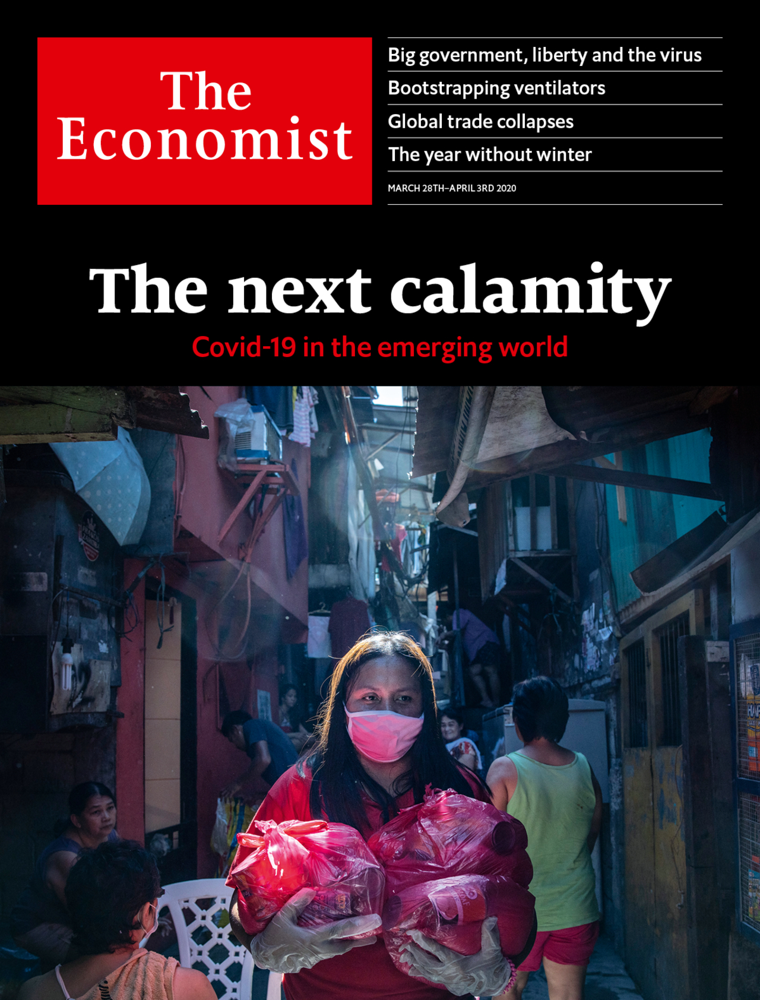

## Covid-19 could devastate poor countries

### The world this week
#### [Politics this week](./The%20world%20this%20week/politics-this-week.md)
#### [Business this week](./The%20world%20this%20week/business-this-week.md)
#### [Kals cartoon](./The%20world%20this%20week/kals-cartoon.md)
### Leaders
#### [The state in the time of covid 19](./Leaders/the-state-in-the-time-of-covid-19.md)
#### [The coronavirus could devastate poor countries](./Leaders/the-coronavirus-could-devastate-poor-countries.md)
#### [Americas emergency stimulus is imperfect but necessary](./Leaders/americas-emergency-stimulus-is-imperfect-but-necessary.md)
#### [Iran cannot fight covid 19 with conspiracy theories](./Leaders/iran-cannot-fight-covid-19-with-conspiracy-theories.md)
#### [Videoconferencing etiquette](./Leaders/videoconferencing-etiquette.md)
### Letters
#### [Letters to the editor](./Letters/letters-to-the-editor.md)
### Briefing
#### [Countries are using apps and data networks to keep tabs on the pandemic](./Briefing/countries-are-using-apps-and-data-networks-to-keep-tabs-on-the-pandemic.md)
#### [Rich countries try radical economic policies to counter covid 19](./Briefing/rich-countries-try-radical-economic-policies-to-counter-covid-19.md)
### Asia
#### [Covid 19 forces japan to delay the olympics](./Asia/covid-19-forces-japan-to-delay-the-olympics.md)
#### [A sex abuse scandal incenses millions of south koreans](./Asia/a-sex-abuse-scandal-incenses-millions-of-south-koreans.md)
#### [Bangladesh releases a jailed opposition figure](./Asia/bangladesh-releases-a-jailed-opposition-figure.md)
#### [Let taiwan into the world health organisation](./Asia/let-taiwan-into-the-world-health-organisation.md)
#### [India and pakistan try to keep a fifth of humanity at home](./Asia/india-and-pakistan-try-to-keep-a-fifth-of-humanity-at-home.md)
### United States
#### [Congress puts aside its habitual dysfunction and responds to covid 19](./United%20States/congress-puts-aside-its-habitual-dysfunction-and-responds-to-covid-19.md)
#### [Young americans have been surprisingly vulnerable to the virus](./United%20States/young-americans-have-been-surprisingly-vulnerable-to-the-virus.md)
#### [The return of slow courtship to american dating](./United%20States/the-return-of-slow-courtship-to-american-dating.md)
#### [The virus should speed efforts to shrink americas prison population](./United%20States/the-virus-should-speed-efforts-to-shrink-americas-prison-population.md)
#### [American teens are sexting more and sexing less](./United%20States/american-teens-are-sexting-more-and-sexing-less.md)
#### [Howie hawkins will probably be the green partys 2020 nominee](./United%20States/howie-hawkins-will-probably-be-the-green-partys-2020-nominee.md)
#### [Relations between china and america are infected with coronavirus](./United%20States/relations-between-china-and-america-are-infected-with-coronavirus.md)
### China
#### [China goes back to work](./China/china-goes-back-to-work.md)
#### [The pandemic will boost chinas standing its propagandists claim](./China/the-pandemic-will-boost-chinas-standing-its-propagandists-claim.md)
### The Americas
#### [Brazils president fiddles as a pandemic looms](./The%20Americas/brazils-president-fiddles-as-a-pandemic-looms.md)
#### [Mexico and the united states shut their border sort of](./The%20Americas/mexico-and-the-united-states-shut-their-border-sort-of.md)
#### [Covid 19 will sicken latin americas weak economies](./The%20Americas/covid-19-will-sicken-latin-americas-weak-economies.md)
### Middle East & Africa
#### [Africa is woefully ill equipped to cope with covid 19](./Middle%20East%20&%20Africa/africa-is-woefully-ill-equipped-to-cope-with-covid-19.md)
#### [As covid 19 spreads arab states are clamping down](./Middle%20East%20&%20Africa/as-covid-19-spreads-arab-states-are-clamping-down.md)
#### [Gaza already under siege imposes quarantine](./Middle%20East%20&%20Africa/gaza-already-under-siege-imposes-quarantine.md)
### Europe
#### [Spain has suffered more covid 19 deaths than any country save italy](./Europe/spain-has-suffered-more-covid-19-deaths-than-any-country-save-italy.md)
#### [Why does germanys death rate look better than italys](./Europe/why-does-germanys-death-rate-look-better-than-italys.md)
#### [Germany offers cash for everyone](./Europe/germany-offers-cash-for-everyone.md)
#### [Why dutch swear words are so poxy](./Europe/why-dutch-swear-words-are-so-poxy.md)
#### [Russias economy is isolated from the global rout](./Europe/russias-economy-is-isolated-from-the-global-rout.md)
#### [How grasshoppers triumphed over ants in europe](./Europe/how-grasshoppers-triumphed-over-ants-in-europe.md)
### Britain
#### [How covid 19 exacerbates inequality](./Britain/how-covid-19-exacerbates-inequality.md)
#### [Boris johnsons belated lockdown](./Britain/boris-johnsons-belated-lockdown.md)
#### [Coke is out weed is in](./Britain/coke-is-out-weed-is-in.md)
#### [How the national health service is transforming itself](./Britain/how-the-national-health-service-is-transforming-itself.md)
#### [Village life under lockdown](./Britain/village-life-under-lockdown.md)
#### [How covid 19 is playing out on a london street](./Britain/how-covid-19-is-playing-out-on-a-london-street.md)
#### [The jobs retention schemes unintended consequences](./Britain/the-jobs-retention-schemes-unintended-consequences.md)
#### [Not guilty verdicts for alex salmond](./Britain/not-guilty-verdicts-for-alex-salmond.md)
#### [Politics in the time of covid 19](./Britain/politics-in-the-time-of-covid-19.md)
### International
#### [Crowdsourcing to fight covid 19](./International/crowdsourcing-to-fight-covid-19.md)
#### [Scientists and industry are dashing to make more ventilators](./International/scientists-and-industry-are-dashing-to-make-more-ventilators.md)
#### [Were hiring](./International/were-hiring.md)
### Special report
#### [Africa is changing so rapidly it is becoming hard to ignore](./Special%20report/africa-is-changing-so-rapidly-it-is-becoming-hard-to-ignore.md)
#### [Africas population will double by 2050](./Special%20report/africas-population-will-double-by-2050.md)
#### [Migration is helping africa in many ways](./Special%20report/migration-is-helping-africa-in-many-ways.md)
#### [Parts of africa will remain unstable for decades](./Special%20report/parts-of-africa-will-remain-unstable-for-decades.md)
#### [African countries must get smarter with their agriculture](./Special%20report/african-countries-must-get-smarter-with-their-agriculture.md)
#### [Many of africas economies are doing well](./Special%20report/many-of-africas-economies-are-doing-well.md)
#### [Why are some african countries improving and others not](./Special%20report/why-are-some-african-countries-improving-and-others-not.md)
### Business
#### [The pandemic shock will make big powerful firms even mightier](./Business/the-pandemic-shock-will-make-big-powerful-firms-even-mightier.md)
#### [How retailers vie to be considered essential in a lockdown](./Business/how-retailers-vie-to-be-considered-essential-in-a-lockdown.md)
#### [The coronavirus crisis thrusts corporate hr chiefs into the spotlight](./Business/the-coronavirus-crisis-thrusts-corporate-hr-chiefs-into-the-spotlight.md)
#### [Diary of a home worker](./Business/diary-of-a-home-worker.md)
#### [How to manage a business without a headquarters](./Business/how-to-manage-a-business-without-a-headquarters.md)
#### [How alan jope runs unilever from his study](./Business/how-alan-jope-runs-unilever-from-his-study.md)
### Finance & economics
#### [If you thought the trade war was bad for global commerce](./Finance%20&%20economics/if-you-thought-the-trade-war-was-bad-for-global-commerce.md)
#### [Americas mortgage market sickens](./Finance%20&%20economics/americas-mortgage-market-sickens.md)
#### [Americas central bank is not the only one doling out greenbacks](./Finance%20&%20economics/americas-central-bank-is-not-the-only-one-doling-out-greenbacks.md)
#### [The ecb breaks its self imposed rules](./Finance%20&%20economics/the-ecb-breaks-its-self-imposed-rules.md)
#### [Saudi arabia floods the oil market america tries to prop up prices](./Finance%20&%20economics/saudi-arabia-floods-the-oil-market-america-tries-to-prop-up-prices.md)
#### [An imaginative template for dealing with the cash crunch](./Finance%20&%20economics/an-imaginative-template-for-dealing-with-the-cash-crunch.md)
#### [How to pay for the pandemic](./Finance%20&%20economics/how-to-pay-for-the-pandemic.md)
### Science & technology
#### [The epidemic provides a chance to do good by the climate](./Science%20&%20technology/the-epidemic-provides-a-chance-to-do-good-by-the-climate.md)
#### [Airborne particles may be assisting the spread of sars cov 2](./Science%20&%20technology/airborne-particles-may-be-assisting-the-spread-of-sars-cov-2.md)
#### [Taking peoples temperatures can help fight the coronavirus](./Science%20&%20technology/taking-peoples-temperatures-can-help-fight-the-coronavirus.md)
### Books & arts
#### [When athenians feared a disease would wreck their democracy](./Books%20&%20arts/when-athenians-feared-a-disease-would-wreck-their-democracy.md)
#### [How art galleries are adapting to the lockdown](./Books%20&%20arts/how-art-galleries-are-adapting-to-the-lockdown.md)
#### [Art and carnage in the italian renaissance](./Books%20&%20arts/art-and-carnage-in-the-italian-renaissance.md)
#### [People and money vanish in the glass hotel](./Books%20&%20arts/people-and-money-vanish-in-the-glass-hotel.md)
#### [Bulgakovs biting vision of an avoidable plague](./Books%20&%20arts/bulgakovs-biting-vision-of-an-avoidable-plague.md)
### Economic & financial indicators
#### [Economic data commodities and markets](./Economic%20&%20financial%20indicators/economic-data-commodities-and-markets.md)
### Graphic detail
#### [The northern hemisphere winter of 2019 20 was the warmest ever on land](./Graphic%20detail/the-northern-hemisphere-winter-of-2019-20-was-the-warmest-ever-on-land.md)
### Obituary
#### [Michel roux died on march 11th](./Obituary/michel-roux-died-on-march-11th.md)
