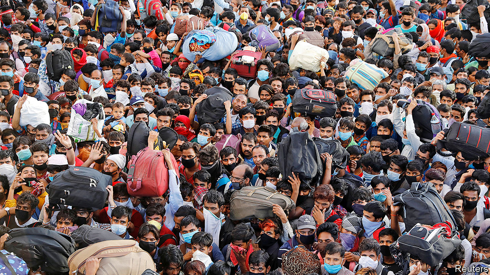

## Under pressure

# Lockdowns in Asia have sparked a stampede home

> Many migrant workers face hardship

> Apr 2nd 2020DELHI AND SINGAPORE

Editor’s note: The Economist is making some of its most important coverage of the covid-19 pandemic freely available to readers of The Economist Today, our daily newsletter. To receive it, register [here](https://www.economist.com//newslettersignup). For our coronavirus tracker and more coverage, see our [hub](https://www.economist.com//coronavirus)

WHERE DO YOU belong? This is not a metaphysical question. For English-speaking Indians, “belonging” to a place means simply that you come from there, as in, “I live in Delhi but belong to Bengal.” Yet for millions of migrant labourers, not only in India but across Asia, covid-19 has given the question new meaning. A Malaysian worker in a Singapore electronics plant, a Filipina servant in a wealthy household in Bangkok or a Bihari cook in a Delhi restaurant all face a similar dilemma. In a time of mass layoffs, curfews and sharp travel restrictions, where do they belong?

Prosperous expatriates can choose whether to stay or go, and if they are citizens of rich countries, their governments may help to fly them home. But for many the sudden absence of work leaves little choice. It is not just hard to survive in expensive cities without a paycheck. Whether you are one of the estimated 2m international migrants in South-East Asia labouring as servants, or toil in one of hundreds of thousands of small industrial workshops that power such Indian industries as gem-polishing or shoemaking, your place of work is also often where you eat and sleep. Even after years on the job, the minute you step off the treadmill there is nothing for it but to head “home”.

So it was that when Narendra Modi, India’s prime minister, on March 24th announced a snap decision to lock down all the country’s 1.3bn people for 21 days and to suspend rail, road and air transport, the immediate closure of businesses forced a hefty chunk of the workforce into awkward motion. At least 600,000 people, according to the government’s very low estimate, began to move. Despite the daunting distance between bustling cities such as Surat on India’s west coast, and impoverished sources of rural emigration such as the state of Uttar Pradesh, many simply started walking along the empty roads.

Chastened by wrenching television images of the exodus, state governments arranged buses for some of the migrants, and Mr Modi himself apologised for any inconvenience caused. But then the central government changed tack again. The mass flight, it realised, was undoing the very purpose of the lockdown, which was to stop the spread of the virus. In testimony to India’s supreme court, the government claimed—somewhat improbably—that as many as one in three of the migrants could be carrying the disease. So new orders were imposed, obliging state governments to quarantine all incoming travellers. This meant that often penniless and exhausted migrants, who had already braved club-wielding police enforcing the national curfew, then faced incarceration in hastily converted shelters in such places as government schools.

Many will now remain stuck in such places for weeks, while those who turned back or stayed put in the cities where they work face a precarious existence. Delhi’s state government is making plans to supply free food to more than 1m people a day.

Other Asian cities are also coping with jobless stay-behinds. Foreign workers who are now stranded under Malaysia’s Movement Control Order—many from Indonesia—complain that they are living in dangerously crowded quarters and running out of money. Some governments have acted to give stay-behinds some support, but this is unusual. Singapore, where migrants make up 38% of the workforce, has offered businesses a stipend of $35 a night for up to two weeks to accommodate commuters from Malaysia, which has shut its border. Migrants who fall sick from the coronavirus in the city state will not have to pay for treatment.

Sadly, some of India’s migrant workers who did reach their villages have not fared too well, either. One group that made it from Tamil Nadu in the far south all the way back to Bengal have hoisted hammocks, charpoys and mosquito nets into trees. They say they must live in suspension as there is no other way in their village to maintain social distance. Elsewhere, returning workers are held in suspicion as possible carriers of disease, sparking conflict. In one case in Bihar, a man was beaten to death after he pointed police to fellow returnees who should have been quarantined. At Bareilly in Uttar Pradesh, television cameras captured the humiliation suffered by migrants, forced by police to squat in a road as they were sprayed with bleach, supposedly to “disinfect” them.

The fear of migrants being a vector is far from misplaced. Workers who fled Mumbai to escape the 1918-19 Spanish flu pandemic carried it far into Indian provinces, and HIV, the virus which causes AIDS, was also spread along migrant corridors, notes Chinmay Tumbe, the author of a book on Indian migration. Just as Chinese migrant textile workers may have carried covid-19 to Italy, some of the first nodes for the disease in India appear to have been seeded by migrant dairy workers returning from Italy to the Punjab, and workers from the Arab Gulf returning to homes in Kerala.

As if that were not bad enough, some of the poor Indian provincial regions to which the recent wave of migrants has just returned may prove exactly the wrong place to be in an epidemic. The 120m people of the state of Bihar, for instance, must make do with just four testing centres for covid-19. They share a meagre 0.11 hospital beds for every 1,000 people, compared with 1:1,000 in Delhi or 2.4:1,000 in Singapore.

More immediately, what many of the migrants fear is simply financial ruin, or even starvation. And it is not just the migrants themselves at risk. In 2017 international remittances brought Asia an estimated $268bn, much of it flowing to rural economies that have few other sources of investment. The scale of such transfers across India is not known, but economists estimate the total size of the migrant workforce at about 100m people, many of whom send regular transfers “home”.

Whether they service rich, advanced economies such as Singapore’s, or perform the menial drudgery in India, migrant workers are among the most vulnerable to any shocks. At times like this they pay the price for the trait that some of their employers most prize: being invisible.■

Dig deeper:For our latest coverage of the covid-19 pandemic, register for The Economist Today, our daily [newsletter](https://www.economist.com//newslettersignup), or visit our [coronavirus tracker and story hub](https://www.economist.com//coronavirus)