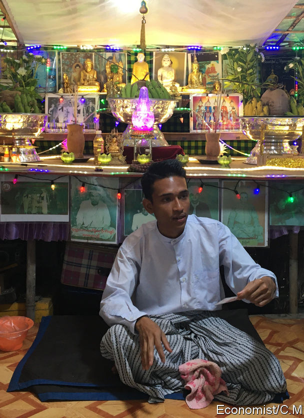

## A wizard wheeze

# Magical spells are a booming business in Myanmar

> Wizards, sidelined under military rule, are making a comeback

> Apr 2nd 2020YANGON

MIN KYAW THEIN is just 26, but he has a commanding presence. In his home in a suburb of Yangon, Myanmar’s biggest city, he sits cross-legged on the floor in front of a shrine festooned with tea lights, flowers and magical diagrams. His family and students gather round and listen intently as he explains how he acquired his powers, among them the ability to cure illnesses, boost profits and repel knife-wielding assailants (with his mind he turns the knife back on them).

Mr Min Kyaw Thein is one of a growing number of devout Burmese Buddhists striving to master occult techniques. Interest in magic has soared in Myanmar over the past few years, says Thomas Patton, author of “The Buddha’s Wizards”. For centuries many Buddhists have believed that extreme piety can confer special powers. Supernatural hermits, after all, help the Buddha himself in the scriptures. In Myanmar weizza, or wizards, are also thought to have protected the faith during periods of calamity, such as during British colonial rule. Today it is common to see shrines to the most powerful weizza in pagodas, where they are venerated for their spiritual purity and their devotion to those in need.

But until recently those purporting to be latter-day weizza had been banished to the margins of Burmese society. Ne Win, the strongman who ran Myanmar from 1962 until 1988, feared and envied secret weizza associations, which had powerful adherents and were so opaque that they were regarded as a “Burmese Buddhist Illuminati”, according to Mr Patton. The dictator is said to have worried that they might overthrow him by, for instance, raising an army of ghosts. He dissolved some of these groups, banned their magazines and books, and had portrayals of weizza scrubbed from films and other media.

Wizards started to make a comeback about a decade ago, when the army began ceding political power to civilians. Since the abolition of the censorship board in 2012, and particularly in the past couple of years, “there has been an explosion of publications about the wizards,” says Mr Patton. Young, image-conscious weizza market their talents on YouTube and Facebook, where the most popular attract hundreds of thousands of followers. Three weizza to whom The Economist spoke said that they have seen surging numbers of students and clients in recent years.

Their appeal lies in their ability to manipulate the physical world. The greatest wizards can apparently fly, turn base metals into gold and attain immortality—all handy skills. Even the middling ones claim useful powers. Clients come to Saw Lwin, an impish weizza with a ruff of brown hair, to perk up their profits, make them more attractive, banish evil spirits and remove tumours. Myanmar’s health-care system is rickety, and the sick often turn to weizza when doctors fail to heal them.

“Science solves cancer with medicine and surgery,” says Saw Lwin. “We can cure such things in our own ways.” Equipped with his battered book of spells and a laminated red diagram, he dips his index finger in a small pot of perfumed ink. As he does he briefly flashes the faded red tattoos—the source of his healing powers—etched onto his inner forearm. He presses his finger into the palm of your correspondent’s hand, then chants a spell. She has not fallen ill since. ■