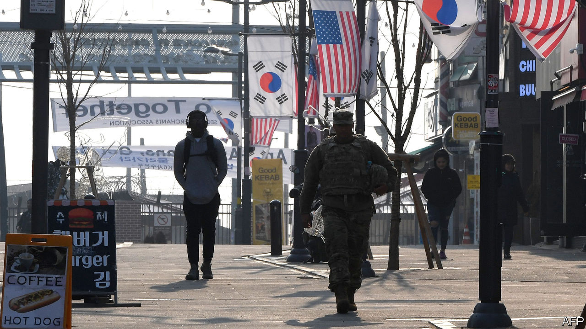

## Base instincts

# South Koreans at US military bases are furloughed

> Donald Trump wants allies to pay more to host American troops

> Apr 4th 2020SEOUL

Editor’s note: The Economist is making some of its most important coverage of the covid-19 pandemic freely available to readers of The Economist Today, our daily newsletter. To receive it, register [here](https://www.economist.com//newslettersignup). For more coverage, see our coronavirus [hub](https://www.economist.com//coronavirus)

THE COMMANDER did not mince words. Furloughing half of the 9,000 South Koreans who work for the American military forces in the country for an indefinite period was “unthinkable” and “heartbreaking”, General Robert B. Abrams said in a televised address on April 1st. Yet he had to do it. As of this month thousands of local civilians working at American bases across the country will stay at home, unpaid, for the first time in the history of the alliance.

However heartbreaking it may have been for General Abrams, the decision was evidently no longer unthinkable enough for his superiors to avoid it. The local staff looking after the 28,500 American troops stationed in South Korea provide a range of services including security, catering and electrical installations. Their wages are covered by an agreement that divvies up the cost of hosting the troops between the two allies. The latest version of the agreement expired at the end of 2019. Three months later, emergency funds to cover wages are running low. The workers now on unpaid leave will remain there until the two countries agree on a new deal.

That is precisely what negotiators have failed to do so far, despite months of talks. The reason is Donald Trump. Previous presidents saw America’s alliance with South Korea as an essential part of a broader strategy—keeping the peace in Asia for the benefit of the whole world, including America itself. American troops deterred North Korea from invading again, and reassured Japan, another ally. South Koreans fought side by side with America not only in the Korean war but also in Vietnam. The cost-sharing agreement was extended with little fanfare every five years.

Now, although both sides still regularly insist the alliance is “ironclad”, the words ring increasingly hollow. Unlike his predecessors, Mr Trump sees alliances as an expensive favour to foreigners rather than a strategic necessity. So renegotiating the deal with South Korea has become a fraught annual ritual. Early in 2019 South Korea’s government agreed to an 8% increase in its contribution, to around $920m, avoiding a furlough of the sort that has just happened.

During the current round of negotiations, America has insisted that South Korea pay vastly more than that—maybe as much as $5bn, which is close to the total cost of keeping the troops in the country. South Koreans consider such a demand to be a shameless shakedown.

With less than two weeks to go until elections for the National Assembly, the decision to oppose it has created a rare political consensus between progressives and conservatives. Jeong Eun-bo, South Korea’s chief negotiator, said this week that the two sides had been close to a deal and expressed regret that America went ahead with the furlough anyway, but he did not specify what each side had offered.

The furlough will test an alliance that was already strained. It comes at a time of heightened uncertainty in regional security. North Korea conducted four short-range missile tests in March and is expected to stage further provocations to mark the birthday of Kim Il Sung, its founding dictator, on April 15th. China and America are at loggerheads over trade and, increasingly, over their respective responses to the covid-19 pandemic. General Abrams did not explicitly acknowledge that the furlough would affect military preparedness, but said the US command would do its utmost to minimise the impact on the troops’ readiness to fight.

The most immediate impact, however, will be on workers who have just lost their income. Lim Yoon-kyung of the Pyeongtaek Peace Centre, which represents some of the workers, said the furlough amounted to “daylight robbery”. “These people’s jobs are directly related to their survival,” she says. The South Korean government said that it would try to pass a special bill to compensate the workers for lost salaries. That may curry favour with the public ahead of the election. But with the world economy slumping, America laying off workers will surely hurt its reputation. And with Mr Trump hoping to procure covid-19 test kits from South Korea, now might not be the wisest time to pick a fight.■

Dig deeper:For our latest coverage of the covid-19 pandemic, register for The Economist Today, our daily [newsletter](https://www.economist.com//newslettersignup), or visit our [coronavirus hub](https://www.economist.com//coronavirus)

## URL

https://www.economist.com/asia/2020/04/04/south-koreans-at-us-military-bases-are-furloughed
