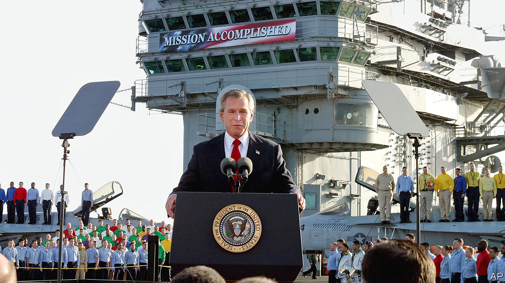

## The victor’s curse

# America won the cold war. What went wrong?

> Three contrasting books examine a superpower’s malaise

> Apr 2nd 2020

Do Morals Matter? By Joseph Nye. Oxford University Press; 268 pages; $24.95 and £18.99.

The Abandonment of the West. By Michael Kimmage.Basic Books; 368 pages; $32 and £25.

The Age of Illusions. By Andrew Bacevich.Metropolitan Books; 239 pages; $27.

THE UNITED STATES, Andrew Bacevich writes near the start of his account of post-cold-war America, is like the man who won the Mega Millions lottery: his unimagined windfall holds the potential for disaster. Things are not quite that bad. But almost three decades after America watched the Soviet Union fall apart, victory feels like a disappointment.

The end of the cold war established America as the most powerful country in history. Its armed forces were unmatched and its governing philosophy seemingly had no rival. Yet it has struggled either to prevail against illiterate tribesmen and tinpot dictators or to get to grips with a newly assertive Russia and a rising China. In a pandemic its allies might have expected America to co-ordinate a planet-wide response. Instead, it has turned inward. Just as startlingly, America itself fell prey to bitterness and division, culminating in the presidency of a man who won office by rejecting many of the values which had helped bring about that original victory.

This is the sombre backdrop for three very different books about America’s place in the world. Joseph Nye, a former dean of the Kennedy School at Harvard, looks at how presidents have struggled to embody their country’s moral leadership. Michael Kimmage, a fellow at the German Marshall Fund, teases out the contradictions in the idea of an American-led “West”. And Mr Bacevich, a professor emeritus at Boston University, depicts the construction (and then, he argues, the demolition) of a post-cold-war doctrine of American power.

None of these books is the last word on an important question. But each offers tantalising insights into how victory soured.

Before getting to the moral conduct of each president, starting with Franklin D. Roosevelt, Mr Nye takes on the argument of his book’s title: “Do Morals Matter?” His target is foreign-policy “realists” who claim that, however they dress it up, countries are amoral and put their own interests first.

Mr Nye is surely right to counter that most American leaders have contrasted themselves to cynical, balance-of-power Europeans. He quotes Theodore Roosevelt: “Our chief usefulness to humanity rests on combining power with high purpose.” Mr Nye—a thinker who in the 1980s formulated the doctrine of soft power—is also right to stress that this high purpose is itself a vital component of American influence. The international order the United States constructed depends on legitimacy, he explains, and legitimacy depends on values.

Every president has had his blemishes, of course. Mr Nye has seen too much of the world to have illusions about that. But—and here you suspect is the real purpose of this book—none has abandoned the rhetoric or the practice of right and wrong in foreign policy quite as shamelessly as President Donald Trump. No president has so enthusiastically embraced both autocrats and the Hobbesian idea that might is right. Only Mr Trump and his officials have sought to dismantle the international order that his predecessors built and maintained, but which the Trump White House sees as “Gulliverising” America.

Mr Nye takes the underpinnings of America’s moral leadership as read. Not so Mr Kimmage. For him the West is not a place, so much as a set of ideas articulated at the end of the 19th century in America as it prepared to take on the mantle of a great power. At its best, the West has stood for capitalism, science, the Enlightenment, the rule of law and human rights, all of which a mythologised Christopher Columbus had introduced from Europe, laying the foundation of what was to become the transatlantic alliance.

In “The Abandonment of the West”, Mr Kimmage argues that, on the left, “the West” long ago came to be seen as a source of hypocrisy and racism. Columbus was recast as a conqueror and plunderer. Martin Luther King pointed out the irony of the White House advocating free elections in communist eastern Europe when large parts of America did not enjoy them. Edward Said, a professor at Columbia University of Palestinian origin, condemned “terrible reductive conflicts that herd people under falsely unifying rubrics like ‘American’, ‘the West’ or ‘Islam’.”

And Mr Kimmage describes how, once it was no longer protected by rivalry with the Soviet Union, the notion of “the West” fell out of favour as an ideological rallying point. The left has increasingly regarded it as “too white, too male in its history, too elitist, too complicit in the Euro-American aggressions of less enlightened eras”. The American right likes the idea of the West’s cultural heritage, but is uncomfortable with the reality of Europe as an essential component of it, “too seemingly divorced from nationhood, too invested in the welfare state, too pacifist, too secular”. As China and Russia challenge democracy and the canon of Enlightenment texts disappears from university reading lists, Mr Kimmage says, the idea of the West is not just wavering; it may be doomed.

Mr Bacevich takes a different tack. He is not interested in the hollowing out of the West’s ideas in universities and think-tanks, but in their grandiose inflation among the political elite. He quotes George W. Bush telling West Point cadets in 2002 that: “The 20th century ended with a single surviving model of human progress, based on non-negotiable demands of human dignity, the rule of law, limits on the power of the state, respect for women and private property and free speech and equal justice and religious tolerance.”

Put like that, it is hard to fault Mr Bush’s sentiments. However, in “The Age of Illusions”, Mr Bacevich’s gloss is that the country’s military, political and commercial elites came to believe American motives were beyond reproach, and that their world-view was sure to prevail. They therefore took it upon themselves to become global enforcers. They built a new operating system designed to cement American primacy, based on globalisation, military dominance, the individualistic pursuit of fulfilment and an imperial presidency.

Yet this system, Mr Bacevich argues, has been plagued by unintended consequences. Globalisation was meant to create wealth, but many Americans complain of inequality; military dominance sucked the country into never-ending wars that sacrificed the children of lower-income families (but, for the most part, no one else’s); the pursuit of fulfilment led to the withering of duty and a selfish, atomised society; and the supremacy of the presidency became a recipe for voters’ disappointment.

All this culminated in the election of Mr Trump. The president’s critics, this book argues, overestimate him even as they underestimate the importance of his victory. Mr Trump is “a mountebank of the very first order”, Mr Bacevich writes, but his presence in the Oval Office is a rejection of the post-cold-war operating system and all it stands for. The elites’ focus on Mr Trump’s wickedness, he maintains, spares them the pain of having to acknowledge how pitifully their own project failed.

It is telling that three such different books all try to understand what went wrong after the Soviet collapse not by looking overseas but within, at the nature of America itself. In their various ways, they all condemn Mr Trump. Mr Nye doubts his morality. Mr Kimmage sees him as the first anti-“West” president. Most interesting is Mr Bacevich, who warns that, although Mr Trump offered no definition of post-cold-war America, just a rejection, there is no going back. That is a lesson for Joe Biden, the presumptive Democratic nominee, who gives the sense that going back is what he would most like to do. ■