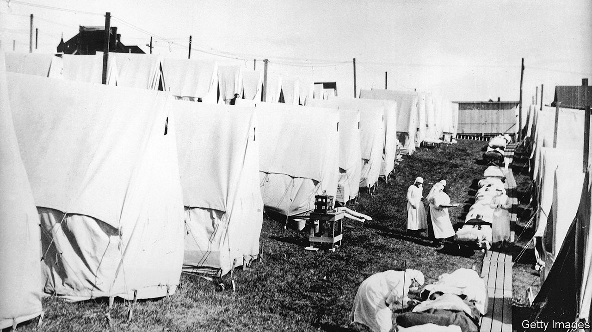

## How to understand a plague

# Five books of science and history that cast light on covid-19

> From the pestilence in London in 1665 to the Spanish flu and beyond

> Apr 4th 2020

Editor’s note: The Economist is making some of its most important coverage of the covid-19 pandemic freely available to readers of The Economist Today, our daily newsletter. To receive it, register [here](https://www.economist.com//newslettersignup). For more coverage, see our coronavirus [hub](https://www.economist.com//coronavirus)

Pale Rider. By Laura Spinney (Public Affairs; Vintage)

The Spanish flu pandemic that began in 1918 killed around 50m people in a few years—more deaths than in the preceding four years of world war. Young adults seemed to perish disproportionately from what was an especially virulent strain of the influenza virus. Doctors could do very little about the sickness, so countries closed their borders and blamed each other. This book tells the story not only of the devastation at the time, but also of the century of scientific detective-work that was required to understand why the episode was so deadly.

Spillover. By David Quammen (W.W. Norton; Vintage)

Some of the outbreaks of disease that have caused most distress among human beings have come from animals. Other, non-human primates were the source of HIV; influenza transferred from birds, and coronaviruses from bats. When the human immune system is newly confronted with something that has just hopped the species barrier—a so-called zoonosis—it can be overwhelmed. By tracking the origin of several zoonoses, this book explains how such diseases emerge, why they are so dangerous and where in the world the next ones might arise.

The Rules of Contagion. By Adam Kucharski (Basic Books; Wellcome Collection)

Today, the freedoms and daily routines of many countries are held in the hands of epidemiologists. Amid the pandemic, these mathematical modellers have supplied scenarios for how travel bans, social distancing or stay-at-home policies could alter the trajectory of covid-19. This book charts the history of this now-pivotal science, from its origins in understanding the spread of malaria at the turn of the 20th century, to its central role in predicting the dissemination of everything from diseases to fake news in the 21st.

A Journal of the Plague Year. By Daniel Defoe (Oxford University Press)

A diary of one man’s life in 1665, when the bubonic plague swept through London, killing almost 100,000. The book recounts the progress of the disease as it transforms the city, describing streets that are either eerily empty or filled with the sounds and smells of suffering. Defoe was only five in 1665 and wrote the book, which blends historical detail and imagination, more than 50 years after the event. He is thought to have based it on the contemporaneous diaries of his uncle, Henry Foe.

The End of Epidemics. By Jonathan Quick and Bronwyn Fryer (St Martin’s Press; Scribe)

Published two years ago, this book’s simple message ought to have been more widely heeded: planning, preparation and open communication count for everything when it comes to ameliorating the vast social and economic damage that a new infection can cause. Using insights from previous outbreaks, the authors offer lessons on how global institutions can best co-ordinate to predict, model and prevent future pandemics. ■

Dig deeper:For our latest coverage of the covid-19 pandemic, register for The Economist Today, our daily [newsletter](https://www.economist.com//newslettersignup), or visit our [coronavirus hub](https://www.economist.com//coronavirus)