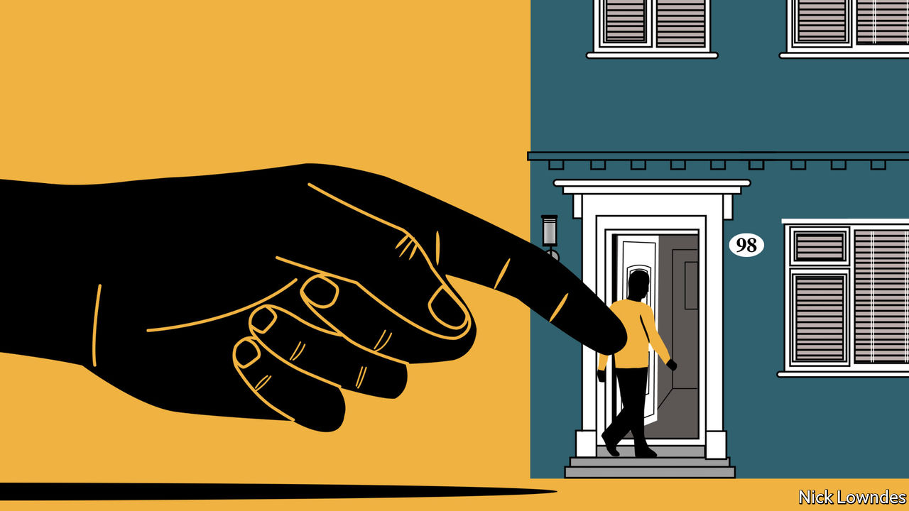

## Johnson

# How to frame public health messages so people hear them

> Behavioural economics offers some important insights

> Apr 4th 2020

Editor’s note: The Economist is making some of its most important coverage of the covid-19 pandemic freely available to readers of The Economist Today, our daily newsletter. To receive it, register [here](https://www.economist.com//newslettersignup). For more coverage, see our coronavirus [hub](https://www.economist.com//coronavirus)

IMAGINE THAT America is preparing for the outbreak of an unusual Asian disease that is expected to kill 600 people. Two alternative responses are proposed. Assume that the consequences of the programmes are as follows: if option A is adopted, 200 people will be saved. If B is chosen, there is a one-third probability that 600 people will be saved and a two-thirds probability that none will be. Which would you choose?

Now assume a different pair of options. If C is implemented, 400 people will perish; if D is preferred, there is a one-third probability that nobody will die and a two-thirds probability that 600 people will. Which will you choose now?

If you are like most people, you chose A in the first scenario, and D in the second. If you stopped and deliberately did the maths, though, or have read Daniel Kahneman’s “Thinking, Fast and Slow”, you will have noticed that the two scenarios are identical: A and C offer the same outcome, as do B and D. Mr Kahneman won the Nobel prize in economics for his pioneering work (with the late Amos Tversky) in behavioural economics, which focuses on how people’s choices are swayed by a host of factors that should not affect decision-making, but perennially do. The first two paragraphs above are taken from a survey the two researchers conducted in 1981, eerily presaging today’s pandemic.

The glitches in human psychology that the pair identified include “negativity bias”: bad outcomes loom larger in people’s minds than positive ones. That is why A appeals (“200 people will be saved”), whereas the identical but differently framed C (“400 people will die”) does not; focusing on the negative pushes three-quarters of people away from this choice. This effect interacts with another one: willingness to gamble. People will not gamble with a sure thing in hand (200 living people) but they will take a risk to avoid certain losses (400 dead).

How can this inform effective communication over covid-19? It may be tempting for governments to stress the negative: “If you go out you may get sick.” No one wants a bad thing—but neither do they want to be stuck at home with no food, toilet paper or fun. Faced with two bad options—one certain (no fun), the other (becoming ill) worse but only hypothetical—many people will take the risk. They might be pushed in the opposite direction by stressing the good thing they have in hand: “Stay safe” rather than “Stop coronavirus spreading”. Most countries seem to be using both tactics.

Another research finding, tested in the real world, uses social psychology. Britain’s tax office added a single line to reminder notices telling overdue filers that most people pay their taxes on time, and that the recipient was one of the few who had not. That raised prompt filings by five percentage points. This kind of social shame might work for the virus, too.

But good framing is not enough. Leaders must also be clear and firm. Denmark, which has imposed a lockdown, is a fine example. “Cancel Easter lunch,” its government told citizens in no uncertain terms. “Postpone family visits. Don’t go sightseeing around the country.” As the Local, a Swedish news website, noticed, that injunction contrasts starkly with the language in Sweden, which (so far) has taken a much softer approach to containing the disease (see [article](https://www.economist.com//europe/2020/04/04/why-swedes-are-not-yet-locked-down)). Its government said: “Ahead of the breaks and Easter, it is important to consider whether planned travel in Sweden is necessary.”

The Danish instructions seem to be working; police report few violations of the rules. As Orla Vigso, a Danish professor of language in Gothenburg, Sweden, says, the strictures are well-calibrated. Danes consider themselves “the anarchists of the Nordic countries”. To be made to comply they need to be told directly. But there is a wider lesson. Recommendations that sound more advisory than mandatory seem to presume rational adults will do the right thing with accurate information. The central insight of behavioural economics is that they do not, at least not reliably.

Rule number one in crisis communications, says Mr Vigso, is coherence. Mixed messages allow people to follow their biases and believe whatever they want. America is hobbled in two regards here. Its federal structure means a president, 50 governors and countless mayors are saying different things. And it has a president who said he wanted to see “packed” churches at Easter, then decided otherwise. You’re much more likely to tell people what they want to hear if you can’t make up your own mind.

Dig deeper:For our latest coverage of the covid-19 pandemic, register for The Economist Today, our daily [newsletter](https://www.economist.com//newslettersignup), or visit our [coronavirus hub](https://www.economist.com//coronavirus)