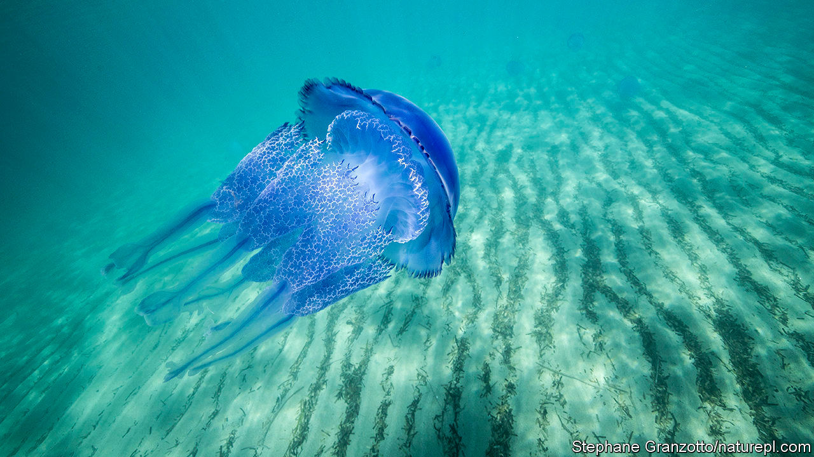

## Rich and strange

# Jellyfish, not the meek, might inherit the Earth

> Yet there are very few toy jellyfish, Peter Williams observes ruefully

> Apr 2nd 2020

Jellyfish. By Peter Williams. Reaktion Books; 224 pages; $19.95 and £12.95.

LACKING BRAINS or much of a gut, jellyfish, which are 95% water, are deceptively simple in structure. Yet they are otherworldly in appearance, as their names—lion’s mane, flower hat—imply. Neither fish nor jelly and rather more like slime, they puzzled Aristotle. Were they animals or plants? Even the father of taxonomy, Carl Linnaeus, was stumped.

In fact, Peter Williams writes in his engaging and handsomely illustrated book, they are animals of surprising sophistication, with an ingenious portfolio of stratagems. Deepstaria enigmatica literally bags its meal by enfolding prey in its sheet-like body and tightening the edge like a drawstring. Erenna, a deepwater species, lures tiny crustaceans to their doom with luminescent tentacles. Turritopsis dohrnii, the “immortal” jellyfish, pulls off the most stunning ploy of all. When injured, it shifts into developmental reverse, devolving back into a polyp, its earliest stage of life. A Japanese researcher says unlocking the secret of this immortality is “the most wonderful dream of mankind”.

Until the advent of underwater cameras, their shape-shifting forms frustrated would-be illustrators and researchers. You might as well dissect a soap bubble. Unlike mammals, fish or insects, they could not be stuffed, mounted or pinned. Preservation was tricky; alcohol degraded their colour and translucency. Some of the best early depictions were exquisite 19th-century glass models, now in Harvard’s Museum of Comparative Zoology, made by father-and-son artists Leopold and Rudolf Blaschka.

Mr Williams’s book is an ambivalent experience itself. The reader is by turns wary, repulsed and fascinated by these creatures. They figure in the grand scheme of nature, providing food for sea turtles, penguins, lobsters and (primarily in Asia) humans. They act as a sink for greenhouse gases; they have played a role in Nobel-prizewinning research in chemistry and medicine.

On the sinister side, jellyfish blooms have sometimes created havoc. Forty million Filipinos were left in the dark in 1999 after swarms were sucked into the cooling system of a power plant, sparking fears of a military coup. In 2009 a Japanese trawler traversed an efflorescence of giant jellyfish, some weighing over 200 kilos. When its nets were raised, the boat capsized. Species such as the Portuguese man-of-war and the box jellyfish have a deadly sting, and antidotes remain elusive.

It may be that the meek will not ultimately inherit the Earth: jellyfish will. Because they can tolerate warming seas, acidification and pollution, some scientists believe that they may be set to outlast less robust animals. Others reckon that recent blooms simply reflect natural fluctuations in numbers.

Enduring they may be; endearing they are not. Toy jellyfish, after all, are few and far between. “Octopuses, yes,” Mr Williams ruefully acknowledges, but “very, very few jellyfish”. They are too toxic and they look too weird. But, he argues persuasively, if they are ineligible for affection, they at least deserve humanity’s respect. ■

## URL

https://www.economist.com/books-and-arts/2020/04/02/jellyfish-not-the-meek-might-inherit-the-earth
