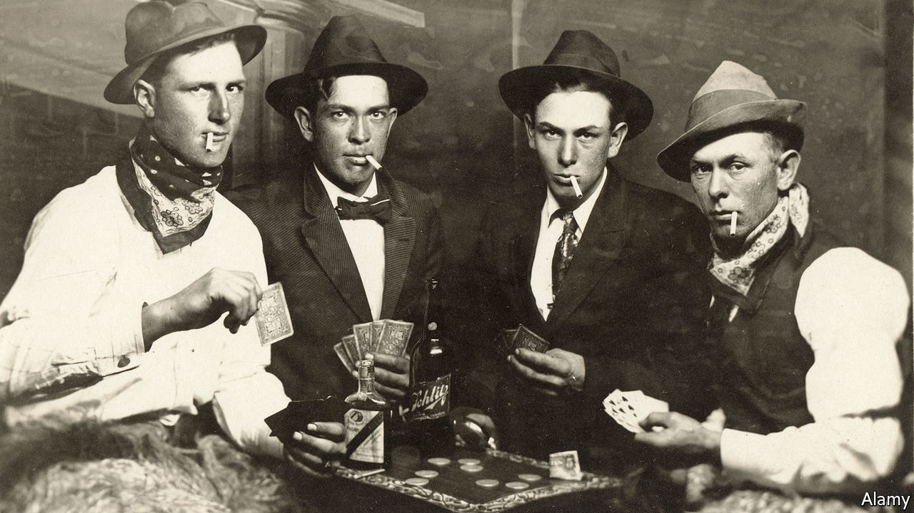

## Home Entertainment

# The joys of teaching poker to your kids

> The lessons they glean will last a lifetime—so long as they hurt

> Apr 4th 2020

“THE BEAUTY of poker,” writes David Sklansky in the introduction to “The Theory of Poker”, perhaps the best book written about the best card game invented, “is that on the surface it is a game of utter simplicity, yet beneath the surface it is profound, rich and full of subtlety.” Cooped-up children can learn the rules in just a few open hands—that is, rounds played with all cards visible and all moves explained. The lessons they glean will last a lifetime.

To sceptics, poker conjures up images of casinos, late nights and smoky back rooms—all places inappropriate for kids. That outmoded caricature need not trouble people playing in quarantined homes, at reasonable hours and without cigars. And, yes, poker is a form of gambling, but it is primarily a game of skill and nerve.

Luck plays a larger role than in purely skill-driven games such as chess, but that is what makes poker so appealing for put-upon parents: you will be a better player than your children, but they will still win often enough to keep them interested. As Mr Sklansky puts it, “The 500th best player could easily win a [poker] tournament. By contrast, the 500th best golfer is not going to win a golf tournament.”

There are enough variations for children to pick personal favourites; in other words, like literature and music, it offers them a chance for self-expression within a shared passion. Just as a parent thrills to see their offspring reading, even if what the child chooses to read is not what the adult would, a poker-enthusiast parent will happily play Five-card Draw with his child, even if he prefers Texas Hold ‘Em.

The goal is always straightforward: amass a better five-card hand than your opponents. But the paths to success are many and divergent. Sometimes it involves bluffing, a practice that, initially, children embrace with lunatic enthusiasm. A parent may feel guilty about taking all his child’s chips the fourth time the kid goes all-in with nothing higher than a nine. Persist: eventually, they will learn that they cannot always lie their way to victory, and that sometimes the wiser action is to withdraw from the fight. They will also learn the corollary of that lesson: sometimes bluffing works.

Soon they will figure out how to read their opponents—observing that cockiness can be a cover for weakness, and reticence a ploy to tempt others into overconfidence. They will see that a lost hand is not a lost game, and a lost game today does not augur the same tomorrow. In poker, as in life, the race is not always to the swift, and chance and bad beats (losing a winnable hand) happeneth to one and all.

But the only way they will learn any of these lessons is if they hurt. After a few practice rounds with matchsticks or toothpicks, the stakes must be actual money—and adults must keep it when they win. This may be difficult: children come into the world lovable but broke, and no parent wants to further impoverish their own. On the other hand, children are also expensive. Consider any victory a partial repayment for their upbringing. ■

## URL

https://www.economist.com/books-and-arts/2020/04/04/the-joys-of-teaching-poker-to-your-kids
