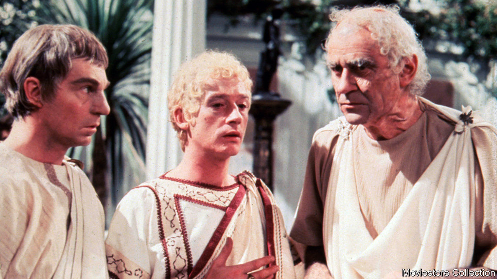

## Home Entertainment

# Why you should be watching the Roman saga of “I, Claudius”

> Set in antiquity, this is a soap opera on a grand scale, featuring murder, madness, incest and betrayal

> Apr 4th 2020

A RICH FAMILY takes control of one of the world’s two superpowers and rules for generations with the aid of a compliant Senate. That is not the plot of a 21st-century political satire but of “I, Claudius”, a British television drama of the 1970s about the Roman imperial family, based on novels by Robert Graves.

The series features some terrific actors such as John Hurt (as Caligula), Patrick Stewart (as Sejanus, a scheming consul) and, in the title part, Derek Jacobi as the stuttering, lame emperor. Brian Blessed, normally a very hammy performer, is marvellously effective as Augustus. Siân Phillips plays his tricksy wife, Livia.

Apart from the acting, two things make the show a pleasure to revisit in isolation. The first is that this is just the right kind of history to dramatise: familiar-sounding but only half-remembered. Most people will have heard, if dimly, of Augustus, Tiberius, Caligula and Nero; the Roman Empire is still revered. Second, this is soap opera on a grand scale, featuring murder, madness, incest and betrayal. It is “Game of Thrones” without the dragons and direwolves.

The story is told in flashback by the aged Claudius as he recalls the (literally) poisonous feuds that engulfed his family and resulted in his unlikely ascent to the imperial throne. Indeed, he only becomes emperor because the praetorian guard needed a ruler to justify their existence, after the assassination of Caligula. In a speech to a doubtful Senate, Claudius says: “As for being half-witted: well, what can I say, except that I have survived to middle age with half my wits, while thousands have died with all of theirs intact. Evidently, quality of wits is more important than quantity.”

Many scenes stick in the mind 40 years after they were first broadcast. In one, Livia carefully explains to Augustus how she has poisoned him with fruit from a fig tree, as Mr Blessed stares in mute, unblinking silence for what seems like five minutes. In another, Claudius’s mother, Antonia, imprisons her daughter, Livilla, after the latter killed her own husband. As Livilla screams, Claudius asks, “How can you leave her to die?” “That’s her punishment,” his mother answers. “How can you bear to sit out here and listen to her?” Claudius says. Antonia replies, “And that’s mine.”

Gulp this down now, and you will need to make allowances. The 1970s were an era of limited budgets, so the series was shot in the studio; vast Roman legions are represented by half a dozen soldiers. But the story is so compelling that it overcomes these shortcomings. It is, above all, a meditation on the corrupting influence of absolute power. Place all authority in the hands of one individual, and society is at risk from his follies and petty jealousies. Even the well-meaning Claudius is betrayed by almost everyone he trusts and, in his dying moments, learns that his dreams of a restoration of a republic will be dashed. ■