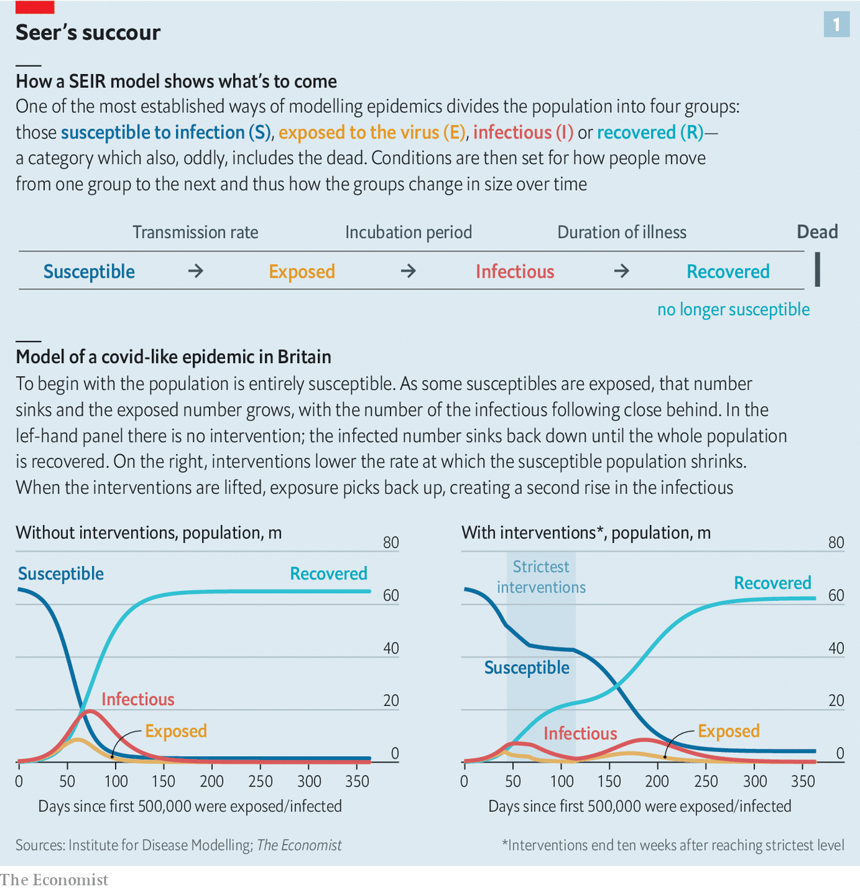
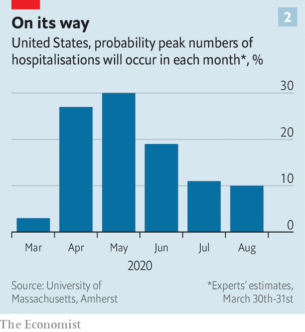
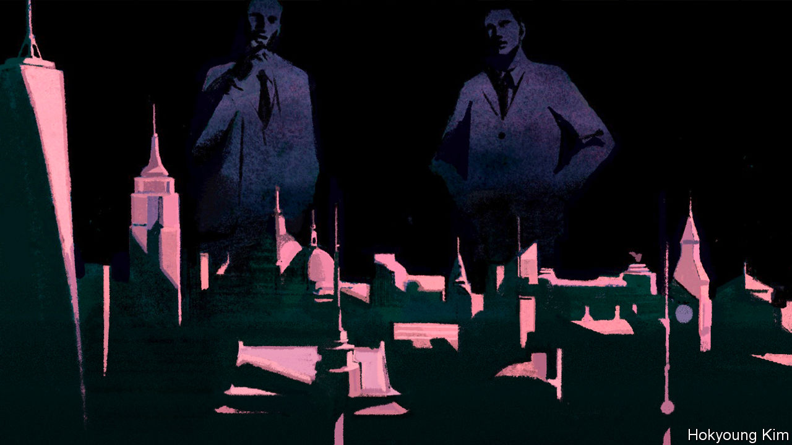
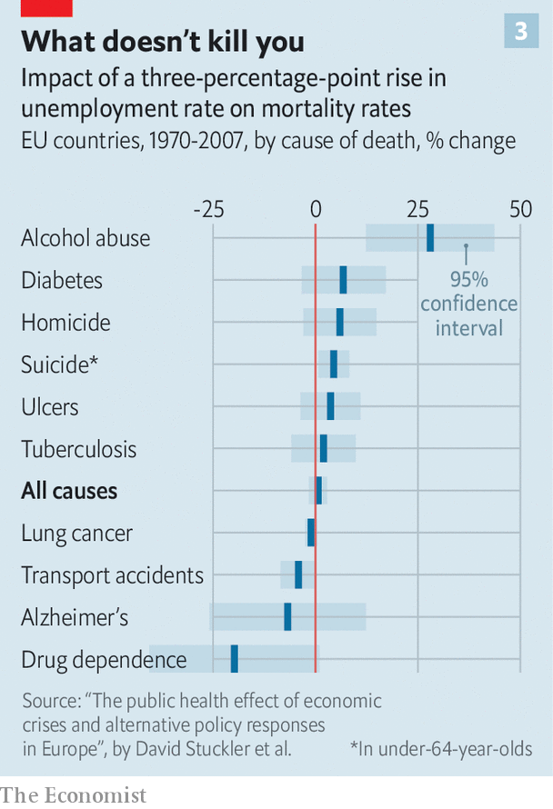

## Between tragedies and statistics

# The hard choices covid policymakers face

> Epidemiological models are among their only guides

> Apr 4th 2020WASHINGTON, DC

Editor’s note: The Economist is making some of its most important coverage of the covid-19 pandemic freely available to readers of The Economist Today, our daily newsletter. To receive it, register [here](https://www.economist.com//newslettersignup). For our coronavirus tracker and more coverage, see our [hub](https://www.economist.com//coronavirus)

“WE HAVE NO choice,” said President Donald Trump on March 30th, after announcing that federal guidelines on social distancing would remain in force until the end of April. “Modelling…shows the peak in fatalities will not arrive for another two weeks. The same modelling also shows that, by very vigorously following these guidelines, we could save more than 1 million American lives.”

Epidemiological models are not the only reason why many countries around the world, and many states in America, are now in some form of lockdown. That China, where the outbreak started, pursued such a policy with an abandon never seen before, and subsequently reported spectacular falls in the rate of new infections, is doubtless another reason. So are the grim scenes from countries where the spread of the virus was not interrupted early enough. By April 1st Italy had seen almost four times as many deaths as China.

The power of the models has been that they capture what has just been seen in these countries and provide a quantitative picture of what may be seen tomorrow—or in alternative tomorrows. They have both made clear how bad things could get and offered some sense of the respite which different interventions can offer. Faced with experts saying, quietly but with good evidence, that a lockdown will save umpty-hundred-thousand lives, it is hard for a politician to answer “At what cost?”

What is more, when the epidemiologists reply “Not our department”, the economists to whom the buck then passes are not necessarily much more help. Estimates of the costs of the interventions now in place are all large, but they vary widely (see [article](https://www.economist.com//finance-and-economics/2020/04/04/emerging-market-lockdowns-match-rich-world-ones-the-handouts-do-not)). A proper assessment requires knowing how well the measures will work, how long they will last and how they will be ended—thus returning the question to the realm of public-health policy.

But as time goes on, “at what cost” will become easier to voice, and harder to duck. “We have no choice” will no longer be enough; as the disruptive effects of social-distancing measures and lockdowns mount there will be hard choices to make, and they will need to be justified economically as well as in terms of public health. How is that to be done?

Epidemiological models come in two types. The first seeks to capture the basic mechanisms by which diseases spread in a set of interlinked equations. In the classic version of this approach each person is considered either susceptible, exposed, infectious or recovered from the disease. The number in each group evolves with the numbers in one or more of the other groups according to strict mathematical rules (see chart 1). In simple versions of such models the population is uniform; in more elaborate versions, such as the one from Imperial College London, which has influenced policy in Britain and elsewhere, the population is subdivided by age, gender, occupation and so on.

The second type of model makes no claim to capture the underlying dynamics. They are instead based on what is essentially a sophisticated form of moving average, predicting things about next week (such as how many new infections there will be) based mostly on what happened this week, a little bit on what happened last week, and a smidgen on what happened before that. This approach is used to forecast the course of epidemics such as the seasonal flu, using patterns seen in epidemics that have already run their course to predict what will come next. Over the short term they can work pretty well, providing more actionable insights than mechanistic models. Over the long term they remain, at best, a work in progress.

All the models are beset by insufficient data when faced with covid-19. There is still a lot of uncertainty about how much transmission occurs in different age groups and how infectious people can be before they have symptoms; that makes the links between the different equations in the mechanistic models hard to define properly. Statistical models lack the data from previous epidemics that make them reliable when staying a few steps ahead of the flu.

This causes problems. The Dutch started expanding their intensive-care capacity on the basis of a model which, until March 19th, expected intensive-care stays to last ten days. Having seen what was happening in hospitals, the modellers lengthened that to 23 days, and the authorities worry about running out of beds by April 6th. Unsettling news; but better known in advance than discovered the day before.

If more data improve models, so does allowing people to look under their bonnets. The Dutch have published the details of the model they are using; so has New Zealand. As well as allowing for expert critique, it is a valuable way of building up public trust.

As models become more important and more scrutinised, discrepancies between their purported results will become apparent. One way to deal with divergence is to bring together the results of various different but comparable models. In Britain, the government convened a committee of modelling experts who weighed the collective wisdom from various models of the covid-19 epidemic. America’s task force for the epidemic recently held a meeting of modelling experts to assess the range of their results.

Another way to try to get at the combined expertise of the field is simply to ask the practitioners. Nicholas Reich of the University of Massachusetts, Amherst, and his colleague Thomas McAndrew have used a questionnaire to ask a panel of experts on epidemics, including many who make models, how they expect the pandemic to evolve. This sounds crude compared with differential equations and statistical regressions, but in some ways it is more sophisticated. Asked what they were basing their responses on, the experts said it was about one-third the results of specific models and about two-thirds experience and intuition. This offers a way to take the models seriously, but not literally, by systematically tapping the tacit knowledge of those who work with them.

In studies run over the course of two flu seasons, such a panel of experts was consistently better at predicting what was coming over the next few weeks than the best computational models. Unfortunately, like their models, the experts have not seen a covid outbreak before, which calls the value of their experience into at least a little doubt. But it is interesting, given Mr Trump’s commitment to just another month of social distancing, that they do not expect a peak in the American epidemic until May (see chart 2).

Though the models differ in various respects, the sort of action taken on their advice has so far been pretty similar around the world. This does not mean the resultant policies have been wise; the way that India implemented its lockdown seems all but certain to have exacerbated the already devastating threat that covid-19 poses there. And there are some outliers, such as the Netherlands and, particularly, Sweden, where policies are notably less strict than in neighbouring countries.

Attempts to argue that the costs of such action could be far greater than the cost of letting the disease run its course have, on the other hand, failed to gain much traction. When looking for intellectual support, their proponents have turned not to epidemiologists but to analyses by scholars in other fields, such as Richard Epstein, a lawyer at the Hoover Institute at Stanford, and Philip Thomas, a professor of risk management at the University of Bristol. These did not convince many experts.

Even if they had, it might have been in vain. The argument for zeal in the struggle against covid-19 goes beyond economic logic. It depends on a more primal politics of survival; hence the frequent comparison with total war. Even as he talked of saving a million lives, Mr Trump had to warn America of 100,000 to 200,000 deaths—estimates that easily outstrip the number of American troops lost in Vietnam. To have continued along a far worse trajectory would have been all but impossible.

What is more, a government trying to privilege the health of its economy over the health of its citizenry would in all likelihood end up with neither. In the absence of mandated mitigation policies, many people would nonetheless reduce the time they spend out of the home working and consuming in order to limit their exposure to the virus. (Cinemas in South Korea, where the epidemic seems more or less under control, have not been closed by the government—but they are still short of customers.) There would be effects on production, too, with many firms hard put to continue business as usual as some workers fell ill (as is happening in health care today) and others stayed away (as isn’t).

This is one reason why, in the acute phase of the epidemic, a comparison of costs and benefits comes down clearly on the side of action along the lines being taken in many countries. The economy takes a big hit—but it would take a hit from the disease too. What is more, saving lives is not just good for the people concerned, their friends and family, their employers and their compatriots’ sense of national worth. It has substantial economic benefits.

Michael Greenstone and Vishan Nigam, both of the University of Chicago, have studied a model of America’s covid-19 epidemic in which, if the government took no action, over 3m would die. If fairly minimal social distancing is put in place, that total drops by 1.7m. Leaving the death toll at 1.5m makes that a tragically underpowered response. But it still brings huge economic benefits. Age-adjusted estimates of the value of the lives saved, such as those used when assessing the benefits of environmental regulations, make those 1.7m people worth about $8trn: nearly 40% of GDP.

Those sceptical of the costs of current policies argue that they, too, want to save lives. The models used to forecast GDP on the basis of leading indicators such as surveys of sentiment, unemployment claims and construction starts are no better prepared for covid-19 than epidemiological models are, and their conclusions should be appropriately salinated. But even if predictions of annualised GDP losses of 30% over the first half of the year in some hard-hit economies prove wide of the mark, the abrupt slowdown will be unprecedented.

Lost business activity will mean lost incomes and bankrupt firms and households. That will entail not just widespread misery, but ill health and death. Some sceptics of mitigation efforts, like George Loewenstein, an economist at Carnegie Mellon University, in Pittsburgh, draw an analogy to the “deaths of despair”—from suicide and alcohol and drug abuse—in regions and demographic groups which have suffered from declining economic fortunes in recent decades.

The general belief that increases in GDP are good for people’s health—which is true up to a point, though not straightforwardly so in rich countries—definitely suggests that an economic contraction will increase the burden of disease. And there is good reason to worry both about the mental-health effects of lockdown (see [article](https://www.economist.com//international/2020/04/04/how-will-humans-by-nature-social-animals-fare-when-isolated)) and the likelihood that it will lead to higher levels of domestic abuse. But detailed research on the health effects of downturns suggests that they are not nearly so negative as you might think, especially when it comes to death. Counterintuitive as it may be, the economic evidence indicates that mortality is procyclical: it rises in periods of economic growth and declines during downturns.

A study of economic activity and mortality in Europe between 1970 and 2007 found that a 1% increase in unemployment was associated with a 0.79% rise in suicides among people under the age of 65 and a comparable rise in deaths from homicide, but a decline in traffic deaths of 1.39% and effectively no change in mortality from all causes (see chart 3). A study published in 2000 by Christopher Ruhm, now at the University of Virginia, found that in America a 1% rise in unemployment was associated with a 1.3% increase in suicides, but a decline in cardiovascular deaths of 0.5%, in road deaths of 3.0%, and in deaths from all causes of 0.5%. In the Great Depression, the biggest downturn in both output and employment America has ever witnessed, overall mortality fell.

Some research suggests that the procyclical link between strong economic growth and higher mortality has weakened in recent decades. But that is a long way from finding that it has reversed. What is more, the effects of downturns on health seem contingent on policy. Work published by the OECD, a group of mostly rich countries, found that some worsening health outcomes seen in the aftermath of the financial crisis were due not to the downturn, but to the reductions in health-care provision that came about as a result of the government austerity which went with it. Increased spending on programmes that help people get jobs, on the other hand, seems to reduce the effect of unemployment on suicides. The fact that some of the people now arguing that the exorbitant costs of decisive action against covid-19 will lead to poorer public health in the future were, after the financial crisis, supporters of an austerity which had the same effect is not without its irony.

But if the argument that the cure might be worse than the disease has not held up so far, the story still has a long way to go. The huge costs of shutting down a significant fraction of the economy will increase with time. And as the death rates plateau and then fall back, the trade-offs—in terms of economics, public health, social solidarity and stability and more—that come with lockdowns, the closure of bars, pubs and restaurants, shuttered football clubs and cabin fever will become harder to calculate.

It is then that both politicians and the public are likely to begin to see things differently. David Ropeik, a risk-perception consultant, says that people’s willingness to abide by restrictions depends both on their sense of self-preservation and on a sense of altruism. As their perception of the risks the disease poses both to themselves and others begins to fall, seclusion will irk them more.

It is also at this point that one can expect calls to restart the economy to become clamorous. In Germany, where the curve of the disease has started to flatten, Armin Laschet, the premier of North Rhine-Westphalia, Germany’s largest and second-most-covid-afflicted state, has said it should no longer be out of bounds to talk about an exit strategy. Angela Merkel, the chancellor—a role Mr Laschet is keen to inherit—said on March 26th there should be no discussion of such things until the doubling time for the number of cases in the country had stretched beyond ten days. When she was speaking, it was four days. Now it is close to eight.

When the restrictions are lessened it will not be a simple matter of “declaring victory and going home”, the strategy for getting out of the Vietnam war advocated by Senator Richard Russell. One of the fundamental predictions of the mechanistic models is that to put an epidemic firmly behind you, you have to get rid of the susceptible part of the population. Vaccination can bring that about. Making it harder for the disease to spread, as social distancing does, leaves the susceptible population just as vulnerable to getting exposed and infected as it was before when restrictions are lifted.

This does not mean that countries have to continue in lockdown until there is a vaccine. It means that when they relax constraints, they must have a plan. The rudiments of such a plan would be to ease the pressure step by step, not all at once, and to put in place a programme for picking up new cases and people who have been in contact with them as quickly as possible. How countries trace cases will depend, in part, on how low they were able to get the level of the virus in the population and how able, or inclined, they are to erode their citizens’ privacy. How they relax constraints will depend to some extent on modelling.

Cécile Viboud of America’s National Institutes of Health argues that if you can make mechanistic models sufficiently fine-grained they will help you understand the effectiveness of different social-distancing measures. That sounds like the sort of knowledge that governments considering which restrictions to loosen, or tighten back up, might find valuable. The ability to compare the outcomes in countries following different strategies could also help. David Spiegelhalter, a statistician at the University of Cambridge, says the differences between Norway, which is conforming to the lockdowns seen in most of the rest of Europe, and Sweden, which is not, provide a “fantastic experiment” with which to probe the various models.

But the fact that it is possible to build things like how much time particular types of people spend in the pub into models does not necessarily mean that the models will represent the world better as a result. For what they say on such subjects to be trustworthy the new parameters on pubs and such like must be calibrated against the real world; and the more parameters are in play, the harder that is. People can change so many behaviours in response to restrictions imposed and removed that the uncertainties will “balloon” over time, says Mr Reich.

Some will see this as a reason to push ahead with calibration and other improvements. Others may see it as a reason to put off the risks associated with letting the virus out of the bag for as long as possible. Longer restrictions would give governments more time to put in place measures for testing people and tracking contacts. If they force many companies into bankruptcy, they will give others time to find workarounds and new types of automation that make the restrictions less onerous as time goes by.

Advocates of keeping things in check for as long as possible can point to a new paper by Sergio Correia, of the Federal Reserve Board, Stephan Luck, of the Federal Reserve Bank of New York, and Emil Verner, of MIT, which takes a city-by-city look at the effects of the flu pandemic of 1918-19 on the American economy. They find that the longer and more zealously a city worked to stem the flu’s spread, the better its subsequent economic performance. A new analysis by economists at the University of Wyoming suggests much the same should be true today.

The flu, though, mostly killed workers in their prime, and the service industries which dominate the modern economy may not respond as the manufacturing industries of a century ago. What is more, in some places the pressure to get the economy moving again may be irresistible. According to Goldman Sachs, a bank, Italy’s debts could reach 160% of GDP by the end of the year—the sort of number that precedes panics in bond markets. The euro zone could forestall such a crisis by turning Italian debt into liabilities shared all its members—something the European Central Bank is already doing, to a limited extent, by buying Italian bonds. But resistance from Germany and the Netherlands is limiting further movement in that direction. There could come a time when Italy felt forced to relax its restrictions to someone else’s schedule rather than leave the euro.

There is also a worry that, the longer the economy is suppressed, the more long-lasting structural damage is done to it. Workers suffering long bouts of unemployment may find that their skills erode and their connections to the workforce weaken, and that they are less likely to re-enter the labour force and find good work after the downturn has ended. Older workers may be less inclined to move or retrain, and more ready to enter early retirement. Such “scarring” would make the losses from the restrictions on economic life more than just a one-off: they would become a lasting blight. That said, the potential for such scarring can be reduced by programmes designed to get more people back into the labour force.

In the end, just as lockdowns, for all that their virtues were underlined by the modellers’ grim visions, spread around the world largely by emulation, they may be lifted in a similar manner. If one country eases restrictions, sees its economy roar back to life and manages to keep the rate at which its still-susceptible population gets infected low, you can be sure that others will follow suit. ■

Dig deeper:For our latest coverage of the covid-19 pandemic, register for The Economist Today, our daily [newsletter](https://www.economist.com//newslettersignup), or visit our [coronavirus tracker and story hub](https://www.economist.com//coronavirus)

## URL

https://www.economist.com/briefing/2020/04/04/the-hard-choices-covid-policymakers-face
