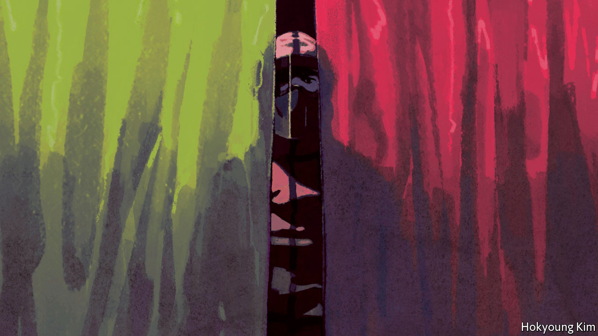

## Triage under trial

# The tough ethical decisions doctors face with covid-19

> When the concept of trade-offs is all too real

> Apr 2nd 2020

Editor’s note: The Economist is making some of its most important coverage of the covid-19 pandemic freely available to readers of The Economist Today, our daily newsletter. To receive it, register [here](https://www.economist.com//newslettersignup). For our coronavirus tracker and more coverage, see our [hub](https://www.economist.com//coronavirus)

IT WAS Dominique-Jean Larrey, a rugged French military surgeon in Napoleon’s Grande Armée, who came up with the system of triage. On the battlefield Larrey, who tended to the wounded at the battle of Waterloo, had to determine which soldiers needed medical attention most urgently, regardless of their military rank. In doing so he came up with the concept of distinguishing between urgent and non-urgent patients. Triage, from the French trier (“separate out”) remains as useful today as it was in the Napoleonic campaigns.

Yet most doctors today have rarely been in battlefield conditions. The covid-19 pandemic has changed that. In Italy there are reports of doctors weeping in hospital hallways because of the choices they have to make. In America and Europe many doctors are faced with terrible decisions about how to allocate scarce resources such as beds, intensive care, and ventilators. In the Netherlands, for example, hospitals are expected to be at full capacity by April 6th; two patients have already been sent to Germany. In some countries, new guidelines over how to distinguish between patients are being hastily drawn up.

One general solution, proffered by both moral philosophers and physicians, is to make sure that resources—in this case staff, supplies and equipment—are directed to the patients who have the greatest chances of successful treatment, and who have the greatest life expectancy. But beyond such a seemingly simple utilitarian solution lie some brutal decisions.

Take the shortage of ventilators. Many patients hospitalised with covid-19 will need one eventually. Provide it too early, and someone else does without. When it is truly needed, though, it will be needed quickly. A paper in the New England Journal of Medicine says that when ventilators are withdrawn from patients dependent on them, they will “die within minutes”.

The decision over whether or not to ventilate then becomes a decision between life or death. If a young patient arrives needing a ventilator, and none are available, there is a chance that one will be removed from someone else who is identified as being less likely to survive. In extreme situations, it may even be taken from someone who might survive but who is expected to live for a shorter length of time. Such frameworks do not favour older patients or those with health problems.

Ventilation is actually hard for the body to take. It is difficult for older patients to survive on it for two or three weeks—the length of time it would take for them to recover from covid-19. In ordinary situations, an effort would be made to keep the patient alive until it becomes obviously futile. In some hospitals that is no longer possible.

Italian doctors say that it helps if the framework for distinguishing between patients is decided in advance, and patients and families are properly informed. It also helps if someone else, other than front-line doctors, makes the difficult decisions. That leaves doctors free to appeal a decision if they think it has been made in error. In America many states have strategies for rationing resources; this is performed by a triage officer or committee in a hospital.

In some places, preparation of new triage guidelines is under way. In Canada a framework is being developed and vetted by government lawyers and regulators, according to Ross Upshur, a professor at the Dalla Lana School of Public Health in Toronto. In Britain, the development of guidelines has been painful. The National Institute for Health and Care Excellence, a government body, recommends that decisions about admission to critical care should be made on the basis of the potential for medical benefit. Since issuing that advice it has, though, clarified that a generic frailty index included in its guidelines should not be used for younger people or those with learning disabilities. On April 1st the British Medical Association, the doctors’ trade union, stepped into the breach, making clear the trade-offs: “there is no ethically significant difference between decisions to withhold life-sustaining treatment or to withdraw it, other clinically relevant factors being equal.”

Whether on the battlefield or in a crowded ICU, humans tend to be inclined to treat others according to need and their chances of survival. That framework seems broadly morally acceptable. Even so, it will involve many heart-wrenching decisions along the way. ■

Dig deeper:For our latest coverage of the covid-19 pandemic, register for The Economist Today, our daily [newsletter](https://www.economist.com//newslettersignup), or visit our [coronavirus tracker and story hub](https://www.economist.com//coronavirus)

## URL

https://www.economist.com/briefing/2020/04/02/the-tough-ethical-decisions-doctors-face-with-covid-19
