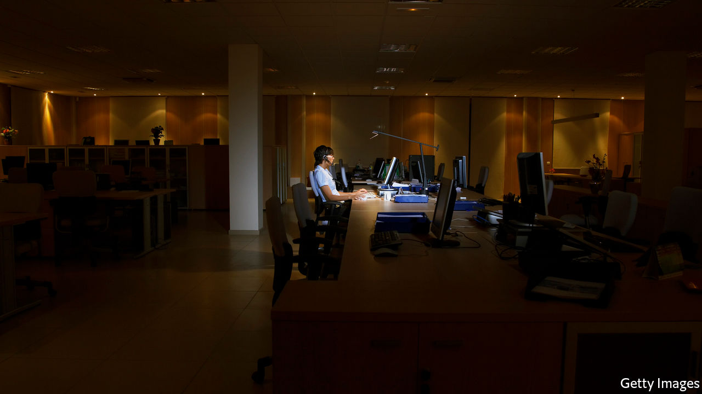

## Customer service

# Britain’s call centres are overwhelmed and overhauling how they work

> Operators are getting over their hang ups and dialling up home-working

> Apr 4th 2020

Editor’s note: The Economist is making some of its most important coverage of the covid-19 pandemic freely available to readers of The Economist Today, our daily newsletter. To receive it, register [here](https://www.economist.com//newslettersignup). For more coverage, see our coronavirus [hub](https://www.economist.com//coronavirus)

GOOD LUCK trying to get in touch with a company these days. Those calling British Airways about a refund will find themselves hung up on by an automated system, immediately after they hear the words, “we appreciate your understanding at this time”. Virgin Media emailed its 5.5m cable and broadband customers to ask them to avoid calling. Banks, insurance companies and this newspaper have issued similar requests to customers seeking support, directing them online instead.

While call numbers have shot through the roof, call centres are closing. Coronavirus has put the industry, which employs some 1.3m Britons, or about 4% of the workforce, in a particularly tight spot. Only 10-20% of call-centre employees typically work from home, reckons Ann-Marie Stagg of CCMA, an industry body. Many call centres take payments, making home-working risky from a legal perspective. Yet if an on-site employee catches coronavirus, hundreds more may be taken offline, at least for a while. A Sky call centre in Cardiff was closed for a day after one worker was diagnosed with it in March.

In February Virgin had a dozen call centres. Now five overseas centres—in India and the Philippines—are closed. The rest, in Britain, remain open, but staff numbers fluctuate as workers fall ill or take time off to care for their families. Abby Thomas, who runs customer service for Virgin, says that the company just doesn’t have as many people as it needs to answer calls. Last month it announced 500 new jobs to supplement its 2,350 domestic call-centre workers. Meanwhile, the firm has redeployed resources: sales calls have been suspended, agents who normally handle customer retention have been assigned service jobs. Staff have been spread out across several floors, every second desk is kept empty and the cafeteria has been closed (workers are brought lunch at their desks instead).

Running homeworkers is tricky. “How do you manage home agents effectively when you have no direct visibility?” asks Charlie Mitchell of Call Centre Helper. Other obstacles include security concerns around customer information; complying with rules for payment processing; and caring for staff who might be taking call after call with no breaks.

But it is not impossible. Sensée, as an entirely work-from-home call centre operator, has several financial firms as clients, and also works for the government. It keeps an eye on staff with webcams, demands that workers’ desks be kept clear, and commandeers their computers so that no screenshots or prints can be made. Its staff has grown from 700 in February to 1,100 last week and “probably 1,500” in the next few days, says Mark Walton, its boss.

Other operators are reconfiguring their processes, often overnight. Serco, a big contractor for the public sector, has moved more than a third of its call-centre workers to home-working. Ascensos, a Scottish firm with 1,200 employees in Britain had ten such positions a month ago; now 600 employees work from home. Virgin has 1,800 laptops ready to go for when it is forced to send employees home. Ms Stagg says several insurance firms she has spoken to are preparing for 100% home-based call centres, even if it means providing fewer services over the phone. “They are having to make the choice: do we give no service or do we give some service,” she says. The future of the industry is on the line.■

Dig deeper:For our latest coverage of the covid-19 pandemic, register for The Economist Today, our daily [newsletter](https://www.economist.com//newslettersignup), or visit our [coronavirus hub](https://www.economist.com//coronavirus)