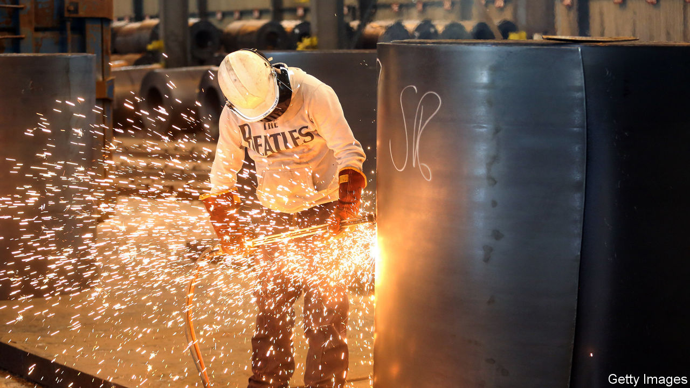
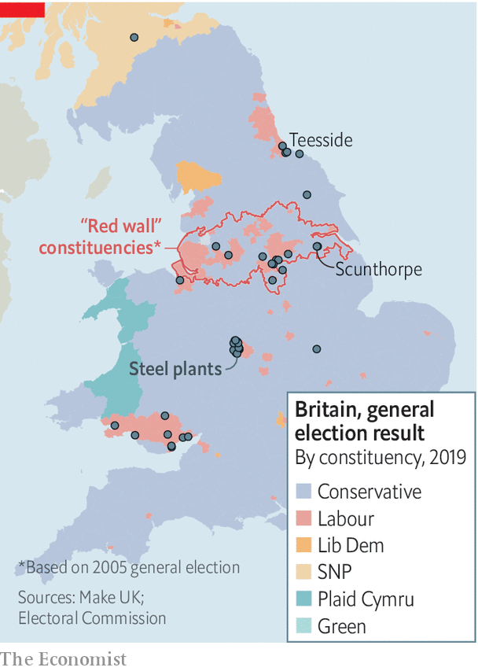

## Propping up firms

# Britain’s steel industry is braced for trouble

> A failing industry looks like falling through the gaps of government support

> Apr 2nd 2020

ON MARCH 9TH Britain’s steel industry received some rare good news when Jingye Group, a Chinese firm, completed its purchase of British Steel, saving some 3,000 jobs in Scunthorpe and Teesside. But a lot has changed in three weeks. “That feels like three years ago,” says an industry insider. “In three weeks’ time I’m worried Britain won’t really have a steel industry.”

Steelmakers have seen demand fall by as much as 40% since car production shut down and most construction projects were suspended. Firms report that the drop is similar to the one experienced in the banking crisis of 2008. But that shock came after years of buoyant growth, when company balance-sheets were in ruder health. This time the industry faces an imminent liquidity crunch, but with cash levels already dangerously low.

The Treasury has put in place a package of support for firms across the economy built on two core ideas: access to cheap finance to tide firms over, and support for wage bills to maintain employment in a downturn. Treasury officials are keen to stick to the principle of broad support for businesses, rather than to bail out specific companies. Firms have been quick to praise the government’s efforts, but there is growing frustration that a “one size fits all” approach may leave too many gaps.

Rishi Sunak, the chancellor, has announced up to £330bn ($410bn) of government loan guarantees (worth 15% of GDP) for firms, but none of that is likely to reach the steel industry. The government is running two lending schemes. The first, delivered through banks, covers firms with annual turnover of up to £45m and is meant to support small- and medium-sized enterprises. The second, administered via the Bank of England, is aimed at larger firms but is open only to investment-grade borrowers. The main British steel firms’ turnover is too high for the SME scheme but they lack the credit rating to use the larger version. Many high-street retailers find themselves in a similar quandary.

The jobs-retention scheme too causes problems. Closing steel plants temporarily is not something that is often done. It can take 8-12 weeks safely to mothball a blast furnace, “It’s not just a last resort, it’s often terminal,” says one boss. In common with other businesses, the industry would prefer a more flexible furlough arrangement in which workers’ hours can be cut, with the government helping cushion the blow to incomes.

Steel may directly employ only 32,600 workers, fewer than the pub chain JD Wetherspoon. But the jobs are clustered together and the workers tend to earn around one-third more than others in their localities. Britain’s new political geography may offer some hope (see map). Much of existing steel employment is concentrated in and around former “red wall” seats that switched from Labour to Conservative at the last election. Even the chair of the All-Party Parliamentary Group on Steel is now a Tory. Steel may be the latest industry arguing its case for more support, but it is unlikely to be the last. ■

## URL

https://www.economist.com/britain/2020/04/02/britains-steel-industry-is-braced-for-trouble
