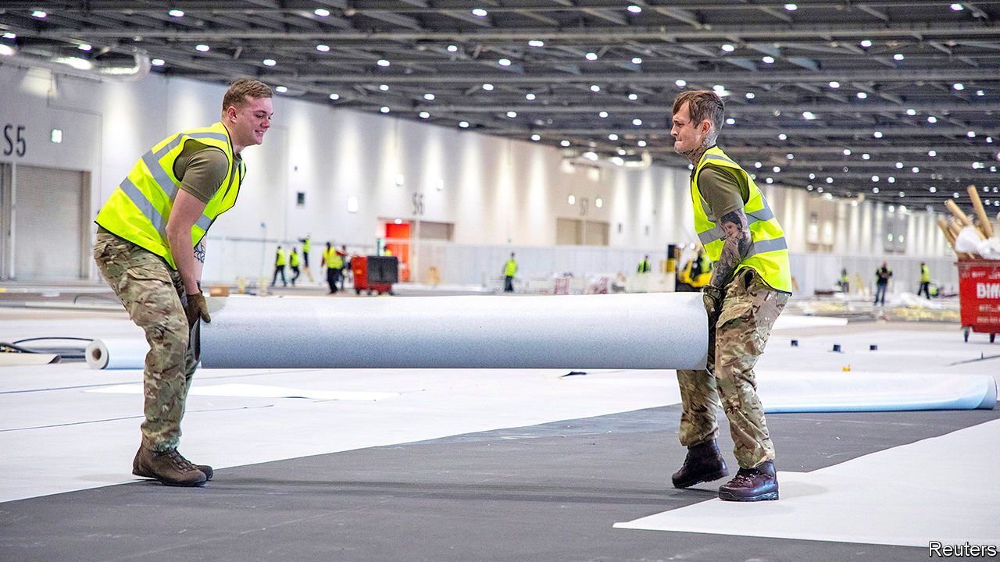

## Government

# How covid-19 is driving public-sector innovation

> Change is coming at an unprecedented pace

> Apr 4th 2020

Editor’s note: The Economist is making some of its most important coverage of the covid-19 pandemic freely available to readers of The Economist Today, our daily newsletter. To receive it, register [here](https://www.economist.com//newslettersignup). For more coverage, see our coronavirus [hub](https://www.economist.com//coronavirus)

THE GOVERNMENT is readying for calamity. Boris Johnson has written to every household warning that “things will get worse before they get better.” The number of deaths from covid-19 continues to rise, with 2,357 recorded as The Economist went to press. As the peak of the pandemic looms ever closer, ministers pray the National Health Service (NHS) will cope. On April 1st, London’s EXCEL Centre (pictured) reopened as a 4,000-bed hospital, the first of four conference centres and a stadium being repurposed. Ashleigh Boreham, a colonel who has served in Afghanistan and Iraq, oversaw the army’s involvement. “My grandfather was at the Somme,” he said. “I’m just at a different battle.”

Covid-19, just like war, is forcing innovation on a scale and at a pace that no government would normally contemplate. Across the public sector, what was previously unthinkable is happening. This overhaul of decades or even centuries of procedures and habits is being driven from the centre. As one Treasury official notes, his department has switched from being one that “looks for reasons to say no, to one that looks for ways to make things work”.

New relationships are being formed, with lines between private and public sectors blurred. As well as building new hospitals, the NHS struck a deal at cost price with private hospitals for beds, ventilators and clinicians. It has enlisted Palantir, a firm founded by Peter Thiel, an American venture capitalist, among others, to improve its data analysis. It needs software that allows it to predict when and where the caseload will overwhelm the capacity of a hospital. The government is working with a consortium including Ford, Siemens and the McLaren and Mercedes Formula 1 teams to build new ventilators, which are due to arrive next week.

The need for speed means normal rules are being ripped up. Regulators have been sidelined; league tables and targets forgotten. Power has both been centralised (with the state assuming vast new responsibilities) and diffused (with officials left to get on with solving problems). Outsourcers as well as government departments have got their skates on: according to Rupert Soames, chief executive of Serco, the company has cut the time it takes to hire a worker from a month to four to five days. The firm, which runs call centres for various bits of government, has moved 600 call handlers, or more than a third of its total, to home-working positions in the past few weeks, a 20-fold increase. Before the crisis, allowing call-handlers to work at home was not on the agenda.

Plenty of these innovations are simply about getting through the next couple of months. The new field hospitals will hold more than 10,000 additional patients. But some of these changes may outlast the current crisis. In the NHS, critics of video consultations are being won over. Martin Marshall, chair of the Royal College of General Practitioners, estimates that nine in ten GP appointments happened face-to-face before the crisis. Now, as GPs seek to keep patients away from germ-filled surgeries, he reckons that maybe as many as nine in ten are happening remotely. Doctors are pleasantly surprised by the time freed up.

Reforms that had languished are suddenly being implemented. In 2016 the government launched what it claimed was the most ambitious courts modernisation programme in the world. More than 100 courts were sold to finance a vast digitisation of justice. But by the time pandemic struck, little had changed. One pilot to test video courts involved only 11 hearings. Only a few sorts of cases, such as small claims, operated at a distance. Lawyers complained that existing technology regularly failed.

Then, on March 19th, Ian Burnett, the Lord Chief Justice, told judges that “we will be using technology...which even a month ago would have been unthinkable.” Some courts remain open for essential face-to-face hearings; jury trials will not take place remotely. But many other hearings are now using technology. The bespoke video software the courts service had been developing for use in trials is not ready, so judges, lawyers and clients have simply turned to off-the-shelf platforms, such as Skype. Before the crisis about 200 cases a day were being heard at least partially via conference call or video-link. By March 31st that had risen to around 1,800. The Supreme Court now exists entirely online.

Concerns remain about holding substantive rather than administrative hearings by video-link; indeed, evidence suggests judges are less likely to offer bail when not receiving evidence in person. But the move to online working has been smoother than many expected. Richard Susskind, who has been evangelising for online courts since 1981, thinks their moment has finally come. From self-isolation, he has noticed a sudden spike in sales of his book, “Online Courts and the Future of Justice”. The pandemic is a human tragedy but it is also, he says, “one big testbed for these ideas”.

Some parts of the state are struggling to keep up. Firms are due to receive state subsidies for workers they have furloughed this month, but the self-employed will not receive their support until June. In Germany, by contrast, such payments have already landed. The vast numbers of Britons unable to wait for the money risk overwhelming the benefits system. One bottleneck is Verify, a private system through which users confirm their identity.

There are also problems in the health system, such as a lack protective equipment for medics, with distribution difficulties to blame. The government is struggling to ramp up testing (see [article](https://www.economist.com//britain/2020/04/04/how-british-family-life-is-going-back-to-the-1950s)). Other services have no choice but to continue as before: there is not yet a way to collect the bins remotely. But where innovation is possible, in patches, it is happening at a staggering pace.

Dominic Cummings, the prime minister’s chief aide, and an advocate of revolution in government, has written of how a “beneficial crisis” can drive change. It seems improbable that even he would have chosen this route to reform. But as Nigel Edwards, chief executive of the Nuffield Trust, a think-tank, notes: “When we review all of this...we’ll find that some of the processes and systems that got in the way were not all that necessary.” Epidemiologists will undoubtedly learn lessons from the outbreak. So should Whitehall.■

Dig deeper:For our latest coverage of the covid-19 pandemic, register for The Economist Today, our daily [newsletter](https://www.economist.com//newslettersignup), or visit our [coronavirus hub](https://www.economist.com//coronavirus)