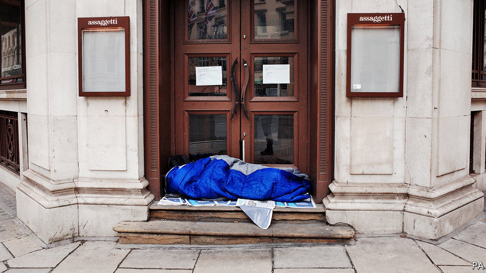

## Rough sleeping

# How the pandemic has helped Britain’s rough sleepers

> Councils have found homes for thousands

> Apr 4th 2020

Editor’s note: The Economist is making some of its most important coverage of the covid-19 pandemic freely available to readers of The Economist Today, our daily newsletter. To receive it, register [here](https://www.economist.com//newslettersignup). For more coverage, see our coronavirus [hub](https://www.economist.com//coronavirus)

ANYBODY WALKING past the British Library over the past week—admittedly a small number of people—would have noticed something missing. It is not just the harried commuters, the hungry scholars and the suitcase-toting tourists that have vanished, but a more reliable presence. Many of the homeless people who bed down for the night along this stretch of the Euston Road have disappeared as well. Where did they go?

On March 26th the government wrote to local authorities asking them to move homeless people “into appropriate accommodation by the end of the week”. Thousands remain on the streets, but impressive progress has been made. Some 4,000-odd rough sleepers in England have already been housed in hotels where “they are being brought three meals a day, have a warm comfortable bed and are being supported by professional staff”, says Matthew Downie, who heads policy for Crisis, a homelessness charity, adding that “the government target to end rough sleeping moved from 2024 to ‘by the weekend’.”

Much work remains to be done. Nearly 4,300 people were found to be sleeping rough on a single night last autumn, but many more stay in night shelters, where people share space and are at high risk of infecting each other. Homeless people are particularly vulnerable to the virus: according to Pathway, an organisation that works on health care for the homeless, they are 2.5 times as likely to have asthma as the general population, and 34 times likelier to have tuberculosis, conditions that often make covid-19 fatal. Homeless men have a life expectancy of 44, half the national average.

Charities and local authorities face their own challenges. About a tenth of staff at St Mungos, London’s biggest provider of beds for the homeless, are off sick, says Howard Sinclair, its boss, who is himself recovering from the disease. Night-time patrols by staff have been slashed as deserted streets are deemed unsafe. And putting people in hotels is not as straightforward as it sounds. “It is ponderous getting people who are not used to living indoors to live indoors,” says John Bird, who slept rough before founding Big Issue, a social enterprise working with homeless people.

Despite the difficulties, charities are looking at the crisis as an opportunity. Once it is over, “it would be a tragedy to say ‘off you go’,” says Mr Sinclair. But for now, the focus remains on ensuring the streets of London—and Britain—become just a little bit more deserted.

Dig deeper:For our latest coverage of the covid-19 pandemic, register for The Economist Today, our daily [newsletter](https://www.economist.com//newslettersignup), or visit our [coronavirus hub](https://www.economist.com//coronavirus)