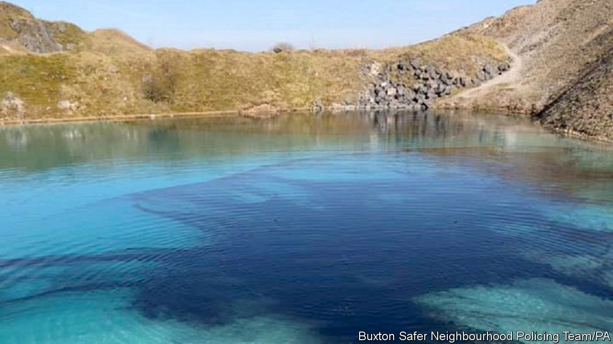

## Law and order

# Policing in a lockdown

> Cops have new powers to tackle the pandemic. Some are too keen to use them.

> Apr 4th 2020

Editor’s note: The Economist is making some of its most important coverage of the covid-19 pandemic freely available to readers of The Economist Today, our daily newsletter. To receive it, register [here](https://www.economist.com//newslettersignup). For more coverage, see our coronavirus [hub](https://www.economist.com//coronavirus)

BRITONS LOVE a chuckle at the expense of puffed-up officials. The villain of “Dad’s Army”, an air-raid warden, is forever instructing the residents of wartime Walmington-on-Sea to “put that light out!” In a famous sketch by Rowan Atkinson, a constable charges a suspect with “walking around with an offensive wife”.

The lockdown has provided satirists with plenty of material. Cops have taken to patrolling parks to break up gatherings and tape off outdoor gyms, as if they were crime scenes. Drivers are being questioned on their reasons for leaving home. A police force ticked off Stephen Kinnock, a Labour MP, for visiting his parents, even though he only went as far as the front garden. Bobbies in Derbyshire released a drone video of visitors to the Peak District walking dogs and taking photographs, activities they deemed “not essential”. The force also dyed a turquoise lake black (pictured) to deter potential swimmers (a local official insists that it does so every year).

Overzealous tactics have prompted equally overblown reactions. Jonathan Sumption, a retired Supreme Court judge, pronounced the measures “disgraceful”. “This is what a police state is like,” he said. But many are uneasy about the enthusiasm with which some officers have taken up their new powers, which allow them to issue fines of £60 for most gatherings of more than two people in public or evading the lockdown without good reason.

The problem is less the jackboot instincts of the constabulary than a lack of regulatory clarity. The distinction between advice and legal restrictions is muddy. Police complain that they were expected to uphold Boris Johnson’s edict on March 23rd that the country should go into lockdown as soon as he announced it, even though the relevant legislation was not published for three days. Ministers have made up their own rules on the hoof, telling people not to exercise more than once a day or for more than an hour, neither of which are stipulated in law. Cops were initially bombarded with calls from taxi drivers asking if they could continue to work and divorced parents worried about sharing parental responsibilities, says Kerrin Wilson, assistant chief constable of Lincolnshire Police. “It was so grey.”

Britain’s diffuse policing structure does not help. Some of England and Wales’s 43 police forces have yet to issue any fines; others have taken a hard line. A woman in Tyneside was arrested and fined £660 after she refused to tell police officers her name and explain why she was at a railway station. Even the National Police Chiefs Council, an umbrella group for chief officers, seems confused. In a conference call it hosted, a journalist asked whether residents in the Peak District could drive to go for a walk in a quiet spot. One senior cop answered “yes” just as the other said: “The point is, how do you guarantee there’s nobody there?”

Restrictions elsewhere are far more draconian. In South Korea, an app alerts the authorities if citizens stray from their quarantine. The French must carry a written declaration of their reasons for going out. The fuss in Britain may be particularly acute precisely because its cops normally use such a light touch. Most officers are unarmed. Fatal shootings trigger automatic inquiries. And, says Lawrence Sherman of Cambridge University, “there is an absolute cultural dedication to proportionate policing”. Long may it last.■

Dig deeper:For our latest coverage of the covid-19 pandemic, register for The Economist Today, our daily [newsletter](https://www.economist.com//newslettersignup), or visit our [coronavirus hub](https://www.economist.com//coronavirus)

## URL

https://www.economist.com/britain/2020/04/04/policing-in-a-lockdown
