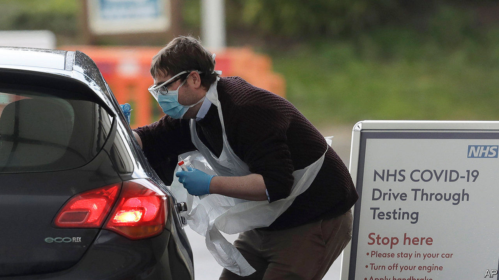

## Testing

# What’s gone wrong with covid-19 testing in Britain

> The government’s policy clearly isn’t working; how to get it right is less clear

> Apr 4th 2020

Editor’s note: The Economist is making some of its most important coverage of the covid-19 pandemic freely available to readers of The Economist Today, our daily newsletter. To receive it, register [here](https://www.economist.com//newslettersignup). For more coverage, see our coronavirus [hub](https://www.economist.com//coronavirus)

UNTIL RECENTLY, hospitals that could test for covid-19 were instructed to save their tests for patients and not to test staff. That changed on March 27th. Over the following weekend, a small sample of tests were carried out on NHS workers. The results were explosive: only around one in seven of those self-isolating actually had the virus, which meant that many who had been staying at home could in fact safely work. Failure to test, thus, had greatly exacerbated the hospital staff shortage.

Until two weeks ago, the government’s priority was not to contain the virus but to protect the vulnerable, so testing was not that important. But as the virus has spread, so the need for more testing, especially of health workers, has increased. Two weeks ago, Boris Johnson promised that Britain was “moving up to 25,000 [tests] a day” and was aiming for 250,000 a day, but Britain is still only carrying out around 10,000 a day. Altogether, it has tested 153,000 people, compared with 500,000 a week in Germany. It lags most other rich countries too.

Exactly what has gone wrong is unclear. Michael Gove, chancellor of the Duchy of Lancaster, says there is a shortage of chemical ingredients. According to Chris Hopson of NHS Providers, a membership organisation, with enough swabs and solution the health service’s pathology laboratories could carry out around 100,000 tests a day.

Others say that the problem lies not with the supply of chemicals, which are commonplace, but with the initial decision to centralise work in a dozen laboratories run by Public Health England (PHE), a government agency. Greg Clark, chair of the House of Commons science and technology committee, has criticised this approach, arguing that more work could be done in hospitals and universities.

Downing Street has since taken control of the operation, on the grounds that PHE and the medical regulator, the normal channel for approval, are too slow, and a number of new labs are being set up to ramp up testing swiftly; but a lack of communication between Number 10 and PHE means a lot of confusion. “There are parallel structures,” says Deenan Pillay, professor of virology at University College London. “They don’t talk to each other.”

As the disease spreads through the population, another sort of testing will become increasingly important: for antibodies, whose presence shows whether someone has ever had the virus. The government has promised a test will arrive soon, but Britons should not hold their breath.

Antibody testing is particularly susceptible to false positives and false negatives, so needs to be carefully validated. A bunch of Chinese companies produce antibody testing kits, and have been churning them out. They are in high demand. The British government is in negotiations to buy millions of them, but business sources say that countries that demand less validation data than Britain—such as Russia, Spain and the Gulf states—have been snapping them up. The swifter countries risk getting dodgy tests; the slower ones risk getting hold of kits too late. ■

Dig deeper:For our latest coverage of the covid-19 pandemic, register for The Economist Today, our daily [newsletter](https://www.economist.com//newslettersignup), or visit our [coronavirus hub](https://www.economist.com//coronavirus)