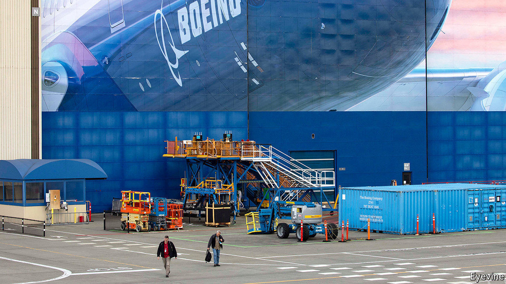

## Up in the air

# Boeing ponders its bail-out options

> The aircraft-maker can survive for now but will eventually need to raise cash

> Apr 4th 2020

Editor’s note: The Economist is making some of its most important coverage of the covid-19 pandemic freely available to readers of The Economist Today, our daily newsletter. To receive it, register [here](https://www.economist.com//newslettersignup). For more coverage, see our coronavirus [hub](https://www.economist.com//coronavirus)

THE CORONAVIRUS laid many of Boeing’s airline customers low—literally, for many have suspended flights. Fears about the giant’s fate, already uncertain because of the year-long grounding of its best-selling 737 MAX jet after two fatal crashes, became so rife that last month Goldman Sachs, a bank, felt compelled to stress that it “will remain a going concern”. The company itself insists likewise. It is probably right—the question is not whether it will survive but how.

Boeing has a safety net. A third of revenues in 2019 came from its defence arm, which, with its services division, will bring in $5bn in profits this year, reckons Bernstein, a research firm. It has cash on its balance-sheet, the balance of a $14bn credit line and has suspended its dividend. Dave Calhoun, Boeing’s new boss, says that the firm has $15bn in liquidity.

Jefferies, a bank, estimates that the company burns through $4.3bn of cash a month with a complete suspension of deliveries. So it may need government help if the crisis drags out. Lucky, then, that Congress folded its plea for assistance for American aviation into a $2trn stimulus package. This includes $25bn for carriers and $17bn for firms “critical to maintaining national security” (ie, Boeing). The terms are unclear and talks ongoing. But Steve Mnuchin, the treasury secretary, has hinted that help would come with strings—including an equity stake for the state.

Boeing is unwilling to entertain this (for now). It may prefer to try to tap $454bn set aside in the stimulus for loans and guarantees to big firms, which would not involve giving up equity. Mr Calhoun says his company can raise money in the market. But the terms would be onerous. Despite recent improvements, its ten-year bonds trade below par and the cost of insuring its debt against default remains high.

Boeing hopes that business will bounce back quickly; it has been reluctant to furlough workers, notes Ken Herbert of Canaccord Genuity, a bank. It intends to restart making the 737 MAX in May (slowly at first). Goldman Sachs reckons that even if it delivers only half the planes planned for this year it will have the liquidity to cover a “deeply negative” cashflow. But airlines may not return to normal service for months, depressing sales. Mr Calhoun may have to pick between a bitter market rescue and an unsavoury government one.■

Dig deeper:For our latest coverage of the covid-19 pandemic, register for The Economist Today, our daily [newsletter](https://www.economist.com//newslettersignup), or visit our [coronavirus hub](https://www.economist.com//coronavirus)

## URL

https://www.economist.com/business/2020/04/03/boeing-ponders-its-bail-out-options
