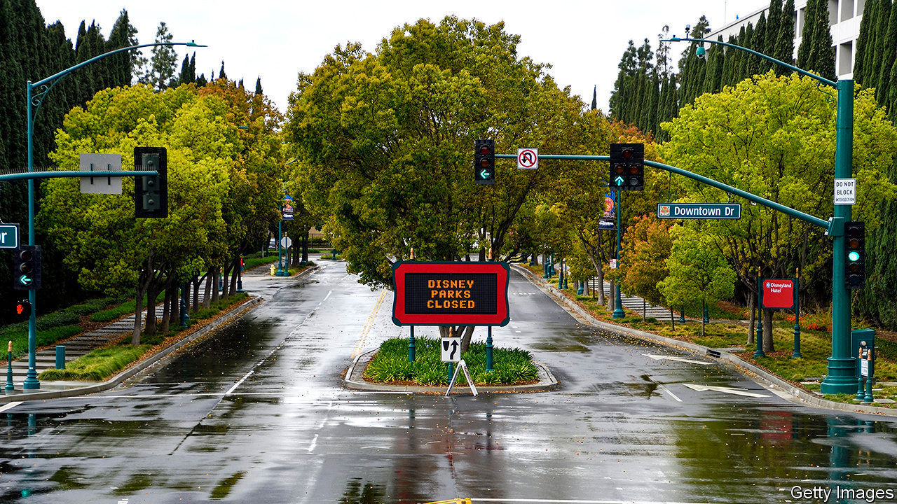
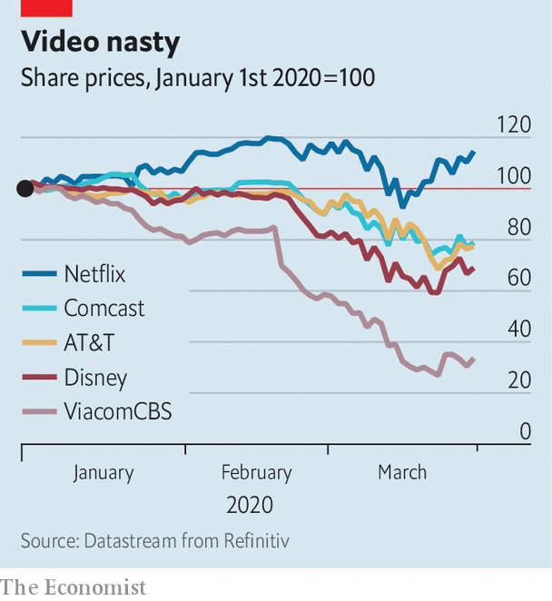

## Aaaaand cut!

# Disney and its rivals star in a real-life disaster movie

> And you thought streaming wars were disruptive

> Apr 2nd 2020

Editor’s note: The Economist is making some of its most important coverage of the covid-19 pandemic freely available to readers of The Economist Today, our daily newsletter. To receive it, register [here](https://www.economist.com//newslettersignup). For more coverage, see our coronavirus [hub](https://www.economist.com//coronavirus)

THE EMPTY freeways of Los Angeles look like a scene from a disaster movie. For many Hollywood bosses, that is how things feel. With one in three people in the world subject to social-distancing rules, box-office takings in 2020 have collapsed. Television is bracing for revenue-starved advertisers to rein in spending. Shooting on productions slated for 2021 has ceased, portending an unpleasant sequel next year.

Covid-19 comes at a tumultuous time for show business. A five-year, $650bn investment binge was already reshaping it for the age of video-streaming. Debts taken on by giant media groups such as AT&T, Comcast, Disney and ViacomCBS—which owe more than $350bn between them—look less sustainable now that their sales have sunk. Even Netflix, whose streaming-only offering is less vulnerable to lockdowns, is not immune. The pandemic will leave scars. It may claim a few victims, too.

Theatrical releases, which studios use to recoup blockbusters’ vast production costs, have all but stopped. Disney’s “Onward”, out on March 6th, has grossed one-fifth of its hoped-for $500m worldwide. Many premieres have moved partly or wholly online. Comcast’s NBCUniversal will start streaming “Trolls World Tour” on April 10th, the same day it opens in the few unshuttered cinemas. Paramount Pictures (part of ViacomCBS) has sold “The Lovebirds”, once scheduled for a cinema run, to Netflix. Releases held until the pandemic ends may find fewer cinemas to screen them. AMC, the world’s largest chain, which lost money in two of the past three years as audiences chose their couch over a night out, is teetering. Cineworld, the second-biggest, has said that in the (“unlikely”) worst-case scenario it may fold.

The small screen has its own problems. Nielsen, a research company, finds that in past lockdowns, such as during Hurricane Harvey, time spent in front of the TV rose by up to 60%. In parts of Italy quarantine boosted TV ratings, according to Auditel, another research firm. Yet this may not help networks. For one thing, they too face a drought of content. ITV, Britain’s biggest commercial broadcaster, has stopped filming its soap opera, “Coronation Street”, and is airing three episodes a week, not the usual six. American networks have built up an inventory fearing a writers’ strike this year, but it will only last until the summer.

Even if people tune in to reruns TV finances will be under strain. As their own revenues evaporate and their customers cannot shop, advertisers are pulling commercials. Ad bonanzas have been postponed (Olympics) or cancelled (Wimbledon). Suspension of live sport has deprived pay-TV operators such as Disney’s ESPN and Sky, a European giant belonging to Comcast, of their last big remaining attraction. Some firms, like Sky, have allowed customers to pause sports subscriptions or offered access to other paid programming in their place. ESPN is airing repeats of classic matches, plus offbeat fare like dodgeball and arm-wrestling. Neither tactic is likely to arrest the slide in the share of households with pay-TV, down from almost 90% in 2010 to 65% in America.

Streaming offers some respite. Netflix’s share price, up by 15% this year, looks buoyant amid a market rout. It claims to have enough fresh content to last a few months. Subscription growth for all the big streamers has soared by double digits from week to week since lockdowns kicked in, estimates Antenna, a data company. After its European launch in March Disney’s new platform, Disney+, was downloaded more than 5m times in just days. AT&T and Comcast hope for similar success when they launch (paid) HBO Max and (ad-supported) Peacock, respectively, later this year.

But an uptick in streaming revenue may not offset the losses from other businesses. Netflix, which has none, is running out of new eyeballs to attract in the West; nearly half of American households already subscribe. Keeping those it has may require serving up new shows—which it cannot produce. Lockdowns are unlikely to bring in new viewers in poorer countries, where streaming remains a luxury, especially as mass joblessness looms.

The revenue squeeze also comes after a period of heavy borrowing by media firms, as they raced to create or buy spectacular content. At the end of last year AT&T was on the hook for some $190bn, including $17bn which comes due this year and next. Comcast owed more than $100bn, Disney $47bn and ViacomCBS $21bn. With outstanding debt of $16bn, or nearly six times gross operating earnings, Netflix is even more leveraged. In March Disney raised $6bn in a new debt offering, for “general corporate purposes”, including paying down debts. ViacomCBS has announced a $2.5bn bond to shore up its balance-sheet. AT&T has put off a planned $4bn share buy-back.

Most firms have warned of adverse effects on business, without putting a figure on it. AT&T and Comcast, which own not just content but the “pipes” through which it is delivered, can count on revenues from self-isolating broadband users, many of whom are upgrading to faster speeds. A pipeless Disney faces the biggest broadside: to the box-office, ESPN, its stores and theme parks.

This has led to speculation of a takeover. Bernie McTernan of Rosenblatt, a financial-services firm, has suggested that Apple, with some $200bn in gross cash, might buy Disney, whose market value has sunk to about $180bn. The tech giant might like the look of Disney assets such as Lucasfilm (which makes “Star Wars”) and Marvel, says Rich Greenfield of LightShed Partners, a research firm, to complement its lacklustre Apple TV+ library. But, he adds, a buy-out would also land it with businesses in which it has little interest, such as theme parks, gift shops and television networks. The drama that plays out in media markets in the next year may turn out to be more exciting than the blockbusters not hitting screens near you. ■

Correction: This article originally stated that Disney’s closure of its parks alone by mid-April would make it suffer an operating loss of over $1bn. In fact it would only cut more than $1bn off its gross operating income. Sorry.

Dig deeper:

For our latest coverage of the covid-19 pandemic, register for The Economist Today, our daily [newsletter](https://www.economist.com//newslettersignup), or visit our [coronavirus hub](https://www.economist.com//coronavirus)

## URL

https://www.economist.com/business/2020/04/02/disney-and-its-rivals-star-in-a-real-life-disaster-movie
